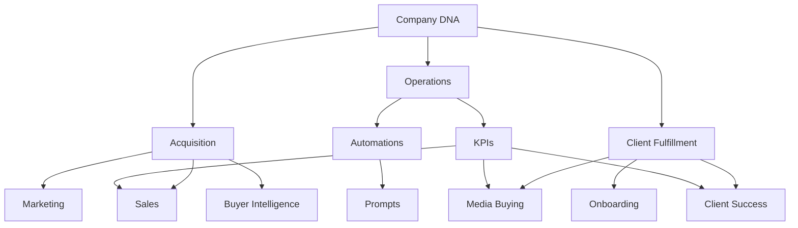

# Operating Map

This map explains how Waiz Media's knowledge base should connect as the repo matures.

## How To Use This Map

- Company docs define principles, market positioning, identity, and the money model.
- Acquisition docs define how Waiz creates demand, qualifies leads, sells, and handles objections.
- Operations docs define the internal systems and accountabilities that keep the business running.
- Client fulfillment docs define how Waiz launches, serves, reports to, and retains clients.
- Automations, prompts, and KPIs support the operating domains instead of becoming isolated silos.

## Approved Subfolder Layout

Acquisition remains a single top-level domain with subfolders: `sales/`, `marketing/`, `intelligence/`, `offer/`.

Client fulfillment uses: `onboarding/`, `client-success/`, `media-buying/`, `crm-architecture/`, `reverse-mortgage-dna/`, `course-material/`.

Operations uses: `people/`, `hiring/`, `systems/`, `reporting/`.

See [README.md](README.md#folder-structure-approved) for the full table.

## Current Source Status

The first raw export contains 158 files. The highest-volume domains are:

- `client-fulfillment/course-material`: 32 files
- `operations`: 26 files
- `client-fulfillment/media-buying`: 16 files
- `acquisition/sales`: 15 files
- `client-fulfillment/reverse-mortgage-dna`: 15 files
- `company`: 14 files
- `client-fulfillment/onboarding`: 9 files
- `acquisition/marketing`: 8 files
