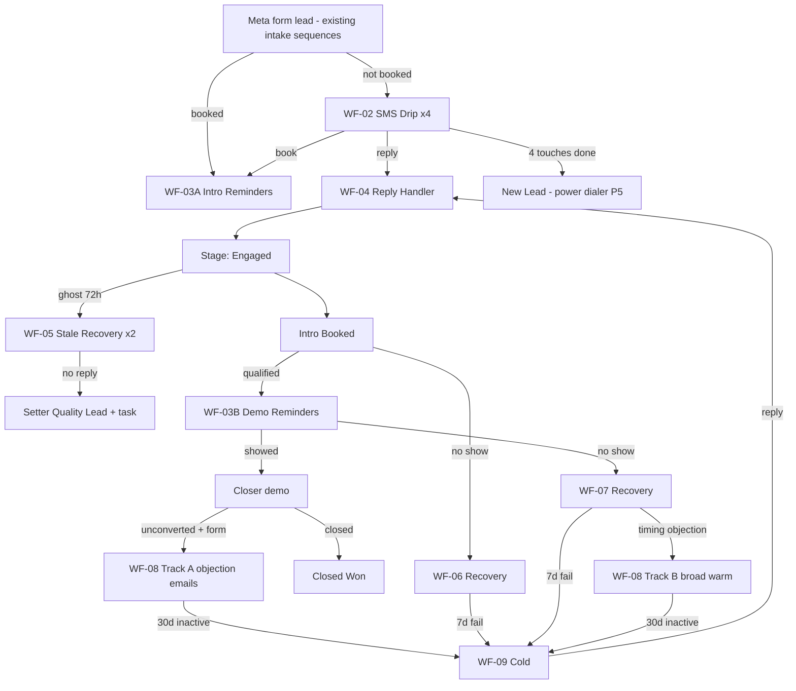

# GHL Automation Workflows (Acquisition)

## Purpose

Build spec for the **9 acquisition workflows** in GHL: triggers, entry filters, step-by-step actions, exits, and touch caps. Written so ops can build (or refactor) each workflow click-for-click. Most map onto existing automations — this spec tightens exits and adds two new pieces, it does not start from zero.

New-lead intake (Meta form → contact created, `src-meta` tag, stage New Lead) is handled by **existing sequences** and is out of scope here — the workflows below assume those fields/tags arrive set.

## Scope

Waiz B2B acquisition sub-account. Stage names, tags, and fields: [GHL Pipeline And Disposition Reference](ghl-pipeline-disposition-reference.md). Message copy sources: [Setter Lead Messaging](setter-lead-messaging.md), [Demo Appointment Confirmation Script](script-demo-appointment-confirmation.md), [No Shows SOP](no-shows-maximizing-show-rates-setter-levers.md), [Pre-Call Objection Videos](../marketing/pre-call-objection-videos.md).

## Owner

Operations builds and maintains workflows. Setter/closer execute the manual touches each workflow assumes.

## Trigger

Use when building, editing, or auditing any acquisition automation, or when leads appear to receive wrong/duplicate messaging.

---

## Map: existing automations → this spec

| Existing automation | Spec | Change type |
|---------------------|------|-------------|
| 1. New lead messaging | WF-02 | Modify — cap at 4 SMS; Meta-only (intake/routing stays in existing sequences) |
| 2. Intro Booked follow-up | WF-03A | Modify — add video sequence + cross-workflow exits |
| 3. Contact responded | WF-04 | Modify — make global; rename stage to Engaged |
| 4. Demo booked | WF-03B | Modify — add confirm sequence; verify exits |
| 5. No show (disposition only) | WF-06 / WF-07 | **Expand — add recovery sequence (biggest gap)** |
| 6. Post demo nurturing | WF-08 (objection track) | Modify — mutual exit with warm track |
| 7. Warm nurturing | WF-08 (broad track) | Modify — never runs alongside objection track |
| 8. Cold lead nurturing | WF-09 | Modify — reply exits to WF-04, never back to drip |
| — (new) | WF-05 Stale Engaged Recovery | **Build new** |

### Global rules (add to every workflow)

1. **First step of every workflow:** If contact has tag `stop-all-nurture` OR `human-active` → **end workflow** (or skip send and re-check at next wait).
2. **On entry to any nurture workflow:** remove all other `nurture:*` tags, then add this workflow's tag.
3. **Any inbound SMS/email reply** anywhere → contact enters WF-04, which removes them from every nurture workflow.
4. No pricing, no guaranteed results, no invented claims in any automated message ([Setter Lead Messaging rules](setter-lead-messaging.md#core-rules-non-negotiable)).

---

## WF-02 — New Lead SMS Drip (4 touches max)

Intake (Meta form → contact, `src-meta`, stage New Lead, skip-if-booked routing) happens in the **existing new-lead sequences** before this drip starts.

- **Entry filter:** tag `src-meta` + stage New Lead + no future appointment + NOT `human-active` / `stop-all-nurture`.
- **On entry:** add tag `nurture:new-lead`.
- **Sequence:**

| Step | Wait | Send | Copy source |
|------|------|------|-------------|
| 1 | 0 min | SMS — speed-to-lead question | [Setter Lead Messaging § A — form opt-in](setter-lead-messaging.md#a-speed-to-lead-05-min) |
| 2 | 30 min (if no reply) | SMS — value bump | [§ A — 30-min bump](setter-lead-messaging.md#a-speed-to-lead-05-min) |
| 3 | Day 2 | SMS — trust video link (asset #1 `prospect_page_url`) | [§ I proof drop](setter-lead-messaging.md#i-no-reply-bumps-new-value-only) + [video #1](../marketing/pre-call-objection-videos.md) |
| 4 | Day 5 | SMS — pattern-interrupt question | [§ F](setter-lead-messaging.md#f-pattern-interrupt-framework-5) |

- **Email during drip window:** at most 1 welcome email (day 0) + 1 value email (day 3). No daily email blast in parallel.
- **Exit triggers (remove from workflow immediately):**
  - Inbound reply → WF-04
  - Appointment booked → remove tag `nurture:new-lead`; WF-03A/B takes over
  - Tag `stop-all-nurture` added, or stage → Closed
- **After step 4 with no reply:** remove `nurture:new-lead`; leave in New Lead for power dialer (P5). Do **not** loop or extend the drip — the dialer and long-term nurture own them from here.

## WF-03A — Intro Appointment Reminders

Existing "Intro Booked" follow-up sequence — kept as its own workflow (separate from the demo sequence below).

- **Trigger:** appointment created on the **setter intro calendar**.
- **On entry:**
  1. Remove tags `nurture:new-lead`, `nurture:no-show`, `nurture:warm`, `nurture:cold` (a booking always wins).
  2. Remove from WF-02 / WF-06 / WF-07 / WF-08 / WF-09.
  3. Add tag `nurture:appt-reminders`.
  4. Stage → **Intro Booked**; set custom field **Next Appointment Date** = appointment start (powers **DQ-2** Confirmations).
- **Sequence:**

| Step | When | Send | Copy source |
|------|------|------|-------------|
| 1 | Immediately | SMS booking confirm + motivator question | [Setter Lead Messaging § A — booked intro](setter-lead-messaging.md#a-speed-to-lead-05-min) |
| 2 | 24–48 hr before | SMS confirm + pre-call video #1 (`prospect_page_url`) | [Video #1](../marketing/pre-call-objection-videos.md) |
| 3 | Morning of | SMS confirm + calendar tie-down | [Demo Confirmation Script — SMS backup patterns](script-demo-appointment-confirmation.md#sms-backup-no-answer--after-voicemail) (adapted for intro) |

- **Exits:**
  - Appointment status → showed: remove `nurture:appt-reminders`; setter advances stage.
  - Appointment status → no-show: stage → **Intro No Show** (fires WF-06).
  - Cancelled/rescheduled: re-enter at step 1 for the new time; **update Next Appointment Date** to the new appointment start (keeps DQ-2 accurate).

## WF-03B — Demo Appointment Reminders

Existing "Demo booked" follow-up sequence — separate workflow on the closer calendar.

- **Trigger:** appointment created on the **closer demo calendar**.
- **On entry:** same cleanup as WF-03A (remove nurture tags + exit all nurture workflows, including WF-03A and any active no-show recovery if they rebooked); add `nurture:appt-reminders`; stage → **Demo Booked**; set **Next Appointment Date** = appointment start; notify closer with setter notes.
- **Sequence:**

| Step | When | Send | Copy source |
|------|------|------|-------------|
| 1 | Immediately | SMS booking confirm | [Demo Confirmation Script](script-demo-appointment-confirmation.md) |
| 2 | 24–48 hr before | SMS confirm + prep video tie-down (default asset #3, setter swaps per objection) | [SMS backup — 24–48hr](script-demo-appointment-confirmation.md#sms-backup-no-answer--after-voicemail) + [quick-send table](../marketing/pre-call-objection-videos.md#quick-send-by-objection) |
| 3 | Morning of | SMS confirm + calendar accept + video re-tie | [SMS backup — morning-of](script-demo-appointment-confirmation.md#sms-backup-no-answer--after-voicemail) |

- Pre-call videos use **prospect_page_url** only, default sequence 1→2→3 per [manifest](../marketing/pre-call-objection-videos-manifest.yaml). Automated reminders **back up, never replace** the manual phone confirms (setter P3 block).
- **Exits:**
  - Showed: remove `nurture:appt-reminders`; closer dispositions post-call.
  - No-show: stage → **Demo No Show** (fires WF-07).
  - Cancelled/rescheduled: re-enter at step 1 for the new time; **update Next Appointment Date** to the new appointment start (keeps DQ-2 accurate).

## WF-04 — Reply Handler (global kill switch)

Upgrade of "Contact responded": today it only exits the new-lead drip. It must fire from **everything**.

- **Trigger:** customer replied (SMS) OR email reply — any contact with any `nurture:*` tag.
- **Steps:**
  1. Remove from workflows WF-02, WF-05, WF-06, WF-07, WF-08, WF-09.
  2. Remove all `nurture:*` tags (keep `nurture:appt-reminders` if a future appointment exists — confirmations still apply).
  3. Add tag `human-active`.
  4. **If stage is New Lead → Engaged.** If already past Engaged (booked, no-show, warm), keep the stage — the reply does not demote them.
  5. Notify setter: Slack/GHL watchshift notification per [Watchshift SOP](sop-watchshift.md).
  6. Wait 48 hours with no outbound human activity → remove `human-active` (re-arms automations; WF-05 backstops pre-demo ghosts).
- **Boundary:** the setter owns the conversation from here ([Setter Lead Messaging](setter-lead-messaging.md)); pricing/policy replies tag Gabriel per watchshift rules.

## WF-05 — Stale Engaged Recovery (new — the ghost gap)

Covers "they replied, we answered, they vanished" — previously these leads sat untouched unless the dialer reached them.

- **Entry filter:** stage = Engaged OR Setter Quality Lead, AND no inbound or outbound SMS in 72 hours, AND no future appointment, AND NOT `stop-all-nurture`.
- **Steps:**

| Step | Wait | Action | Copy source |
|------|------|--------|-------------|
| 1 | 0 (at 72h silence) | SMS — value bump / direct check | [Setter Lead Messaging § I — direct check](setter-lead-messaging.md#i-no-reply-bumps-new-value-only) |
| 2 | +48 hr (no reply) | SMS — direct reschedule ask | [§ H steer to book](setter-lead-messaging.md#h-steer-to-book-short--use-when-thread-is-warm) |
| 3 | +24 hr (no reply) | Stage → Setter Quality Lead + GHL task "Manual follow-up — went quiet after engaging" + Grade review | — |

- **Exits:** reply → WF-04; booking → WF-03A/B. Never re-enters WF-02.
- **Cap:** 2 SMS total, once per 30 days per contact (use a `stale-recovery-ran` tag with 30-day removal to prevent loops).

## WF-06 — Intro No Show Recovery

Expands the existing no-show automation from disposition-only to disposition + recovery. The live-call protocol in [No Shows SOP](no-shows-maximizing-show-rates-setter-levers.md#no-show-protocol) (3/7/10-minute calls and texts) stays manual — this workflow starts where it ends.

- **Trigger:** stage → **Intro No Show** (set manually by setter after P6 protocol, or by appointment status = no-show).
- **On entry:** remove other `nurture:*` tags; add `nurture:no-show`.
- **Sequence:**

| Step | When | Action | Copy source |
|------|------|--------|-------------|
| 1 | Immediately | SMS (skip if setter already sent it live) | [No Shows SOP — Jeremy Miner text](no-shows-maximizing-show-rates-setter-levers.md#no-show-protocol) |
| 2 | Day 1 | SMS reschedule ask | [No Shows SOP — final text](no-shows-maximizing-show-rates-setter-levers.md#no-show-protocol) |
| 3 | Day 3 | SMS pre-call video link (`prospect_page_url`) | [Video #1](../marketing/pre-call-objection-videos.md) |
| 4 | Days 1–3 | Slack reminder to setter daily: "call [Name] — no-show recovery" | — |

- **Exits:**
  - Rebooked → WF-03A (stage → Intro Booked).
  - Reply → WF-04.
  - Day 7 no response → remove `nurture:no-show`; stage → **Cold Nurture**; enter WF-09.

## WF-07 — Demo No Show Recovery

Identical structure to WF-06. Differences:

- **Trigger:** stage → **Demo No Show**.
- Step 1 copy references the strategy call with the closer by name.
- Add internal notification to the **closer** as well as the setter.
- Day 7 no response → Cold Nurture (WF-09). If they reply with a timing objection instead of rebooking → setter moves stage to Warm Nurture (WF-08 broad track).

### One-time backlog migration (95 leads)

For the existing **70 Intro No Show + 25 Demo No Show**:

1. Build WF-06/07 first and test on 2–3 contacts.
2. Bulk action: add tag `retrigger-noshow-recovery` to all 95.
3. A small helper workflow triggers on that tag → routes into WF-06 or WF-07 by current stage → removes the tag.
4. Skip step 1 (`no-show-jeremy-miner`) for anyone whose no-show is older than 14 days — start them at the reschedule ask so the copy doesn't reference a "call earlier today."
5. Anyone who ignores the full recovery → Cold Nurture per normal exit.

## WF-08 — Post-Demo + Warm Nurture (two tracks, never both)

Merges the rules for existing automations #6 (post demo nurturing) and #7 (warm nurturing). Both end in the **Warm Nurture** stage but only one email track runs at a time.

### Track A — objection-tailored (priority)

- **Entry:** closer submits post-call form (unconverted) → Post-Demo Objection field set → stage **Warm Nurture** → tag `nurture:post-demo`.
- **Sequence:** existing objection-branched emails, every 2 days (founder videos + educational content). Max **1 SMS per week**, and only if no email opens in 7 days.
- Manual closer/setter follow-up runs in parallel per [Money Model](../../company/overview-money-model-april-26.md#offer-routing-logic) — any manual text requires adding `human-active` first (pauses sends 48h).

### Track B — broad warm (fallback)

- **Entry:** lead manually moved to Warm Nurture **without** a post-call form (e.g. pre-demo timing objection, recovered no-show not ready to book) → tag `nurture:warm`.
- **Entry guard:** if tag `nurture:post-demo` exists → do not enter; Track A wins.
- **Sequence:** broader indoctrination emails every 2–3 days.

### Shared exits (both tracks)

- Reply or booking → WF-04 / WF-03A/B.
- 30 days with no opens/clicks/replies → remove tags; stage → **Cold Nurture**; enter WF-09.
- Boot Camp purchased → Closed Won + `boot-camp-route`.

### One-time Warm audit (72 leads)

1. Active deal in motion → stage **Negotiating** (no nurture tags).
2. Post-call form on file → keep in Track A only (remove from Track B if double-enrolled).
3. No form, engaged within 30 days → Track B.
4. No engagement in 30+ days → Cold Nurture (WF-09).

## WF-09 — Cold Long-Term Nurture

- **Entry:** from WF-08 (30 days inactive) or WF-06/07 (recovery failed) → tag `nurture:cold`; stage **Cold Nurture**.
- **Sequence:** 1 email per week, conservative educational content. **No SMS. No dialing priority.**
- Long-term email copy: migrate from Drive `Script -- Long Term Email Nurturuing.docx` (inventory slug `script-long-term-email-nurturuing`) — keep the existing cold automation's copy until that conversion is approved.
- **Exits:** any reply → WF-04 + stage Engaged (never back into WF-02); unsubscribe/opt-out → Closed Lost.

---

## WF-FIELDS — Custom field stamping (smart list dependency)

**Build before smart lists go live.** DQ-1 (Clear Today) and DQ-2 (Confirmations) depend on these fields updating automatically — not on setter manual entry (except Lead Grade, Next Work Date, and Next Follow-Up Date).

### Last Human Touch

Powers **DQ-1** daily queue exit and reload. When set to today, the lead drops out of DQ-1 for the rest of the day and reappears tomorrow if still in an actionable stage.

**Option A — single utility workflow (recommended):**

- **Name:** `WF-FIELDS — Last Human Touch`
- **Triggers (add each as a separate trigger on the same workflow, or duplicate the update step):**
  1. **Outbound call completed** — filter: call direction = outbound, call status = completed (or answered), assigned user = setter role.
  2. **Outbound SMS sent** — filter: message direction = outbound, sent by setter user (exclude automated workflow sends where possible — use "manual message" or "user sent" if GHL distinguishes).
- **Action:** Update contact custom field **Last Human Touch** = `{{right_now}}` (current date/time).
- **Also run on:** WF-04 after `human-active` is added (setter reply to inbound).

**Option B — embed in existing workflows:** Add "Update custom field Last Human Touch = now" as the last step of WF-03A/B confirmation SMS sends and WF-05/06/07 outbound SMS steps. Less reliable for manual setter texts — prefer Option A.

**Manual fallback:** Setter updates **Last Human Touch** when placing a call from the contact record if automation is not yet live. Remove this habit once WF-FIELDS is verified.

### Next Appointment Date

Powers **DQ-2** (Confirmations) and **SL-C1**.

Already specified in WF-03A/B on entry. **Also required on:**

- Appointment **rescheduled** (WF-03A/B exit path above)
- Appointment **cancelled** with no replacement → clear **Next Appointment Date** (empty field)

**Verification:** Book test intro → field populates → contact appears in DQ-2 (not DQ-1). Reschedule → field updates.

### Next Work Date (clear on stage change)

Powers **DQ-1** snooze. Setter sets manually when deferring. **Optional workflow clears the field** when stage changes to:

- **Intro Booked** or **Demo Booked** (lead moves to DQ-2)
- **Closed** (Won/Lost)
- **Warm Nurture** or **Cold Nurture**

Add to WF-03A/B on entry and any Closed-stage workflow: **Update custom field Next Work Date** = empty.

### Build order relative to smart lists

| Step | Action |
|------|--------|
| 1 | Create all 7 contact custom fields (including **Next Work Date**) per [Prerequisites audit](ghl-pipeline-disposition-reference.md#prerequisites-audit-run-before-building-lists) |
| 2 | Build WF-FIELDS (Last Human Touch) |
| 3 | Verify WF-03A/B stamp Next Appointment Date on book + reschedule; clear Next Work Date on book |
| 4 | Run smoke test (new lead in DQ-1, call drops out, book moves to DQ-2) |
| 5 | Build **DQ-1**, **DQ-2**, **DQ-3** + SL-C1 through SL-C3 |
| 6 | Pin setter lists DQ-1 → DQ-2 → DQ-3; brief setter: "Clear DQ-1 daily. Touch = out today. Snooze = Next Work Date." |

---

## End-to-end flow

---

## Build order

| Phase | Build | Why first |
|-------|-------|-----------|
| 0 (before lists) | [WF-FIELDS](#wf-fields--custom-field-stamping) + contact custom fields + daily queue lists DQ-1–DQ-3 | DQ-1 stays empty without Last Human Touch + Next Work Date |
| 1 (day 1) | WF-06/07 recovery steps + backlog retrigger | 95 recoverable no-shows idle — highest ROI |
| 2 (day 2–3) | WF-04 global reply handler + tag checks in #1/#6/#7/#8; rename Contact Responded → Engaged | Stops double-messaging before adding volume |
| 3 (week 1) | WF-08 mutual-exit guard; WF-03A/B exit verification; trim WF-02 to 4 SMS | Overlap cleanup |
| 4 (week 2) | WF-05 new build; pipeline stage migration; Warm audit (72 leads) | Ghost gap + board cleanup |

## Success metrics

| Metric | Signal |
|--------|--------|
| New Lead → Engaged rate | Drip + speed-to-lead working |
| Intro No Show → rebooked within 30d | WF-06 impact |
| Engaged → Intro Booked | Setter conversion |
| Demo show rate | WF-03B + manual confirms ([KPI thresholds](../../kpis/acquisition/sales-kpi-thresholds.md)) |
| Warm → reactivated (reply/book) | Indoctrination working |
| SMS opt-outs / STOP replies | Over-texting alarm — investigate immediately |

Roll up through the existing funnel in [WM Acquisition Report Data System](../../operations/reporting/wm-acquisition-report-data-system.md).

## Related docs

- [GHL Pipeline And Disposition Reference](ghl-pipeline-disposition-reference.md)
- [Setter Lead Messaging](setter-lead-messaging.md) — SMS copy source
- [Demo Appointment Confirmation Script](script-demo-appointment-confirmation.md) — reminder copy source
- [Setter Daily Checklist](setter-daily-checklist.md)
- [No Shows And Maximizing Show Rates](no-shows-maximizing-show-rates-setter-levers.md)
- [Pre-Call Objection Video Assets](../marketing/pre-call-objection-videos.md)
- [Money Model And Offer Architecture](../../company/overview-money-model-april-26.md)

## Open Questions

- [ ] Convert Drive `Script -- Long Term Email Nurturuing.docx` for WF-09 copy.
- [ ] Convert Drive `Example Emails For Post Demo Followup.docx` for WF-08 Track A copy.
- [x] Intro and demo reminders confirmed as **two separate workflows** (WF-03A / WF-03B), matching the existing GHL setup (2026-06-10).
- [x] WF-FIELDS spec added for Last Human Touch + Next Appointment Date stamping (2026-06-10).
- [x] Daily queue model (DQ-1/DQ-2/DQ-3) + Next Work Date clear-on-book spec (2026-06-10).
