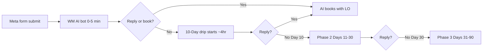

# Lead Nurture Playbook

> **Reference playbook** — gold-standard format for future client playbooks.  
> **North star:** Turn cold Meta leads into booked conversations through education-first follow-up from the loan officer's team — not pressure.

## Purpose

Define **how and why** Waiz nurtures reverse mortgage leads after the ad click — the system, rules, and quality bar. Message copy and GHL build details live in linked execution docs; this playbook is the strategic layer clients and team align on first.

## Scope

| Included | Excluded |
|----------|----------|
| Four-pillar nurture framework (Availability, Speed, Personalization, Volume) | Full email/SMS copy (→ [10-Day RM Drip](10-day-rm-drip-campaign.md)) |
| Waiz nurture stack: bot → drip → AI booking | Speed-to-lead bot logic (→ [How WM AI Bot Works](../crm-architecture/how-wm-ai-bot-works.md)) |
| Phase cadence, routing rules, exit conditions | Meta ad creative (→ [RM Ad Playbook](rm-ad-playbook.md)) |
| RM compliance + outcome-first language standards | Per-client custom drips (→ `clients/` folder) |

## Owner

Client Success (build + QA). LO approves voice-sensitive lines and composite stories.

## Trigger

Use this playbook when:

- Onboarding a client who will receive Meta form leads
- Building or auditing a nurture workflow in GHL
- Client asks "what happens after someone fills out my form?"
- CS diagnoses low reply or show rates post-launch

## Inputs

- Meta instant form live and tagged `meta`
- [CRM Infrastructure](../crm-architecture/crm-infrastructure.md) configured
- WM AI bot active for 0–5 minute speed-to-lead
- LO custom values: `{{user.first_name}}`, setter/assistant display name
- Optional: `form_intent` from Meta form for segment routing

## Outputs

- Lead replies → exits all drips → AI/Closebot books with LO
- No reply by Day 10 → Phase 2 (Days 11–30)
- No reply by Day 30 → Phase 3 (Days 31–90)
- Appointment booked → nurture off; appointment reminders only

## The four pillars

All four must work together. Weakness in one pillar shows up as "bad leads" or "ads don't work."

| Pillar | Question it answers | Waiz implementation |
|--------|---------------------|---------------------|
| **I — Availability** | Can they take the next step immediately? | Instant Meta form; thank-you path clear; AI offers booking in first minutes; calendar accessible |
| **II — Speed** | How fast do you show up after interest peaks? | WM AI bot: 0–5 min; first drip touch ~4 hrs after form; reply to inbound within the hour |
| **III — Personalization** | Does follow-up feel relevant to *their* intent? | Intent routing on `form_intent`; LO assistant voice; outcome-first copy matched to form promise |
| **IV — Volume** | Do you quit before the lead is ready? | ~18 touches Days 1–10; 8 touches Days 11–30; 6 touches Days 31–90 — most conversions happen after touch 5+ |

### Pillar I — Availability

- **Rule:** Every motivated lead must know the single next step within 3 seconds of submitting the form.
- **Waiz:** Form → bot conversation or booking path → no dead ends, no "check your email in 45 minutes" as the only action.
- **LO action:** Keep calendar slots open; confirm booking link works weekly.

### Pillar II — Speed

- **Rule:** First human/system touch in **under 5 minutes**; gold standard under 60 seconds (bot).
- **Waiz:** Bot handles peak-motivation window; drip starts ~4 hours later so the LO's assistant voice doesn't collide with bot.
- **LO action:** Respond personally if a lead replies to SMS/email — treat as hot lead.

### Pillar III — Personalization

- **Rule:** Reference what they asked for on the form; lead with **outcome**, not product jargon.
- **Waiz:** Segment openers by intent (remove payment, pay debt, cash out). Sender = LO's assistant, not a brand.
- **Language:** See outcome-first table in [10-Day RM Drip — Outcome-first language](10-day-rm-drip-campaign.md#outcome-first-language-use-vs-avoid).
- **Compliance:** [RM Compliance Guardrails](../reverse-mortgage-dna/rm-compliance-guardrails.md) — no tax advice in SMS; say *retired homeowners* not age targeting in copy.

### Pillar IV — Volume

- **Rule:** Assume the lead needs education before booking; plan for 5–12+ contacts before giving up.
- **Waiz:** Three-phase arc (primary → long-term A → long-term B). Do not stop at Day 3 because "they're cold."
- **Exit only on:** reply, book, unsubscribe, or hard disqualify — not silence alone before Day 90.

---

## Waiz nurture stack (execution order)

| Stage | Doc | Owner |
|-------|-----|-------|
| Lifecycle context | [Fulfillment Lead Lifecycle](../fulfillment-lead-lifecycle.md) | CS |
| Speed-to-lead + booking | [How WM AI Bot Works](../crm-architecture/how-wm-ai-bot-works.md) | Ops |
| Primary + long-term copy | [10-Day RM Drip Campaign](10-day-rm-drip-campaign.md) | CS |
| SMS-only intent path | [RM iMessage Intent Drip (7-Day)](rm-imessage-intent-drip-7day.md) | CS |
| Alternate sequence | [RM Lead Nurture Drip Sequence](rm-lead-nurture-drip-sequence.md) | CS |

---

## Phase summary

| Phase | Days | Touches | Goal |
|-------|------|---------|------|
| **Primary** | 1–10 | ~18 (email + SMS) | Educate, preempt objections, earn reply |
| **Long-term A** | 11–30 | 8 | Deeper education, lighter CTA pressure |
| **Long-term B** | 31–90 | 6 | Stay top-of-mind until ready or exit |

Full cadence, themes, and copy: [10-Day RM Drip Campaign](10-day-rm-drip-campaign.md).

---

## Decision rules

| Condition | Action |
|-----------|--------|
| Any inbound reply (any channel) | Stop all drip workflows → AI/responder books appointment |
| Appointment booked | Remove from nurture; appointment reminders only |
| `STOP` / unsubscribe | Remove immediately; do not re-add |
| Day 10, no reply | Enroll Phase 2 (Days 11–30) |
| Day 30, no reply | Enroll Phase 3 (Days 31–90) |
| Lead source ≠ Meta | Do not use Meta-specific Day 8 copy; confirm sequence variant with CS |
| Intent unknown | Use universal opener lines in drip doc |

---

## Quality bar

- **Voice:** LO's assistant reaches out — personal, educational, not corporate blast.
- **Frame:** Outcome-first per [Doctrine RM Marketing](../reverse-mortgage-dna/doctrine-rm-marketing.md); name HECM/reverse mortgage only when teaching mechanics.
- **Compliance:** [RM Compliance Guardrails](../reverse-mortgage-dna/rm-compliance-guardrails.md) on every touch.
- **Stories:** Carol/Ruth/Tom-style composites — LO-approved or labeled internal composite.
- **Meta leads:** Acknowledge form source Day 1; address scam/social-media fear by Day 8.

---

## Metrics

| Metric | Target direction | Notes |
|--------|------------------|-------|
| Speed-to-lead (bot first message) | < 5 min | Bot KPI |
| Reply rate (Days 1–10) | Trend up vs baseline | By client cohort |
| Cost per booked call | Down | Nurture supports show rate |
| Show rate | ≥ team benchmark | After book, separate workflow |
| Unsubscribe rate | Stable / low | Spike = tone or frequency issue |

Formal KPI definitions: [Fulfillment Constraint Diagnosis KPI Standards](../client-success/fulfillment-constraint-diagnosis-kpi-standards.md).

---

## Related docs

### Methodology (from OS)

| Doc | What we reuse |
|-----|----------------|
| [RM High-Quality Lead Acquisition](rm-high-quality-lead-acquisition.md) | Education-first, quality-over-volume mindset |
| [Doctrine RM Marketing](../reverse-mortgage-dna/doctrine-rm-marketing.md) | Archetypes, outcome-first framing |
| [Fulfillment Lead Lifecycle](../fulfillment-lead-lifecycle.md) | Where nurture sits in full engine |

### Execution (do not duplicate here)

| Doc | Role |
|-----|------|
| [10-Day RM Drip Campaign](10-day-rm-drip-campaign.md) | **Primary execution** — copy, GHL, phases |
| [RM iMessage Intent Drip (7-Day)](rm-imessage-intent-drip-7day.md) | Intent-segmented SMS path |
| [How WM AI Bot Works](../crm-architecture/how-wm-ai-bot-works.md) | Pre-drip speed + booking |

### Course material (client education)

| Doc | Role |
|-----|------|
| [Lead Nurture — Course Material](../course-material/lead-nurture-playbook.md) | Client-facing teaching layer; links here |

---

## Open questions

- [ ] Confirm default assistant display name pattern across all client snapshots
- [ ] Standard reply-rate benchmark for Meta RM clients at Day 30
- [ ] When to use 7-day iMessage path vs email+SMS 10-day path (decision tree for CS)
