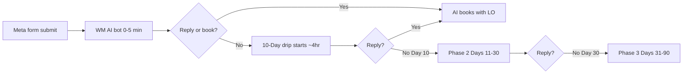

# Lead Nurture Playbook — Waiz Meta Stack

> **Application layer** — how Waiz runs automated nurture for **Meta instant-form leads**.  
> **Principles** (why nurture matters, four pillars, beliefs, manual cadence): [Nurture Framework](playbook-nurture-framework.md).  
> **North star:** Turn cold Meta leads into booked conversations through education-first automated follow-up — not pressure.

## Purpose

Define **how Waiz implements** nurture for Meta RM leads: bot → drip → AI booking, phase cadence, GHL routing, and CS quality bar. **Do not duplicate** universal follow-up principles — those live in the [Nurture Framework](playbook-nurture-framework.md).

## Scope

| Included | Excluded |
|----------|----------|
| Waiz nurture stack: bot → drip → AI booking | Why follow-up is sales, RM psychology (→ [Nurture Framework](playbook-nurture-framework.md)) |
| Four-pillar **Waiz implementation** for Meta | Pillar definitions and universal rules (→ framework § Four pillars) |
| Phase cadence (Days 1–90), routing, exit conditions | Manual dial, BAMFAM, reactivation (→ framework §2–4 + linked scripts) |
| GHL decision rules and CS metrics | Full email/SMS copy (→ [10-Day RM Drip](10-day-rm-drip-campaign.md)) |
| RM compliance + outcome-first standards for automated touches | Speed-to-lead bot logic (→ [How WM AI Bot Works](../crm-architecture/how-wm-ai-bot-works.md)) |

## Owner

Client Success (build + QA). LO approves voice-sensitive lines and composite stories.

## Trigger

Use this playbook when:

- Onboarding a client who will receive Meta form leads
- Building or auditing the **Waiz automated** nurture workflow in GHL
- Client asks "what happens after someone fills out my form?"
- CS diagnoses low reply or show rates on the **automated** sequence

For coaching on manual follow-up or "leads are ghosting," start with [Nurture Framework](playbook-nurture-framework.md).

## Inputs

- Meta instant form live and tagged `meta`
- [CRM Infrastructure](../crm-architecture/crm-infrastructure.md) configured
- WM AI bot active for 0–5 minute speed-to-lead
- LO custom values: `{{user.first_name}}`, setter/assistant display name
- Optional: `form_intent` from Meta form for segment routing

## Outputs

- Lead replies → exits all drips → AI/Closebot books with LO
- No reply by Day 10 → Phase 2 (Days 11–30)
- No reply by Day 30 → Phase 3 (Days 31–90)
- Appointment booked → nurture off; appointment reminders only

## Waiz implementation — four pillars

Pillar definitions and universal rules: [Nurture Framework — Four pillars](playbook-nurture-framework.md#the-four-pillars-universal).

| Pillar | Waiz implementation | LO action |
|--------|---------------------|-----------|
| **Availability** | Instant Meta form; thank-you path clear; AI offers booking in first minutes | Keep calendar slots open; confirm booking link weekly |
| **Speed** | WM AI bot: 0–5 min; first drip touch ~4 hrs after form | Respond personally if lead replies to SMS/email — hot lead |
| **Personalization** | Intent routing on `form_intent`; LO assistant voice; outcome-first copy | Approve LO voice; match form promise |
| **Volume** | ~18 touches Days 1–10; 8 Days 11–30; 6 Days 31–90 | Trust 90-day arc; don't stop at Day 3 on silence alone |

Outcome-first language: [10-Day RM Drip — Outcome-first language](10-day-rm-drip-campaign.md#outcome-first-language-use-vs-avoid). Compliance: [RM Compliance Guardrails](../reverse-mortgage-dna/rm-compliance-guardrails.md).

---

## Waiz nurture stack (execution order)

| Stage | Doc | Owner |
|-------|-----|-------|
| Principles | [Nurture Framework](playbook-nurture-framework.md) | CS / Education |
| Lifecycle context | [Fulfillment Lead Lifecycle](../fulfillment-lead-lifecycle.md) | CS |
| Speed-to-lead + booking | [How WM AI Bot Works](../crm-architecture/how-wm-ai-bot-works.md) | Ops |
| Primary + long-term copy | [10-Day RM Drip Campaign](10-day-rm-drip-campaign.md) | CS |
| SMS-only intent path | [RM iMessage Intent Drip (7-Day)](rm-imessage-intent-drip-7day.md) | CS |
| Alternate sequence | [RM Lead Nurture Drip Sequence](rm-lead-nurture-drip-sequence.md) | CS |

---

## Phase summary

| Phase | Days | Touches | Goal |
|-------|------|---------|------|
| **Primary** | 1–10 | ~18 (email + SMS) | Educate, preempt objections, earn reply |
| **Long-term A** | 11–30 | 8 | Deeper education, lighter CTA pressure |
| **Long-term B** | 31–90 | 6 | Stay top-of-mind until ready or exit |

Full cadence, themes, and copy: [10-Day RM Drip Campaign](10-day-rm-drip-campaign.md).

---

## Decision rules

| Condition | Action |
|-----------|--------|
| Any inbound reply (any channel) | Stop all drip workflows → AI/responder books appointment |
| Appointment booked | Remove from nurture; appointment reminders only |
| `STOP` / unsubscribe | Remove immediately; do not re-add |
| Day 10, no reply | Enroll Phase 2 (Days 11–30) |
| Day 30, no reply | Enroll Phase 3 (Days 31–90) |
| Lead source ≠ Meta | Do not use Meta-specific Day 8 copy; confirm sequence variant with CS |
| Intent unknown | Use universal opener lines in drip doc |

---

## Quality bar

- **Voice:** LO's assistant reaches out — personal, educational, not corporate blast.
- **Frame:** Outcome-first per [Doctrine RM Marketing](../reverse-mortgage-dna/doctrine-rm-marketing.md).
- **Compliance:** [RM Compliance Guardrails](../reverse-mortgage-dna/rm-compliance-guardrails.md) on every touch.
- **Stories:** Carol/Ruth/Tom-style composites — LO-approved or labeled internal composite.
- **Meta leads:** Acknowledge form source Day 1; address scam/social-media fear by Day 8.

---

## Metrics

| Metric | Target direction | Notes |
|--------|------------------|-------|
| Speed-to-lead (bot first message) | < 5 min | Bot KPI |
| Reply rate (Days 1–10) | Trend up vs baseline | By client cohort |
| Cost per booked call | Down | Nurture supports show rate |
| Show rate | ≥ team benchmark | After book, separate workflow |
| Unsubscribe rate | Stable / low | Spike = tone or frequency issue |

Formal KPI definitions: [Fulfillment Constraint Diagnosis KPI Standards](../client-success/fulfillment-constraint-diagnosis-kpi-standards.md).

---

## Related docs

### Principles (do not duplicate here)

| Doc | Role |
|-----|------|
| [Nurture Framework](playbook-nurture-framework.md) | **Parent** — why, pillars, beliefs, cadence, reactivation |
| [LO Lead Dialing SOP — RM](sop-lo-lead-dialing-rm.md) | Manual dial execution |
| [BAMFAM Playbook — RM](../client-sales/playbook-bamfam-rm.md) | Book next step on the phone |
| [Lead Nurture — Course Material](../course-material/lead-nurture-playbook.md) | Client education hub |

### Execution (copy + GHL)

| Doc | Role |
|-----|------|
| [10-Day RM Drip Campaign](10-day-rm-drip-campaign.md) | Primary execution — copy, GHL, phases |
| [RM iMessage Intent Drip (7-Day)](rm-imessage-intent-drip-7day.md) | Intent-segmented SMS path |
| [How WM AI Bot Works](../crm-architecture/how-wm-ai-bot-works.md) | Pre-drip speed + booking |

## Open questions

- [ ] Confirm default assistant display name pattern across all client snapshots
- [ ] Standard reply-rate benchmark for Meta RM clients at Day 30
- [ ] When to use 7-day iMessage path vs email+SMS 10-day path (decision tree for CS)
