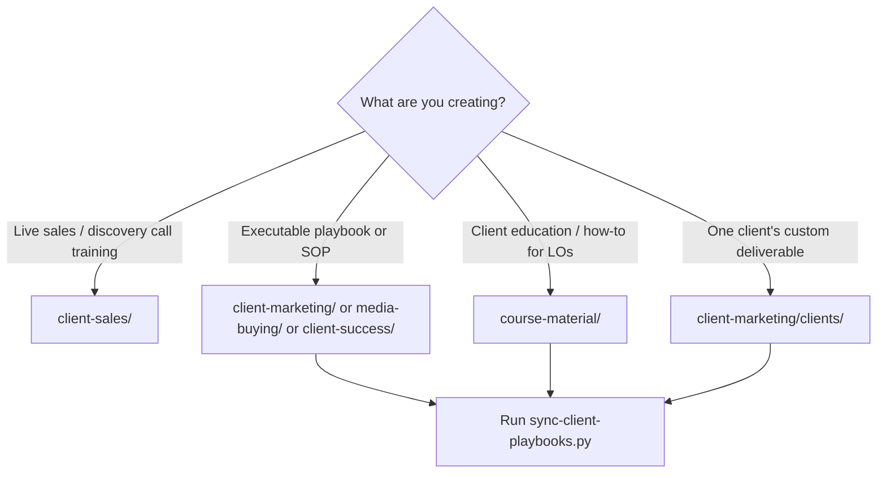

# Client Playbooks

**Start here** when creating playbooks, SOPs, or training for paying loan officer clients.

| Asset | Purpose |
|-------|---------|
| [Catalog (auto-index)](catalog.md) | Every indexed playbook, SOP, and training doc |
| [Playbook format spec](PLAYBOOK-FORMAT.md) | **Section order + two-layer rules** |
| [Shareability boundaries](../shareability-boundaries.md) | **LO course vs DFY fulfillment — what not to leak** |
| [Shareability checklist](SHAREABILITY-CHECKLIST.md) | Pre-publish audit for prospect course modules |
| [catalog.yaml](catalog.yaml) | Methodology pools, topic groups, per-doc overrides |
| [Playbook template](../../templates/client-playbook-template.md) | Copy-paste frontmatter + structure |
| [Nurture Framework](../client-marketing/playbook-nurture-framework.md) | Principles — lead nurture example |
| [Lead Nurture Playbook — Waiz Meta Stack](../client-marketing/playbook-lead-nurture.md) | Application layer example |
| [Course material](../course-material/README.md) | Client education layer |

Sync after changes: `python scripts/sync-client-playbooks.py`

---

## Where to put a new doc



| Layer | Folder | Use when |
|-------|--------|----------|
| **Canonical** | `../client-marketing/`, `../client-sales/`, `../media-buying/`, `../client-success/`, `../onboarding/` | Steps, copy libraries, rules — source of truth |
| **Course material** | `../course-material/` | Client-facing education; **link** to canonical, do not duplicate ops copy |
| **Client instance** | `../client-marketing/clients/` | Per-client delta only (names, market, approved variants) |

Read [Waiz vs client marketing boundaries](../waiz-vs-client-marketing-boundaries.md) and [shareability boundaries](../shareability-boundaries.md) before filing.

**Prospect LO course:** only `shareability: lo-course` docs in lesson bodies. Waiz DFY stack → gated appendix or client portal.

---

## Create a new playbook (5 steps)

1. **Check the [catalog](catalog.md)** — avoid duplicating an existing doc.
2. **Copy** [client-playbook-template.md](../../templates/client-playbook-template.md) or duplicate a similar playbook.
3. **Scan methodology** — read `catalog.yaml` → `methodology_pools`. Link existing techniques via `methodology_sources:` in frontmatter. If you invent a reusable technique, the agent will ask whether to update the knowledge base.
4. **Save** in the correct folder with `status: draft`.
5. **Sync:** `python scripts/sync-client-playbooks.py`

Use [client-playbook-creator skill](../../.claude/skills/client-playbook-creator/SKILL.md) for the full interview → build → sync workflow. Use [sop-builder](../../.claude/skills/sop-builder/SKILL.md) for internal team SOPs only.

---

## Frontmatter quick reference

```yaml
artifact_type: playbook       # playbook | sop | script | guide | training
audience: [client]            # client | team
content_layer: canonical      # canonical | course-material | client-instance
product: reverse-mortgage     # reverse-mortgage | dscr | shared
delivery_group: lead-nurture  # see catalog.yaml delivery_groups
methodology_sources:
  - docs/acquisition/sales/objection-handling-hub.md
canonical_parent: ...         # course-material wrappers only
portal_url:                   # optional live client portal link
client_delivery: true         # include docs outside client-fulfillment/
```

---

## Content layers

| Layer | Meaning |
|-------|---------|
| `canonical` | What Waiz and clients execute against — one source of truth |
| `course-material` | How we teach it to clients — pedagogy, examples, checkpoints |
| `client-instance` | What changed for one client — delta only |

**Rule:** If the same workflow exists in canonical ops, course material **links** to it — never maintain two copies of steps or copy libraries.

---

## Methodology from the rest of the OS

Team training, acquisition docs, company DNA, and skills are **pull sources**, not separate playbooks.

- Pools live in [catalog.yaml](catalog.yaml) → `methodology_pools`
- Reference in your playbook: `methodology_sources:`
- New reusable technique → agent asks: update KB / add to pool / keep local only

---

## Publish to clients

| Channel | When |
|---------|------|
| **GitHub `docs/`** | Always — canonical source of truth |
| **Course material folder** | Client education modules |
| **Google Doc** (per client) | [team-doc-translate](../../.claude/skills/team-doc-translate/SKILL.md) for DFY deliverables |
| **Team Drive** | Internal team copies only — [team-doc-publish](../../.claude/skills/team-doc-publish/SKILL.md) |

---

## Related

- [Fulfillment Operating System](../fulfillment-operating-system.md)
- [Client marketing](../client-marketing/README.md)
- [Client sales](../client-sales/README.md)
- [SOURCE-OF-TRUTH](../../SOURCE-OF-TRUTH.md)
