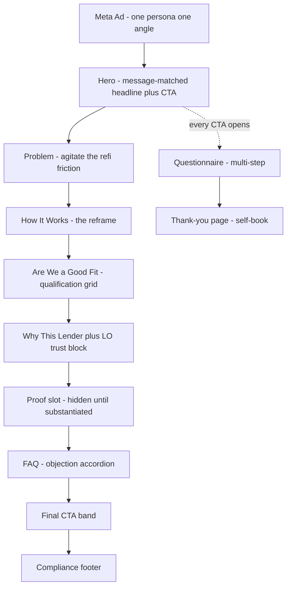

# DSCR Lander Build Pack

> **DRAFT — REFINANCE ONLY · BUSINESS-PURPOSE · GENERIC TEMPLATE.** The buildable, front-to-end spec
> for the DSCR Meta-ad landers: two split-testable page designs (Lander A — number-free mechanism;
> Lander B — specs-forward), the multi-step Perspective questionnaire, the thank-you page, the test
> plan, and the build checklist. Copy sources stay canonical in
> [DSCR Landing Page And VSL Copy](dscr-landing-and-vsl.md) and
> [DSCR Funnel Form Spec](dscr-funnel-form-spec.md) — this doc assembles them into pages a builder
> can ship in Perspective without guessing. All copy passes
> [DSCR Compliance Guardrails](dscr-compliance-guardrails.md).
>
> **Launch gates:** (1) Lander B may **not** receive traffic until every `[pricing-sheet: …]` token is
> filled from the approved pricing sheet / active lender program. (2) Proof slots ship empty (section
> hidden) until real, substantiated results exist. (3) Consent and footer wording confirmed with counsel.

## Purpose

Give the funnel builder one document that specifies everything on the page — section order, layout
direction, final copy, button behavior, form logic, tracking — for both DSCR lander variants, so the
build matches the strategy and nothing gets invented at build time.

## Scope

The Meta-ad click destination: two Perspective landers (A and B), the shared multi-step questionnaire,
the thank-you page, the A/B test sequence, and the Perspective/GHL/pixel build checklist. Generic LO
template with placeholder tokens (`[COMPANY]`, `[LO_NAME]`, `[NMLS_ID]`, `[HEADSHOT]`, etc.) swapped
per client. Does not cover ads (Phase 1) or nurture (Phase 3).

## Trigger

Building or revising the DSCR lander for a client launch; starting the lander split test.

## Inputs

- Offer, CTA ladder, voice: [DSCR Offer And Funnel Map](dscr-offer-and-funnel-map.md)
- Headline bank + section copy source: [DSCR Landing Page And VSL Copy](dscr-landing-and-vsl.md)
- Questionnaire questions + DQ logic: [DSCR Funnel Form Spec](dscr-funnel-form-spec.md)
- Beachhead + angle priority: [DSCR GTM And Positioning Brief](dscr-gtm-positioning-brief.md)
- Product mechanics (for Lander B structure): [Intelligence DSCR Product](intelligence-dscr-product.md)
- Build steps: [Perspective Funnel Setup SOP](../media-buying/perspective-funnel-setup-sop.md)

## Outputs

- Two published Perspective landers + questionnaire + thank-you page, integrated to the DSCR Snapshot,
  pixel-verified, ready for the Wave 1 test.

## Quality Bar

- Align with [Identity Core](../../company/doctrine-identity-core-april-26.md) and [SOURCE-OF-TRUTH](../../SOURCE-OF-TRUTH.md).
- Refinance only · business-purpose · no guarantees · message-matches the ad that drove the click.
- Lander A: zero numbers. Lander B: numbers only from `[pricing-sheet: …]` tokens, with "from / up to /
  as fast as" qualifier wording — never flat claims.
- Operator-to-operator tone (numbers-literate peer), never consumer-relief tone.

## Operating Content

### 0. Shared page architecture

Both landers use the same skeleton; B adds the spec blocks. Every CTA button on either page opens the
same questionnaire (§3). One conversion action per page — no nav menu, no outbound links above the
footer.

**Design direction (both landers):**

- **Look:** clean financial-operator aesthetic — generous whitespace, one accent color from client
  brand, real-estate photography only if it reads "rental portfolio," not "dream home." No stock
  handshake photos.
- **Mobile-first:** 80%+ of Meta traffic is mobile. Hero headline ≤ 9 words visible without scroll;
  CTA button visible in the first viewport; sticky bottom CTA bar on mobile after the user scrolls
  past the hero.
- **CTA repetition:** hero → after mechanism → after fit grid → final band. Same label everywhere
  (don't make the user re-decide).
- **Speed:** compress images; no autoplay video on A (VSL optional embed is click-to-play).

---

### 1. Lander A — "Mechanism" (number-free · ships now)

The control lander. Sells the reframe — **the property qualifies itself** — with zero pricing. Two
hero swaps message-match the two Wave 1 ad angles; everything below the hero is shared.

#### 1.1 Hero (two message-match swaps)

Layout: full-width, headline + subhead + CTA left (or centered on mobile), LO/brand mark top-left,
no nav. Optional background: subtle photo of a small rental property / duplex, heavily darkened.

**Swap A1 — Self-Employed / Write-Off (beachhead — pairs with ad angles 1, 7, 8)**

- **Eyebrow:** DSCR Refinance — For Rentals You Already Own
- **Headline:** Refinance on the Rent, Not Your Tax Returns.
- **Subhead:** A DSCR refinance qualifies on your property's rental income — not your W-2, pay stubs,
  or write-off-heavy returns. If the rent covers the payment, you may have options.
- **CTA button:** See If My Property Qualifies
- **Under-button microcopy:** Takes about a minute. No tax returns. No obligation.

**Swap A2 — Balloon / Hard-Money Exit (urgency — pairs with ad angle 3)**

- **Eyebrow:** DSCR Refinance — Exit Before the Balloon
- **Headline:** Refinance Out of Hard-Money — Before the Balloon Hits.
- **Subhead:** Exit your bridge or balloon note into a long-term DSCR loan that qualifies on the
  property's rent — not your income docs.
- **CTA button:** Map My Exit
- **Under-button microcopy:** Takes about a minute. No tax returns. No obligation.

> **Message-match rule:** the ad's angle decides the swap. Never send a balloon-urgency ad to the
> write-off hero or vice versa — run them as two Perspective funnels (or two variant pages) with
> distinct URLs/UTMs.

#### 1.2 Trust strip (directly under hero)

Thin horizontal band, icon + short phrase, no numbers:

`No W-2s or Tax Returns` · `Close in Your LLC` · `No Property-Count Cap` · `Cash-Out Available` · `Built for Investors`

#### 1.3 Problem (agitate)

Layout: short copy block, max 3 sentences, optionally beside a simple illustration of a "DENIED"
conventional-refi stamp concept.

**Header:** Conventional Lenders Are Looking at the Wrong Thing.

**Body (Swap A1 emphasis):** You've built real cash flow across your rentals — and the bank still says
no. Write-offs wreck your DTI. Property-count caps block the next refi. You're re-documenting your
whole life for a property that already pays for itself.

**Body (Swap A2 emphasis):** That bridge loan did its job — but the clock is running, the rate is
eating your cash flow, and a conventional refinance is too slow or won't qualify you. The maturity
date isn't waiting for underwriting to catch up.

#### 1.4 How it works (the mechanism — 4 cards)

Layout: 4 icon cards, 2×2 on mobile, single row on desktop. Header above:

**Header:** The Property Qualifies Itself.
**Intro line:** DSCR stands for Debt-Service-Coverage Ratio — a simple idea: if the rental's income
covers the payment, the property can carry the loan.

| Card | Title | Body |
|------|-------|------|
| 1 | Qualify on the property | Underwriting looks at the rental's income — not your personal income, DTI, or tax returns. |
| 2 | No income docs | No W-2s, no pay stubs, no tax returns. The lease and the rent do the talking. |
| 3 | Built for how investors operate | Close in your LLC or entity. Each property stands on its own income — no conventional property-count ceiling. |
| 4 | Refinance with purpose | Cash out trapped equity, stabilize the payment, or exit a balloon into a long-term loan. |

**CTA repeat (button under cards):** See If My Property Qualifies

#### 1.5 "Are we a good fit?" (qualification grid — number-free)

Borrowed structure from the strongest competitor pages: a candid who-this-is-for grid. It pre-qualifies
honestly and raises form quality. Layout: 2-column checklist, green check icons.

**Header:** Is a DSCR Refinance a Fit for You?
**Intro:** This program is built for a specific investor. You're likely a fit if:

- You **already own** the investment property — this line is refinance only
- The property is a **rental** (long-term, 2–4 unit, condo, townhome, or short-term rental)
- It's **rented or producing income** — the rent is what qualifies it
- You want to **cash out, stabilize the payment, exit a balloon, or move it into an LLC**
- It's **not the home you live in** — investment / non-owner-occupied only

**Honesty line (below grid):** Not a fit? We'd rather tell you in one minute than waste your week.
The questionnaire screens for it.

**CTA repeat:** See If My Property Qualifies

#### 1.6 Why this lender + LO trust block

Layout: split section — copy left, LO headshot + credentials card right.

**Header:** A Lender Who Doesn't Need DSCR Explained to Them.
**Body:** We work with real-estate investors all day. We talk like investors, underwrite like
investors, and close when we say we will — no re-explaining your entity structure, your STR income,
or why your tax returns look the way they do.

**LO card:** `[HEADSHOT]` · **Meet `[LO_NAME]`** · `[LO_BIO — 2–3 sentences, investor-credibility
focused]` · `[COMPANY]` · NMLS `[NMLS_ID]`

#### 1.7 Proof slot (hidden until substantiated)

Placeholder section, **toggled off at launch**. When real proof exists: 2–3 short investor outcomes
(situation → what we did → outcome), names/photos with permission, no invented numbers. Never use
template lorem-ipsum or borrowed testimonials (the example page we studied ships placeholder Latin —
that's the trust-killer we're avoiding).

#### 1.8 FAQ (objection accordion)

Layout: accordion, closed by default. Sourced from [ICP objections](intelligence-icp-dscr.md):

1. **Do I need to show tax returns or W-2s?** — No. Qualification is based on the property's rent
   versus its payment, not your personal income.
2. **Can I refinance in my LLC?** — Most programs allow entity vesting. For how it fits your tax and
   liability structure, talk to your CPA or attorney — we'll handle the lending side.
3. **Isn't the rate higher than conventional?** — Typically, yes — that's the trade for no income
   docs and entity flexibility. The real comparison is the cost of trapped equity or a maturing
   balloon. We'll run your scenario honestly.
4. **Will it close before my balloon is due?** — Doc-light underwriting is built for speed, and in
   many cases closes faster than conventional. We'll map your timeline on the call — no guarantees,
   just a straight answer.
5. **Does my property even qualify?** — That's exactly what the questionnaire checks: the rent, the
   balance, and the basics. Takes about a minute.
6. **What if my property doesn't cash-flow?** — If the rent doesn't cover the payment, most programs
   won't fund it — and we'll tell you that up front instead of stringing you along.

#### 1.9 Final CTA band

Full-width accent-color band:

- **Header:** See What Your Property Qualifies For — On Its Own Income.
- **Sub:** About a minute. No tax returns. No obligation. If it doesn't pencil, we'll tell you.
- **CTA button:** See If My Property Qualifies *(Swap A2: Map My Exit)*

#### 1.10 Compliance footer (both landers + thank-you)

- `[COMPANY]` · `[LO_NAME]`, NMLS `[NMLS_ID]` · `[ADDRESS]` · `[PHONE/EMAIL]`
- **Business-purpose disclosure:** "For investment (non-owner-occupied) property only. Business-purpose
  financing. Not a commitment to lend; all loans subject to underwriting and property qualification."
  *(confirm final wording with counsel)*
- Privacy policy + terms links. No state list displayed — licensed-state gating is internal (§3).

---

### 2. Lander B — "Specs-Forward" (savvy-investor · gated on pricing sheet)

Same skeleton as A; adds the spec blocks sophisticated investors scan for. Models what works on the
Investor Capital Lending page (stat strip, loan-highlights table, requirements grid) while fixing its
failures (placeholder testimonials, purchase framing, consent wall mid-page). **Every number is a
`[pricing-sheet: …]` token — the page cannot take traffic until all tokens are filled from the
approved pricing sheet / active lender program and counsel signs the qualifier wording.**

#### 2.1 Hero + stat strip

Hero copy: same swaps as A (1.1). Directly beneath, a 5-stat strip — large numeral, small label:

| Stat | Value | Required qualifier wording |
|------|-------|---------------------------|
| Rate | `[pricing-sheet: rate-from]` | "Rates from* — subject to credit, DSCR, LTV, and program" |
| LTV | `[pricing-sheet: max-ltv-cashout]` | "Up to — cash-out; program-dependent" |
| Close time | `[pricing-sheet: close-days]` | "As fast as — typical, not guaranteed" |
| Loan range | `[pricing-sheet: loan-min]`–`[pricing-sheet: loan-max]` | — |
| Structures | `[pricing-sheet: terms]` (e.g., 30-yr fixed / IO options) | "Program-dependent" |

Asterisk note in small text under the strip: *"Illustrative program terms, subject to underwriting and
property qualification. Not a commitment to lend or a rate quote."*

#### 2.2 "What is DSCR?" explainer (instead of an interactive calculator)

**Recommendation: no interactive calculator in v1.** Perspective isn't built for it, a wrong/divergent
calculation is a UDAP risk, and a calculator gives the visitor a reason to self-disqualify on bad
inputs instead of entering the questionnaire. Replace it with a static visual:

- **Header:** The Only Math That Matters Here.
- **Visual:** `DSCR = Monthly Rent ÷ Monthly Payment (P&I + taxes + insurance + HOA)` — rendered as a
  simple fraction graphic.
- **One line:** If the rent covers the payment, the property may qualify — at any income, with any
  tax return. The questionnaire checks it in under a minute.
- **CTA:** Run My Property's Numbers *(opens questionnaire — the form IS the calculator experience)*

#### 2.3 Loan highlights table

Two-column "term · value" table, mirroring the competitor pattern investors scan:

| Term | Value |
|------|-------|
| Transaction types | Refinance only — rate/term and cash-out |
| Experience required | `[pricing-sheet: experience]` |
| Minimum credit score | `[pricing-sheet: min-fico]` |
| Max LTV (rate/term) | `[pricing-sheet: max-ltv-rt]` (up to) |
| Max LTV (cash-out) | `[pricing-sheet: max-ltv-cashout]` (up to) |
| Reserves | `[pricing-sheet: reserves]` |
| Rate | `[pricing-sheet: rate-from]` (from*) |
| Loan amounts | `[pricing-sheet: loan-min]` – `[pricing-sheet: loan-max]` |
| Structures | `[pricing-sheet: terms]` |
| Property types | `[pricing-sheet: property-types]` (e.g., SFR, 2–4 unit, condo, townhome) |
| Vesting | LLC / entity allowed (program-dependent) |
| Occupancy | Non-owner-occupied investment property only |
| Prepayment penalty | `[pricing-sheet: ppp]` |

#### 2.4 Qualification requirements grid

Same "Are we a good fit?" section as A (1.5), with the number-free bullets replaced by tokenized
thresholds (credit floor, reserves) where the pricing sheet provides them.

#### 2.5 Remaining sections

Why-this-lender, proof slot, FAQ, final CTA band, footer: identical to A (1.6–1.10). FAQ item 3
(rate objection) may reference the tokenized "rates from" figure once filled.

#### 2.6 Lander B launch gate (checklist)

- [ ] Every `[pricing-sheet: …]` token filled from the approved pricing sheet / active lender program
- [ ] All figures carry "from / up to / as fast as / program-dependent" qualifiers — zero flat claims
- [ ] Illustrative-terms disclaimer present under the stat strip
- [ ] Counsel has reviewed the stat strip + table wording
- [ ] Client's licensed-state list confirmed for the figures shown

---

### 3. Questionnaire (shared by both landers — Perspective multi-step)

The canonical disqualify-first set from [DSCR Funnel Form Spec](dscr-funnel-form-spec.md), sequenced
one question per Perspective step. Progress bar on; back navigation on; every step has a single
tap-target answer list (no free text until contact step).

**Opening frame (form intro screen, optional):**
- **Header:** Let's See What Your Property Qualifies For.
- **Sub:** Seven quick questions — about the property, not about you. No tax returns, no credit pull.

| Step | Question (on-screen wording) | Options | Logic |
|------|------------------------------|---------|-------|
| 1 | What best describes this property? | Investment or rental property · Second / vacation home · Primary residence (where I live) | Primary or Second home → **DQ exit A** |
| 2 | What state is the property in? | US state dropdown | Unlicensed state → flag `state_dq` internally; lead still captured, routed to DQ pipeline (no on-screen rejection) |
| 3 | What's your estimated credit score? | 740+ · 700–739 · 660–699 · 620–659 · Below 620 | Below 620 → **DQ exit B** (soft) |
| 4 | Roughly what's the property worth today? | Ranges per form spec | Under minimum → flag `weak_value` |
| 5 | About how much do you still owe on it? | Ranges (incl. "Free and clear") | Paired with 4 = equity sense; >~75% of value → flag `no_cashout_room` |
| 6 | How much do you have in reserves (cash you could leave untouched)? | $100k+ · $50k–100k · $25k–50k · Under $25k · No reserves | "No reserves" → flag `reserves_flag` |
| 7 | Roughly what does it rent for per month? | Ranges per form spec | Rent below likely payment → flag `dscr_risk` |
| 8 | Contact: First name · Last name · Email · Phone + consent checkbox | — | Submit fires `lead` |

**Microcopy per step (keeps momentum, pre-empts hesitation):**

- Step 1: *"DSCR financing is for investment property only — this just confirms fit."*
- Step 3: *"A range is fine — this is not a credit pull."*
- Step 4–5: *"Ballpark is perfect. This gives us your rough equity picture."*
- Step 6: *"Lenders like to see a cushion — months of payments, not a down payment. This is a refinance; there's no down payment."*
- Step 7: *"This is the number that does the qualifying."*

**DQ exits (friendly, on-brand):**

- **Exit A (occupancy):** "Thanks for your honesty — this program is only for investment
  (non-owner-occupied) property, so it isn't a fit for the home you live in. If you also own a rental,
  start over with that property." *(Restart button.)*
- **Exit B (credit, soft):** "Based on that range, most DSCR programs won't be a fit right now — we'd
  rather tell you straight than waste your time. If your score improves, come back and run it again."
  *(No contact capture; no false hope.)*

**Consent checkbox (final step — required; confirm wording with counsel):**
"I agree to be contacted by `[COMPANY]` and its assistant by call, text, and email about my refinance
inquiry. Msg/data rates may apply. Reply STOP to opt out."

**Submit button:** Show My Options
**On submit:** fire Meta `lead` event (final-step button click) → push to GHL DSCR Snapshot → Laura
speed-to-lead (Phase 3).

**GHL field mapping (create the 4 new fields in the DSCR Snapshot BEFORE integrating):**

| Step | GHL field | Status |
|------|-----------|--------|
| 1 Property use | `property_use` | **Create** |
| 2 State | `state` | Exists |
| 3 Credit range | `credit_score_range` | **Create** |
| 4 Value | `property_value` | Exists |
| 5 Balance | `est_balance` | Exists |
| 6 Reserves | `reserves_liquidity` | **Create** |
| 7 Rent | `monthly_rent` | **Create** |

---

### 4. Thank-you page

Four jobs: confirm, capture peak intent with self-book, prime for the call, pre-empt the ghost.
(Expands the spec in [DSCR Landing Page And VSL Copy](dscr-landing-and-vsl.md).)

- **Headline:** You're In. Here's What Happens Next.
- **Subhead:** `[LO_NAME]`'s team is reviewing your property now. **Laura** — `[LO_NAME]`'s assistant —
  will text you within a few minutes to grab a couple of details and find a time.
- **Primary CTA — self-book (calendar embed above the fold):**
  - "Don't want to wait for the text? Grab a time now." → **[Book Your Refinance Review]**
- **Have these handy for the call (3-item checklist):**
  - Rough monthly rent on the property
  - Your current loan balance (ballpark is fine)
  - What you'd do with the cash you pull out *(or: your balloon's maturity date — Swap A2 funnels)*
- **What to expect block:** "A straight look at what your property qualifies for on its own rental
  income — no tax returns, no obligation. If the numbers work, `[LO_NAME]` maps your options. If they
  don't, you'll hear that too."
- **Trust block:** `[HEADSHOT]` + "Meet `[LO_NAME]`" bio (reuse 1.6 card) + proof slot (same gating
  as 1.7).
- **Footer:** identical compliance footer (1.10).

> The Laura mention is deliberate — it makes the first outbound text expected instead of cold, which
> protects reply rate and matches the Phase 3 nurture promise.

---

### 5. Test plan + build checklist

#### 5.1 Test sequence

Judged on **refi-ready CPL → booked → showed** per the
[DSCR KPI And Test Scorecard](dscr-kpi-and-test-scorecard.md) — never raw CTR or raw CPL.

| Wave | Test | What's live | Decision |
|------|------|-------------|----------|
| 1 | **Angle vs angle** (within Lander A) | A/Swap A1 (write-off) vs A/Swap A2 (balloon), each fed only by its matching ad angle | Winner = lower cost per refi-ready lead at acceptable book rate; let each cell spend ~2–3× target CPL before judging |
| 2 | **Lander A vs Lander B** (within winning angle) | Winning swap of A vs B with pricing tokens filled (gate 2.6 passed) | Does specs-forward lift form starts or lead quality enough to beat the control? |
| 3 | **On-page iteration** on the winner | Hero headline variants from the [headline bank](dscr-landing-and-vsl.md); CTA label; proof section once substantiated | One variable at a time |

**URL/UTM convention:** one Perspective funnel (or variant page) per cell with distinct slugs, e.g.
`/dscr-rent` (A1), `/dscr-exit` (A2), `/dscr-terms` (B). UTMs per
[Campaign Master Angles](dscr-campaign-master-angles.md) so the scorecard can split angle × lander.

#### 5.2 Build checklist (per [Perspective Funnel Setup SOP](../media-buying/perspective-funnel-setup-sop.md))

1. [ ] Duplicate the Perspective funnel template; rename for the DSCR client/cell
2. [ ] Brand: logo (transparent), accent color, footer with `[COMPANY]` / `[LO_NAME]` / NMLS / address —
   on every page including thank-you
3. [ ] Build Lander A sections per §1 (correct hero swap per cell); Lander B per §2 only after gate 2.6
4. [ ] Replace template form with the §3 questionnaire — step order, DQ exits, microcopy, consent
5. [ ] Create the 4 new GHL fields in the DSCR Snapshot, then activate the GHL integration, map all
   fields, add the entry tag
6. [ ] Activate Meta integration; pixel ID + access token; map `lead` to the final-step button click
7. [ ] Thank-you page per §4 with calendar embed connected to the LO's booking calendar
8. [ ] Submit a test lead end-to-end: pixel event fires → contact lands in DSCR Snapshot with all
   fields → Laura sequence triggers → calendar booking works
9. [ ] Publish to the DSCR domain/slug per cell; paste live URLs into the ClickUp client task
10. [ ] Pre-launch tracking checklist from the [KPI scorecard](dscr-kpi-and-test-scorecard.md) all green

---

### 6. Compliance pre-flight (run against this doc's copy)

Per [DSCR Compliance Guardrails §4](dscr-compliance-guardrails.md):

1. **Business-purpose framing only** — every section speaks to investment/income-producing property;
   the occupancy question hard-screens primary/second homes; the disclosure footer is on every page. ✓
2. **No invented numbers** — Lander A is number-free; Lander B carries only `[pricing-sheet: …]`
   tokens with mandated qualifier wording and an explicit traffic gate. ✓
3. **No guarantees** — copy uses "may qualify," "may have options," "in many cases," "typically";
   close-speed claims are qualified ("as fast as," "no guarantees, just a straight answer"). ✓
4. **Truthful/substantiated** — proof sections ship hidden until real results exist; no fabricated
   testimonials or funded-deal tables. ✓
5. **Licensed states + platform policy** — state gating is internal via the questionnaire (no public
   state list); Meta runs under the Financial Products & Services Special Ad Category. ✓
6. **No tax/legal advice** — LLC/entity items route to "talk to your CPA or attorney." ✓

**Outstanding counsel items before traffic:** consent-checkbox wording (§3), business-purpose footer
wording (§1.10), Lander B stat/table wording (§2.6), per-client licensed-state confirmation.

## Related Docs

- [DSCR Landing Page And VSL Copy](dscr-landing-and-vsl.md)
- [DSCR Funnel Form Spec](dscr-funnel-form-spec.md)
- [DSCR Offer And Funnel Map](dscr-offer-and-funnel-map.md)
- [DSCR GTM And Positioning Brief](dscr-gtm-positioning-brief.md)
- [DSCR KPI And Test Scorecard](dscr-kpi-and-test-scorecard.md)
- [DSCR Compliance Guardrails](dscr-compliance-guardrails.md)
- [Perspective Funnel Setup SOP](../media-buying/perspective-funnel-setup-sop.md)
