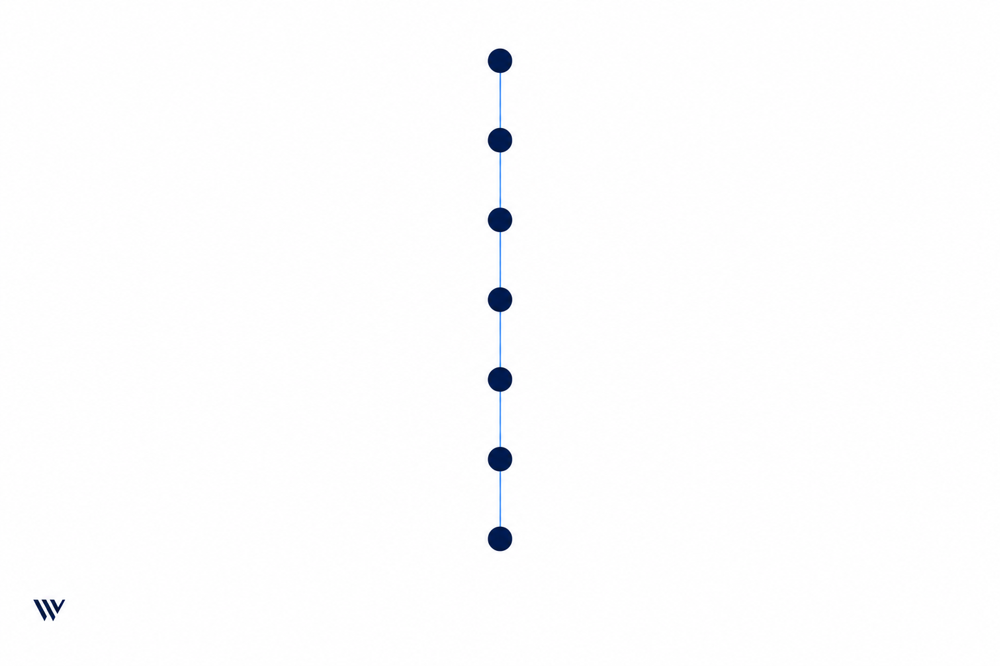
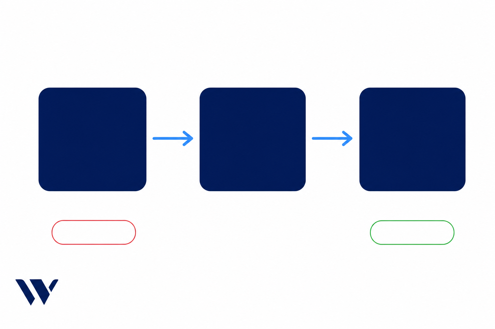

# DSCR Prospecting Playbook

> **North star:** The first 48 hours decide the file. Show up like an operator, book the call while the lead is still hot, and never hang up without the next step on the calendar.

This is the Waiz playbook for **DSCR clients who work their own leads** — no Waiz call center, no Laura, no setter pod. You (or your VA) are the system.

**Client PDF:** [DSCR Prospecting Playbook](assets/playbook-self-serve-nurture/DSCR-Prospecting-Playbook.pdf)

*Eight chapters. One system. The first 48 hours decide the file.*

## Purpose

Give the loan officer a Waiz-branded operating system for contact rate, conversation rate, speed, and BAMFAM — written for the DSCR investor, not the reverse-mortgage senior. The drip is the safety net. This playbook is the strategy.

## Scope

| Included | Excluded |
|----------|----------|
| Why this ICP is hotter and less patient than RM | Waiz call center / [Laura](dscr-nurture-and-booking-laura.md) — do not run both |
| Speed-to-lead and speed-of-response, with sourced data | Purchase, primary residence, RM voice |
| First-48-hour play, dial + text cadence | Full consult / close script → [Objection-Handling Guide](dscr-objection-handling-guide.md) |
| If/then response rules (including "they texted — call now") | GHL / bot build specs |
| BAMFAM rules and investor-tone word tracks | Invented rates, LTV, FICO, day-counts |
| Show-rate hygiene after the book | Post-consult nurture |
| How the drip supports you — not replaces you | Per-client custom sequences |

## Owner

Loan officer. A VA can run dials and texts. The LO owns calendar, speed, and whether a live conversation ends with a hold.

## Trigger

Use this playbook when:

- A paying DSCR client is **not** on the Waiz call center
- A new form / ad lead lands in the LO's CRM
- Contact rate or booking rate is weak and the diagnosis is follow-up, not ads
- You are installing or auditing the self-serve drip

## Inputs

- CRM the LO actually uses (GHL, Follow Up Boss, Lofty, or similar)
- Direct line the lead can save — preferably iMessage / a number that does not look like spam
- Live calendar with same-day and next-day slots
- Consent already captured on the form
- [Intelligence ICP DSCR](intelligence-icp-dscr.md) — who they are
- [DSCR Compliance Guardrails](dscr-compliance-guardrails.md) — ship gate on every line

## Outputs

- Every new lead gets a first human touch inside **5 minutes** when you are working (gold: under 60 seconds)
- Every live conversation that does not close now ends with a **calendar hold**
- Any inbound text is treated as a hand-raise — you **call**, you do not type a novel
- Drip is running as backup and **dies** the moment they reply or book
- CRM note + next step on every touch

## How Waiz thinks about this

Universal nurture science lives in the [Nurture Framework](../client-marketing/playbook-nurture-framework.md). Four pillars still apply: availability, speed, personalization, volume.

This playbook does not rewrite those pillars. It applies them to a **different human**.

| Pillar | RM default | DSCR self-serve |
|--------|------------|-----------------|
| Availability | Long trust cycle; family often joins | Short call, same week, respect the clock |
| Speed | Important | **The offer.** They will take the first competent person who shows up |
| Personalization | Education before pressure | Peer-to-operator. Name DSCR. Talk about *their* door |
| Volume | 5–12+ touches over weeks is normal | Front-load Days 1–2. After that you are chasing |

**Waiz line:** ads create the conversation. You capture it. If you are late, another broker is not.

---

# Chapter 01 — Why this ICP is different

These leads already own rentals. They think in cash flow, equity, and deadlines — write-offs killing DTI, a balloon coming due, idle equity sitting in a door. They are not buying a loan. They are buying a **better position on a property they already have**.

That changes follow-up.

| | Reverse mortgage | DSCR investor |
|--|------------------|---------------|
| Energy | Cautious, family in the loop, slow yes | Operator. Inbox is a deal flow |
| Time | Will research for weeks | Will give you 12 minutes if you earned it |
| Responsiveness | Silence on Day 3 is normal | They *do* reply — then they move on |
| What "hot" means | Peak interest after the form, then a long education arc | Peak interest is **minutes and the first two days** |
| What they punish | Pressure and jargon | Slowness and "just circling back" |
| Who they pick | The person they trust | The person who showed up first and sounded like they do this |

They opted in because something is live *right now* — a note, a refinance they cannot do at the bank, equity they want back to work. If you wait until Thursday to "work leads," that file is already talking to someone else.

**Rule:** treat every new DSCR lead like a bid that expires. Not with fake scarcity. With speed.

---

# Chapter 02 — The data (why speed wins)

*The heat is minutes 0–5 and Days 1–2. After that you are chasing.*

You do not need a speech. You need to believe the clock.

| Finding | What it means on your desk | Source |
|---------|----------------------------|--------|
| Contact inside **60 seconds** → about **391%** higher conversion | First touch is a sprint, not a "I'll hit them after this call" | Velocify |
| Companies that contact within **1 hour** are **7×** more likely to qualify the lead than those who wait another hour — and **60×** more likely than those who wait 24 hours | Same-day is not enough if you mean 6pm | Harvard Business Review |
| **78%** of customers buy from the company that responds first | You are not competing with "the market." You are competing with whoever texts them next | Lead Connect |
| **44%** of salespeople stop after the **first** attempt; average is **~1.3** attempts | Persistence is not annoying. Quitting is expensive | InsideSales.com / RAIN Group |
| Faster first contact → **fewer** total touches to convert | Speed is how you work *less* later | Same body of speed-to-lead research; see [Nurture Framework §1](../client-marketing/playbook-nurture-framework.md#data-backing-why-volume-and-speed-matter) |

Waiz read for DSCR: this ICP is **more** responsive than a senior RM lead, so the data hits harder. They will pick up. They will text back. They will also take the next broker's calendar link if you leave them on read.

**Litmus test:** if you are not hearing "that was fast" at least once a week, you are late.

Three speeds. Learn the names.

| Speed | Definition | Waiz standard |
|-------|------------|---------------|
| **Speed to first contact** | Opt-in → first call or text | **≤5 minutes** when you are working. Gold: under 60 seconds |
| **Speed to first appointment** | Interest → live conversation on the calendar | Same day, next day, or day after. **72 hours max** |
| **Speed of response** | They engage → you reply | Same hour. A text back is a **call**, not a typing contest |

---

# Chapter 03 — The first 48 hours

This is the file. Everything after Day 2 is recovery.

### Hour 0 — they just opted in

Do all three. Do not pick one.

1. **Call.** Now. From a number they can save.
2. **If no answer:** double-dial immediately. A lot of phones send call one to silence and let call two through.
3. **Voicemail + text in the same breath.** Who you are, that they asked about a DSCR refinance on a rental, one clear ask.

First SMS (adapt to your name; keep STOP on the first campaign text):

> {{first_name}} — {{lo_first_name}} here. Saw you came through on a DSCR refinance. I qualify these on the property's rent, not your tax returns. Got 10 minutes today? (Txt STOP to opt out)

Voicemail:

> {{first_name}}, {{lo_first_name}} — you asked about a DSCR refi on a rental. I can tell you in one short call whether the property even makes sense. I'll text you this number. Call or text me back.

### Rest of Day 1

| Window | Move |
|--------|------|
| +2–4 hours if no connect | Second double-dial. Different time of day. Text only if you did not already send one this block |
| Late afternoon / evening (quiet hours) | One more live attempt. Do not spam. Do not disappear |
| They reply | **Stop the drip. Call them.** Chapter 04 |

### Day 2

Morning pass. Evening pass. Text after the second miss if they have gone quiet.

This is still a **hot** lead. They remember the ad. They have not rebuilt their day around ignoring you yet.

### Day 3+

You are not done. You are no longer in the easy window. Cadence tapers (Chapter 05). The drip carries the hours you are on other calls (Chapter 08).

**What "on top of it" looks like**

- Fresh leads are the top of every queue. Not "after I finish this file."
- Calendar has same-day and next-day holes on purpose. Those holes are for new leads.
- Your VA can fire the first text. **You** own the first live conversation when they engage.
- After hours: text now, first call at 8am **their** time.

---

# Chapter 04 — How you respond

*They replied. You call. You book. You do not type a novel.*

This chapter is the operating system. Memorize the table. Use the lines.

### If / then

| If | Then | Why |
|----|------|-----|
| New lead lands while you are working | Call **and** text inside 5 minutes | Peak motivation is a timer |
| First call rings out | Double-dial, then VM + text | One ring is not a work ethic |
| They **text back** | **Call immediately.** Do not write a paragraph | A reply is a hand-raise. Calling is how you book |
| They answer and can talk | Run the call or pull them in now | Same-moment conversation is a 100% show |
| They answer and are busy | BAMFAM — two real slots, book before you hang up | "I'll circle back" is how DSCR files die |
| They already booked, you have a hole today | Pull the appointment forward | Sooner shows higher |
| They ask a question after booking | Reply the same hour. If it is meaty, call | Slow replies train them you are sloppy |
| After hours / quiet hours | Text now. Call at 8am their time | Do not go dark overnight on a Day-0 lead |
| STOP / unsubscribe | Kill everything. Honor it | Non-negotiable |
| They book | Kill the chase drip. Reminders only | Chapter 07 |

### They texted. Call them.

Do not do this:

> Hey! Thanks for getting back. I'd love to learn more about the property and see if a DSCR refinance might be a fit. What does your calendar look like next week?

Do this: **ring them.** If they do not pick up, one short text:

> Just called — easier to do this live. You around for 8 minutes?

If they insist on texting, one question, then the book:

> Got it. Is this a rental you already own that you want to refinance? I can look at it on a short call today — 11:30 or 4:00. Which is less annoying?

### First 15 seconds (they picked up)

Peer. Not closer-voice. Not "this is a courtesy call from the team."

> {{first_name}}, it's {{lo_first_name}} — you came through on the DSCR refinance. I don't want to waste your time. Is now a terrible moment?

If yes → BAMFAM. If no:

> Cool. Quick version: I look at rentals you already own. Qualification is the property's rent versus the payment — not your W-2. What prompted you to look at this?

Then shut up. They will tell you write-off, balloon, or idle equity. That is the call.

### Availability (you cannot book what you do not offer)

- Take calls the days and hours **investors** actually answer — early, lunch, late afternoon. Not only 10–2 Tuesday.
- Offer **two concrete times**, 15-minute increments if you can. "Whenever you're free next week" is how you lose.
- Inbound, outbound, and a booking link. Use all three. Walk them onto the calendar **while you are on the phone**. Do not text a link and pray.
- Same-day is the goal. Next day is fine. Day-after is the ceiling. Past 72 hours, treat it as an objection — not a preference.

---

# Chapter 05 — Contact rate and conversation rate

These are two different problems. Do not mix the medicine.

| Metric | What it is | If it is weak |
|--------|------------|---------------|
| **Contact rate** | They pick up or reply | Number health, speed, cadence, channel |
| **Conversation rate** | Once live, they stay and book | Script, respect for time, one clear ask |

### Contact — get them to engage

- **Local / trusted caller ID.** Unknown or spam-flagged numbers kill pickup. Rotate if you are getting voicemail-only.
- **iMessage when you can.** Blue bubbles read like a person. Green blasts read like a sequence.
- **Double-dial.** Always on the first two days.
- **Call, text, email.** Start on all three if you have them. **Continue where they answered.**
- **Short texts.** Two or three lines. Not a block.
- **Front-load Days 1–2.** Then taper. Do not diagnose the lead on touch one.

**Default cadence (self-serve, no call center)**

| When | Attempts |
|------|----------|
| Day 1 | Double-dial 3× across the day. VM + text on the first miss. Space the later attempts by a few hours |
| Day 2 | Double-dial morning and later. Text after the second miss |
| Days 3–4 | One call + one text per day |
| Days 5–7 | One touch per day (call or text, not both stacked) |
| After Day 7 | Drip + periodic manual re-touch. Stop calling like it is Day 1 |

Obey TCPA, quiet hours (~8am–7pm lead local), and your state's rules. Consent was on the form. This playbook does not create consent.

### Conversation — get them to stay

Once they are live, you are not "working a lead." You are an investor talking to an investor.

- One idea. One ask. The ask is a **short call on the property**, not an application.
- Name DSCR. Do not hide the product.
- Do not underwrite on the first text thread.
- If they are qualified and free now — take the meeting now.
- Notes every touch. A dial with no note did not happen.

Queue when you sit down to work leads:

1. Fresh (today)
2. Inbound replies (call these — do not "get to them")
3. Promised callbacks
4. Unreached, still inside the first week
5. Aged (different job)

---

# Chapter 06 — BAMFAM

*Free now → take the call. Busy → two real times. Never hang up empty.*

**BAMFAM** = Book A Meeting From A Meeting. You never end a live conversation with "I'll send some times" or "I'll follow up later."

On DSCR this matters more, not less. This ICP will not sit in limbo. If you leave the next step in no-man's-land, they take the next broker's slot.

Same method as [BAMFAM — RM](../client-sales/playbook-bamfam-rm.md). Different human. Different words.

### Rules

| Rule | Why |
|------|-----|
| No "I'll call you back" without a hold | Motivation dies in hours |
| Book inside 72 hours | Sooner shows. Prefer same day or next day |
| Confirm while you still have them | Day, time, timezone, number you will call from |
| Text the confirmation before you hang up | If they have to "watch for an email," you already lost |
| Pull forward when you can | Same-day talk is the best show rate you will ever get |
| Two real options, not an open calendar | Operators pick faster when you make the choice small |

If they push past 72 hours, that is an **obstacle to solve on this call** — not permission to book three weeks out and hope.

### Five outcomes (every live attempt)

| # | Outcome | Action |
|---|---------|--------|
| 1 | No answer | Cadence in Chapter 05 — not a BAMFAM moment |
| 2 | Unqualified / wrong product | Clean exit. Do not keep them on a fake calendar |
| 3 | **Qualified + free now** | Take the conversation now. Best show rate possible |
| 4 | **Qualified + pulled forward** | Move the existing slot earlier while they are on the line |
| 5 | **Qualified + confirmed** | Book the soonest honest slot. Confirm. Send the text |

### Word tracks (investor tone)

**They don't have time right now**

> Totally fine — I'm not going to keep you. Let's lock 12 minutes so we're not playing tag. I've got **tomorrow at 8:30** or **4:15**. Which is less painful?

Offer two concrete slots. Not "when are you free sometime?"

**They want you to "send times" or use the link**

> I can text the link — I'll do it right now while we're on. Easier if we just pick: **today at 5** or **tomorrow at 9**. I'll hold it so it doesn't disappear.

**Pull forward (they already booked)**

> {{first_name}}, {{lo_first_name}} — you've got us on **Thursday**. A slot opened **this afternoon at 3:30**. Want to knock the property out sooner so you're not carrying it all week?

**Anchor to what they already said**

> You said the balloon is the issue / the write-offs are killing the conventional file / the equity is just sitting there. If that's still true, the useful move is a short look at *this* property — **tomorrow morning or tomorrow at 5**. Which one?

**Confirm + save the contact**

> You're set for **Tuesday, 4:00 your time**. I'll call from this number. Save it as {{lo_first_name}} — DSCR so it doesn't look like spam. Texting the confirm now.

**"I'll think about it"**

> Fair. That's why the first call is short — your numbers, whether the property even belongs in a DSCR box. Hold **Wednesday at 11**. Cancel if it's not useful. Morning or afternoon better?

Do not argue. Do not pitch the loan. Book the look.

### Anti-patterns

| Don't | Do |
|-------|-----|
| "I'll follow up next week" | Book next week **now** — then try to pull it forward |
| Text a calendar link and hang up | Stay on until the slot is on both calendars |
| Book 10 days out as the default | Fight for ≤72 hours |
| Let a VA "circle back with times" after the call | The live call *is* the booking window |

---

# Chapter 07 — Show-rate hygiene

Booking is not the win. **Show** is the win. Investors no-show when the meeting feels optional or you went silent after the book.

### Right after they book

Text from a real phone:

> Locked: **{{day}}, {{time}} {{timezone}}** with me. I'll call you. If the property details are handy (address + rent), grab them — we'll go faster.

If they reply with a question — **same hour.** If the answer is longer than two sentences, call.

### Reminders

Say the automated ones are automated. People do not mind reminders. They mind being lied to.

| When | Who | What |
|------|-----|------|
| Immediately | You / CRM | Confirm time, your name, number or area code you will call from |
| 24 hours before | Automated | Same facts. Local timezone |
| 12 hours before | Automated | Short |
| 3 hours before | Automated | Short |
| Night before | You, real phone | One line. Human |
| Morning of | You, real phone | One line |
| 60 minutes prior | You, if they are flaky or high-intent | "Still good for :00?" |

Include the **area code you will call from**. Pickup roughly doubles when they recognize it.

### If they go quiet after booking

Do not wait for the slot to no-show you. Call. One time, day before or morning of:

> Still good for tomorrow at 4 — or do you want me to slide you to a time that actually works?

If they no-show: BAMFAM on the first connect. Do not send them back to the drip as if they were never booked.

---

# Chapter 08 — The drip (safety net, not the strategy)

The drip covers the hours you are on other calls, in a closing, or asleep. It does **not** replace Chapters 03–06.

**Rules**

- Day 1 of the drip is not a substitute for the 5-minute call. If you have no human speed-to-lead, Day 1 **is** the first text — send it the minute they land (quiet hours).
- **Any inbound reply → kill the drip.** Then Chapter 04: call them.
- **Any book → kill the drip.** Then Chapter 07.
- **STOP → kill immediately.**
- One sender identity. You. Not "the team," not Laura, not a bot pretending to be you.
- Do not run this next to [Laura](dscr-nurture-and-booking-laura.md).

**The file they paste into their CRM**

→ **[DSCR Cash-Out Drip — LO first person (12 touches + long tail)](dscr-cash-out-self-serve-crm-drip.md)**  
→ Client-delivery copy for Drive: [assets/playbook-self-serve-nurture/DSCR-Cash-Out-Drip.md](assets/playbook-self-serve-nurture/DSCR-Cash-Out-Drip.md)

Open it. Copy SMS into GHL / Follow Up Boss / Lofty. Map the tokens. Set exit on reply, book, and STOP. Assumes a **cash-out / pulling equity** ad angle — swap that phrase on Touches 1, 3, 7, and 12 if the ad is different.

Alternate (refinance-shaped 10-day): [10-Day DSCR Self-Serve CRM Drip](dscr-10-day-self-serve-crm-drip.md). Do not invent a third chase sequence.

---

## Decision rules (full board)

| Condition | Action |
|-----------|--------|
| Lead is fresh (0–48 hours) | You are in Chapters 03–04. Highest priority on the board |
| Lead is Day 3–7, no connect | Cadence in Chapter 05 + drip |
| Inbound text or missed call | Call now. Do not answer in a paragraph |
| Live, no time | BAMFAM (Chapter 06) |
| Live, time now | Take the meeting |
| Booked | Reminders only (Chapter 07) |
| No-show | Rebook on first connect. Do not restart Day-1 chase as if they were new |
| Wrong product / not an investor rental refinance | Exit clean. Do not keep dialing |
| They use Laura / Waiz call center | This playbook is not theirs |

## Quality bar

- Peer-to-operator. Name **DSCR**. Refinance of a rental they already own.
- Fast, short, specific. No "just checking in," "circling back," "bumping this."
- One ask: a short call on **their** property.
- "May qualify." No guarantees. No invented numbers. Tax / entity → their CPA.
- Quiet hours and STOP are part of the craft, not extras.
- Compliance: [DSCR Compliance Guardrails](dscr-compliance-guardrails.md) on every send and every word track.

## Metrics

| Metric | Direction | Notes |
|--------|-----------|-------|
| Speed to first contact | Down — minutes, not hours | Median and % under 5 minutes |
| Contact rate (Days 1–2) | Up | Pickup + reply. Diagnose number / speed first |
| Reply → call-back time | Down | Target: immediate |
| Booked inside 72 hours / all bookings | Up | Far-out books inflate no-shows |
| Show rate | Up | Hygiene in Chapter 07 |
| Lead → booked | Up | The only number that combines work ethic and skill |
| Drip reply rate (by day) | Watch | Weak Day 1 = opener or sender ID |

You do not get to call the leads "bad" until speed, cadence, and BAMFAM have been run.

## Related docs

### Methodology

| Doc | What we reuse |
|-----|----------------|
| [Nurture Framework](../client-marketing/playbook-nurture-framework.md) | Four pillars, speed/volume data, cadence science |
| [BAMFAM Playbook — RM](../client-sales/playbook-bamfam-rm.md) | Same method; this playbook is the DSCR application |
| [Intelligence ICP DSCR](intelligence-icp-dscr.md) | Who they are; idle equity, write-off, balloon |
| [DSCR Compliance Guardrails](dscr-compliance-guardrails.md) | Ship gate |

### Execution

| Doc | Role |
|-----|------|
| [DSCR Cash-Out Drip (12 touches + long tail)](dscr-cash-out-self-serve-crm-drip.md) | Default paste-in sequence — cash-out ad angle |
| [10-Day DSCR Self-Serve CRM Drip](dscr-10-day-self-serve-crm-drip.md) | Alternate refinance-shaped sequence |
| [DSCR Objection-Handling Guide](dscr-objection-handling-guide.md) | Live consult after they show |

### Do not mix

| Doc | Why |
|-----|-----|
| [Nurture And Booking — Laura](dscr-nurture-and-booking-laura.md) | Call-center / assistant identity. Self-serve clients stay in first person as the LO |

## Open questions

- [ ] Client-facing stat list — keep Velocify / HBR / Lead Connect / RAIN as cited, or trim to a shorter approved card
- [ ] Per-client: who dials (LO vs VA) and what "working hours" means for the 5-minute standard
- [ ] Counsel pass on [DSCR Compliance Guardrails](dscr-compliance-guardrails.md) before this ships to a client as `active`

---

**Format:** [PLAYBOOK-FORMAT.md](../client-playbooks/PLAYBOOK-FORMAT.md)
