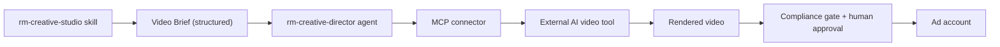

# FUTURE — RM Video Agent Spec (Layer 2)

Forward-looking spec only. **Not built in the current scope.** Documented now so today's
script output (the Video Brief block) is already the right shape for an automated video pipeline.

> Layer 1 (now): the [rm-creative-studio skill](../../../../.claude/skills/rm-creative-studio/SKILL.md)
> generates ideas + scripts + Video Briefs. Layer 2 (future): an agent turns a Video Brief into a
> rendered video via an external AI video tool.
>
> **Layer 1.5 (now, manual): prompt construction exists.** The
> [higgsfield-prompt-builder.md](higgsfield-prompt-builder.md) turns a concept into paste-ready
> Higgsfield AI-video prompts (short UGC, standard or chunked). A human still runs the generation
> in Higgsfield and stitches chunks. Layer 2 below is the *automation* of that render step — not
> yet built.

## What it would be

An agent, `rm-creative-director`, living in the **execution/engine layer** (an orchestration
runtime such as the V30 kit), not in this OS, that:

1. Calls the studio skill to produce a script + Video Brief (or accepts one as input).
2. Translates the Video Brief into the external tool's job format.
3. Submits the render job via an MCP connector and returns asset links for review.
4. Routes the result back through the [compliance gate](compliance-gate-checklist.md) and human approval before anything goes live.

## Why the handoff already works

The [script generator](rm-script-generator.md) emits a structured **Video Brief**: per-scene
beat, on-screen subject, shot/framing, b-roll, on-screen text, audio, pacing, caption style,
and first frame. That is exactly the input an AI video tool needs — so no rework when Layer 2 is built.

## Integration points (to design later)

- **MCP connector** (one connector per external tool), authored in the engine layer's MCP setup.
- **Tool candidates** to evaluate: text/brief-to-video platforms with API access (e.g. avatar/UGC generators, scripted-video tools). Selection depends on RM-appropriate talent + caption control.
- **Talent constraint**: the retired-homeowner feed needs warm, credible, real-feeling delivery — favor tools with realistic spokesperson/UGC output over hype-style templates.
- **Asset naming + storage**: render outputs land in `outputs/` (or a client folder) with the source script ID.

## Hard guardrails for Layer 2

- Nothing auto-publishes. Rendered video passes the compliance gate + human approval first.
- No fabricated testimonials/persons presented as real clients.
- Client-specific claims, names, amounts stay `[TO FILL]` until verified.
- The agent lives in the engine; **this OS stays the source of truth** for scripts and compliance.

## Prerequisites before building

1. Layer 1 skill validated and `status: active` (founder review).
2. Chosen video tool + API access + budget approved.
3. MCP connector authored and tested in the engine layer.
4. A render-review SOP (who approves, against what checklist).
