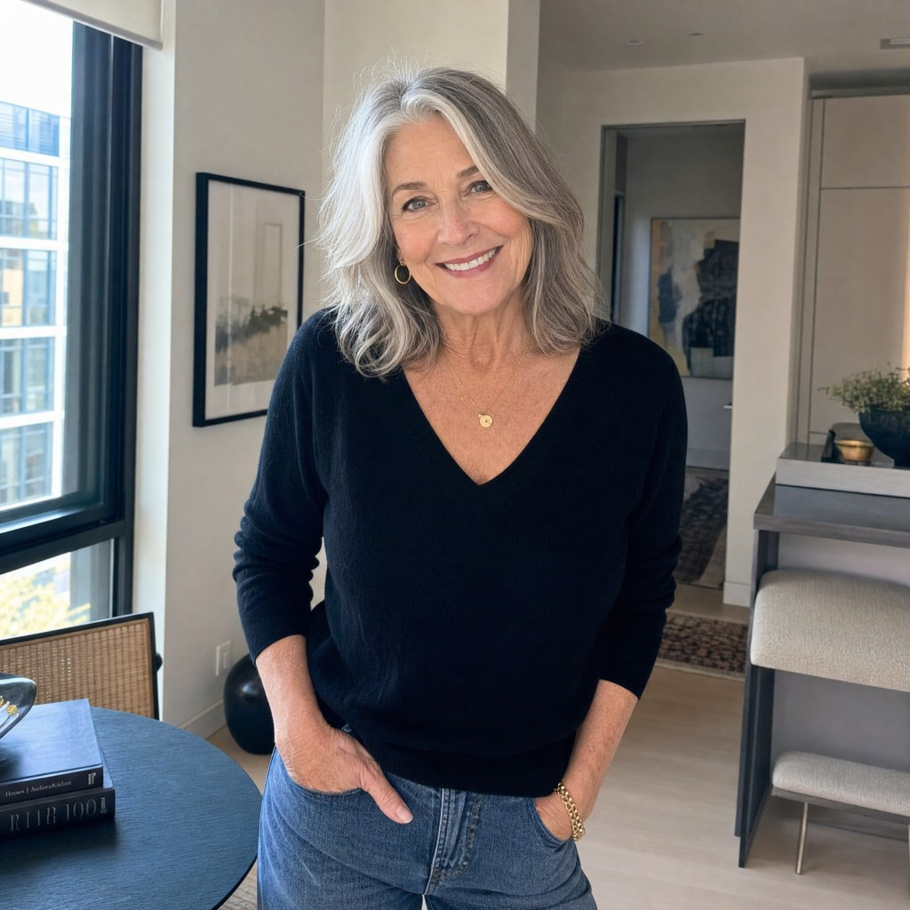

# RM TOF Legacy Planner — Concepts + Script + Higgsfield Prompt (2026-05-30)

A `brainstorm` batch (6 concepts), one selected `script` rewritten for natural UGC delivery, and
a ready-to-paste `prompt` for the Higgsfield AI-video generator — produced with the
[RM Creative Studio](../../../../../.claude/skills/rm-creative-studio/SKILL.md) and run through the
[compliance gate](../compliance-gate-checklist.md). The Higgsfield prompt is built per
[higgsfield-prompt-builder.md](../higgsfield-prompt-builder.md) and audited against the source
*Universal UGC Script Writing System v2*.

- Archetype: **Legacy Planner** (driver: protect family / inheritance)
- Stage: **TOF** (cold / problem-aware)
- Format: short AI UGC video — **Full Stack (28-32s)**, 5-chunk
- Talent: locked to the provided character (see below)

> TOF + Legacy Planner note: at the top of funnel we lead with the prospect's *felt world* — the
> quiet worry of being a burden and leaving the kids a mess — never inheritance/equity mechanics
> (those need the program named, so they are held for MOF). No product name anywhere, "retired
> homeowners" not ages, no guarantees, no tax claims, no false urgency, no fabricated proof.

## Locked character



Warm, credible retired female homeowner: silver-grey wavy shoulder-length hair, genuine warm
smile, gold hoop earrings, small gold pendant necklace and gold bracelet, black V-neck sweater,
blue jeans. Setting: bright modern apartment, floor-to-ceiling windows with a city view, round
dark wood dining table (design books + a glass of water), framed art, console and bench, soft
natural daylight. She already embodies the dignified, in-control "after" state the builder
requires. Use this image as the **start frame / character reference** in Higgsfield (image-to-video).

---

## `brainstorm` — 6 TOF Legacy Planner concepts

| ID | Angle | Hook type | One-line premise | Lead hook (direction) | VOC anchor (ICP §5) | Frameworks | Gate |
|----|-------|-----------|------------------|-----------------------|---------------------|------------|------|
| **IDEA-001** | Burden | Confessional | A retired parent admits the fear they'd never say to their kids: becoming the thing their children have to manage. | "The last thing I want is to become something my kids have to take care of." | "I don't want to ask my kids for help." | F7 confessional; F2 Liking/Similarity; F4 burden fear (§3) | PASS |
| IDEA-002 | Regret / Social Proof | Curiosity gap | Opens a loop about the one money worry retired parents hide from their grown kids. | "There's one thing most retired homeowners never admit to their own children." | "My kids don't worry about me anymore. That means everything." | F7 curiosity gap; F2 Zeigarnik open loop; F4 shame-about-struggling (§3) | PASS |
| IDEA-003 | No Monthly Payment | Rhetorical question | Flips "saving it for the kids" into the realization that their tightness is what worries the kids. | "What would your kids say if they knew how carefully you count every month?" | "I just want to stop worrying every month." | F7 rhetorical; F2 Framing; F4 fear-of-running-out (§3) | PASS |
| IDEA-004 | Surviving vs Living (legacy lens) | Paradox | The lifelong provider is now the one quietly being worried about, and it doesn't have to stay that way. | "You spent your life providing for them, so why are they the ones quietly worrying about you?" | "I worked my whole life, this isn't how it was supposed to be." | F7 paradox; F2 Contrast; F4 retirement-not-matching (§3) | PASS |
| IDEA-005 | Aging-in-Place | Specific pain | The unspoken sacrifices (skipped trips, delayed repairs) that grown kids start to notice. | "Skipping the visit again because the roof can't wait, and hoping the kids don't notice." | "I don't want to move." / delaying repairs (§3) | F7 specific pain; F2 Loss Aversion (reframed); F4 delaying-repairs (§3) | PASS |
| IDEA-006 | Inflation Hedge | Niche callout | Calls out retired homeowners with grown kids and names the quiet math nobody at the table talks about. | "Retired homeowners with grown kids: there's a quiet bit of math no one at the table talks about." | "Everything costs more, but my income never increases." | F7 niche callout; F2 Anchoring; F4 rising-costs (§3) | PASS |

Anti-overlap check: 6 distinct angles, 6 distinct hook types. PASS.

---

## Selection

**IDEA-001 — Burden / Confessional** (selected). Strongest emotional truth for the Legacy
Planner at TOF: a first-person admission of the fear they would never say out loud, which mirrors
the prospect's own private thought and opens a loop the script closes. Clean TOF compliance (no
product name, no age, no numbers).

---

## `script` — IDEA-001 (natural UGC pass, ~45s long-form record)

Format: Video (short AI UGC) | Talent: the locked character, confessional to camera

### Hook options (0-5s)
- A. (recommended) "The last thing I want is to become something my kids have to take care of."
- B. "I'd give my children almost anything, except the job of worrying about me."
- C. "My kids think I'm fine. I've gotten very good at making sure they think that."

### Script
HOOK (0-5s):
"The last thing I want is to become something my kids have to take care of."

EMPATHY (5-20s):
"I worked my whole life so they'd never have to worry about me. But honestly? Money's tighter
than I let on. I count every single month, and I just don't say anything."

FRAME SHIFT (20-45s):
"For the longest time I felt stuck. The house is paid off, but all that value's just sitting in
the walls while I pinch pennies. Then someone explained there's a federally-insured program that
can turn part of that into monthly income. No monthly payment. And you still own your home, you
stay right where you are."

PROOF (45-70s):
"The part that got me? My kids are never on the hook for it. You can't owe more than the home is
worth, and whatever's left still goes to them."

CTA (70-90s):
"If you've ever quietly worried about this, don't decide anything yet. Just get the free guide
and understand it. No pressure."

### Frameworks Applied
- Hook: confessional (F7) + Liking/Similarity (F2) + Zeigarnik open loop (F2)
- Empathy: VOC verbatim (F4 §5 "I don't want to ask my kids for help"; "I worked my whole life...") + pain->impact "burden -> guilt/withdrawal" (F4 §3) + VOC mirroring (F3)
- Frame Shift: mechanism in one sentence, locked home value -> monthly income, no required payment, stays owner (F1) + Framing/Contrast Debt->Retirement-Tool (F2) + benefit-over-feature (F3)
- Proof: Legacy objections #2 "my kids will inherit debt" + #8 "I want to leave my home to my kids" (F4 §7) + FHA non-recourse / heirs-keep-equity + Loss Aversion reframed (F2)
- CTA: approved info-access bank, free guide / no-pressure (F5, ICP §8) + Commitment small-step (F2) + ethical advisor framing (ICP §9)

### Compliance Gate
```
A Hard:    PASS — no "reverse mortgage"/"HECM"; no age; "can," no guarantee; no tax claim; no false urgency; dignity kept
B Stage:   PASS — hook + empathy lead with the prospect's world; category introduced only at Frame Shift as "federally-insured program," never the product name
C Quality: PASS — VOC / mechanism / proof (non-recourse + heirs) / awareness (TOF) all present
D Hygiene: PASS — first 5s for the prospect, no "Hi I'm..."; soft info-access CTA
RESULT: READY
```
Note: proof uses only the factual FHA non-recourse / heirs reassurance. Any real social-proof line or dollar amount must be added as `[TO FILL]` with a verified source before use.

---

## `prompt` — Higgsfield AI-video prompt (from IDEA-001)

IDEA-001 is TOF, so format = **Full Stack (28-32s)** and the reveal-asset pattern is **all NO**
(no program named or shown on screen in any chunk). This voiceover is the faithful short cut of
the approved natural script above (same beats, including the Proof/heirs reassurance), tightened
to ~169 words / ~32s per the prompt-builder. Use the locked character image as the start frame /
character reference on every generation.

Format: Full Stack (28-32s) | Delivery: Standard single + 5-chunk | Talent: locked character | Reveal-asset pattern: NO,NO,NO,NO,NO

### Voiceover (short UGC) — ~169 words (faithful to the approved script)
"The last thing I want is to become something my kids have to take care of. So I keep telling them I'm fine. I worked my whole life so they'd never have to worry about me, but money's tighter than I let on. I count every month, and I don't say anything. The house is paid off, but all that value just sat in the walls while I pinched pennies. Then someone explained there's a federally-insured program that can turn part of that into monthly income, with no monthly payment, while you keep living right where you are. Think of it less like borrowing, and more like drawing from a well that's been full your whole life. And my kids are never on the hook for it. You can't owe more than the home is worth, and whatever's left still goes to them. Now, for the first time in a while, I'm not quietly worried. If you've ever carried this on your own, just get the free guide. No pressure."

### Shared blocks — paste the character lock + all four direction blocks into EVERY chunk

```
[CHARACTER LOCK]
[CREATOR: a female retired homeowner, warm and credible, silver-grey wavy shoulder-length hair, genuine warm smile, gold hoop earrings, a small gold pendant necklace and a gold bracelet, wearing a black V-neck sweater and blue jeans. Calm, dignified, in-control energy.] [SETTING: a bright modern apartment with floor-to-ceiling windows and a city view, a round dark wood dining table with design books and a glass of water on it, framed art, a console and bench along the wall, with soft natural daylight.]

[SUBJECT / SETTING REALISM BLOCK]
Important subject direction: The creator is a credible, healthy, in-control retired homeowner with a calm, warm, dignified presence throughout the entire video. They look comfortable and at ease in their own home, relaxed posture, genuine micro-expressions, no distress, no worry, no frailty or hardship at any point. The home is clean, lived-in, and pleasant. This applies to every talking-to-camera scene and every cutaway. The setting is a bright, modern apartment with floor-to-ceiling windows and a city view, neutral walls, framed art, a round dark wood dining table, and soft natural daylight.

[CONCEPT-REVEAL BLOCK]
Important reveal direction: When the idea is introduced, show it as the creator gesturing calmly around her own home and a warm in-home moment, with no on-screen program text and no document or guide prop at any point (this is a cold ad, so the program is never shown on screen). No cash, no stacks of money, no flying dollars, no bank or lender logos, no "approved" stamps, no distressed-senior or crisis imagery at any point. The visual stays warm, ordinary, and dignified, the home and the person, not a financial product.

[B-ROLL SEQUENCING BLOCK]
Important b-roll sequencing: No reverse-mortgage or program reference appears on screen at any point in this video. The camera stays on the creator. No on-screen "reverse mortgage" or "HECM" text, no document props, no money or lender imagery, no decorative cutaways. This is a top-of-funnel video, so the program is never referenced visually in any chunk.

[UGC REALISM BLOCK]
Important UGC realism direction: This is a casually filmed video. The phone is propped somewhere off-camera, so both hands are free throughout. Natural handheld jitter and small micro-movements give it a self-filmed feel. The creator gestures naturally with both hands, shifts weight, and speaks like she is telling a friend something useful. Never frozen in a still pose, never hands in pockets or behind the back. The energy is "I want to tell you something," not "I am posing for a commercial." Warm and calm, never hyped or salesy.
```

### Delivery A — Standard single continuous prompt (ready to paste)

```
Animate the provided image into a UGC-style, casually self-filmed reverse-mortgage ad. Keep the exact same woman from the image with no change to her identity: warm, credible retired homeowner with silver-grey wavy shoulder-length hair, a genuine warm smile, gold hoop earrings, a small gold pendant necklace and gold bracelet, wearing a black V-neck sweater and blue jeans. Keep the exact same setting: a bright, modern apartment with floor-to-ceiling windows and city view, neutral walls, framed art, a round dark wood dining table with a couple of design books and a glass of water on it, a console and bench along the wall, soft natural daylight. Calm, dignified, in-control energy throughout.

Important subject direction: The creator is a credible, healthy, in-control retired homeowner with a calm, warm, dignified presence throughout the entire video. She looks comfortable and at ease in her own home, with relaxed posture, genuine micro-expressions, no distress, no worry, no frailty or hardship at any point. The home stays clean, bright, lived-in, and pleasant. This applies to every shot. Natural daylight from the large windows keeps the mood warm and real.

Important reveal direction: Show no financial product of any kind. There is no on-screen program text and no document, paper, brochure, or guide prop anywhere in this video, because the program is never shown on screen. No cash, no money, no flying dollars, no bank or lender logos, no "approved" stamps, no distressed-senior or crisis imagery at any point. The visual stays warm, ordinary, and dignified, focused on her and her home, never a financial product.

Important b-roll sequencing: No reverse-mortgage or program reference ever appears on screen. The camera stays on her throughout, with no on-screen "reverse mortgage" or "HECM" text, no document props, no money or lender imagery, and no decorative cutaways. The program is only ever referenced in the spoken voiceover, never visually.

Important UGC realism direction: This is a casually filmed video. The phone is propped off-camera, so both hands are free. At the start she takes her hand out of her pocket and begins gesturing naturally with both hands. Natural handheld jitter and small micro-movements give it a self-filmed feel. She shifts her weight, gestures, and speaks like she is telling a friend something useful. Never frozen in a still pose, never hands in pockets after the opening, never hands behind the back. The energy is "I want to tell you something," not "I am posing for a commercial." Warm and calm, never hyped or salesy.

Important action and blocking direction: This is never a static talking-head video. She moves and does small natural things in her own home as she talks, with both hands free and busy. She begins standing by the dining table, takes her hand from her pocket, and rests it lightly on the back of a chair as she looks to camera. As she talks she touches the stack of books, opens her hands in easy gestures, and glances away on the most personal line before looking back. On the line about the value sitting in the walls, she steps toward the bright floor-to-ceiling window into the daylight and gestures gently around her own home, and lifts the glass of water from the table for an unhurried sip, so the action quietly echoes the idea of drawing from a well. On the line about her kids never being on the hook, she turns back to camera with a reassured, settled expression. She finishes settled near the window in the daylight with a small, earned, genuine smile. Do not show bills, paperwork, documents, money, or any financial items at any point.

Camera style: natural self-filmed handheld, slightly off-center framing that re-adjusts as she moves between the table and the window, with subtle drift and small motivated push-ins. Motivated cuts only, cutting when she moves to do something or when the idea lands. Normal speed, no slow motion. 3 scenes, warm and calm pacing, never hyped.

Here's the full script:
"The last thing I want is to become something my kids have to take care of. So I keep telling them I'm fine. I worked my whole life so they'd never have to worry about me, but money's tighter than I let on. I count every month, and I don't say anything. The house is paid off, but all that value just sat in the walls while I pinched pennies. Then someone explained there's a federally-insured program that can turn part of that into monthly income, with no monthly payment, while you keep living right where you are. Think of it less like borrowing, and more like drawing from a well that's been full your whole life. And my kids are never on the hook for it. You can't owe more than the home is worth, and whatever's left still goes to them. Now, for the first time in a while, I'm not quietly worried. If you've ever carried this on your own, just get the free guide. No pressure."
```

### Delivery B — 5-chunk production (each chunk is fully self-contained, copy-paste-ready)

Generate each chunk separately with the locked character image as the start frame, then stitch in
post. Each block already contains the character lock + all four direction blocks.

#### Chunk 1 — Hook (5-6s) · Reveal: NO

```
Animate the provided image into a UGC-style, casually self-filmed reverse-mortgage ad, keeping the exact same woman and setting from the image.
[CHARACTER LOCK] A female retired homeowner, warm and credible, silver-grey wavy shoulder-length hair, genuine warm smile, gold hoop earrings, small gold pendant necklace and gold bracelet, black V-neck sweater and blue jeans, calm and dignified and in control. Setting: a bright modern apartment with floor-to-ceiling windows and a city view, a round dark wood dining table with design books and a glass of water, framed art, a console and bench, soft natural daylight.
Important subject direction: The creator is a credible, healthy, in-control retired homeowner with a calm, warm, dignified presence throughout, relaxed posture, genuine micro-expressions, no distress, no worry, no frailty at any point. The home is clean, bright, lived-in, and pleasant.
Important reveal direction: No on-screen program text and no document, brochure, or guide prop anywhere. No cash, money, flying dollars, bank or lender logos, "approved" stamps, or distressed-senior/crisis imagery. Warm, ordinary, dignified, focused on her and her home, never a financial product.
Important b-roll sequencing: No reverse-mortgage or program reference appears on screen. Camera stays on her. No "reverse mortgage"/"HECM" text, no document props, no money imagery, no decorative cutaways. Top-of-funnel video, so the program is never referenced visually.
Important UGC realism direction: Casually filmed, phone propped off-camera so both hands are free. Natural handheld jitter and micro-movements for a self-filmed feel. She gestures with both hands, shifts weight, speaks like telling a friend something useful. Never frozen, no hands in pockets after the opening. Warm and calm, never hyped or salesy.
Action: She begins standing by the dining table, takes her hand out of her pocket, and rests it lightly on the chair back as she looks to camera with an easy expression. This locks the baseline framing, wardrobe, hair, and light for the rest of the video.
Camera style: natural self-filmed handheld, slightly off-center, subtle drift, motivated cuts only, normal speed, no slow motion, warm and calm.
Voiceover: "The last thing I want is to become something my kids have to take care of. So I keep telling them I'm fine."
```

#### Chunk 2 — Reframe pt.1 (5-6s) · Reveal: NO

```
Animate the provided image into a UGC-style, casually self-filmed reverse-mortgage ad, keeping the exact same woman and setting from the image.
[CHARACTER LOCK] A female retired homeowner, warm and credible, silver-grey wavy shoulder-length hair, genuine warm smile, gold hoop earrings, small gold pendant necklace and gold bracelet, black V-neck sweater and blue jeans, calm and dignified and in control. Setting: a bright modern apartment with floor-to-ceiling windows and a city view, a round dark wood dining table with design books and a glass of water, framed art, a console and bench, soft natural daylight.
Important subject direction: The creator is a credible, healthy, in-control retired homeowner with a calm, warm, dignified presence throughout, relaxed posture, genuine micro-expressions, no distress, no worry, no frailty at any point. The home is clean, bright, lived-in, and pleasant.
Important reveal direction: No on-screen program text and no document, brochure, or guide prop anywhere. No cash, money, flying dollars, bank or lender logos, "approved" stamps, or distressed-senior/crisis imagery. Warm, ordinary, dignified, focused on her and her home, never a financial product.
Important b-roll sequencing: No reverse-mortgage or program reference appears on screen. Camera stays on her. No "reverse mortgage"/"HECM" text, no document props, no money imagery, no decorative cutaways. Top-of-funnel video, so the program is never referenced visually.
Important UGC realism direction: Casually filmed, phone propped off-camera so both hands are free. Natural handheld jitter and micro-movements for a self-filmed feel. She gestures with both hands, shifts weight, speaks like telling a friend something useful. Never frozen, no hands in pockets. Warm and calm, never hyped or salesy.
Action: Same spot as the opening, slight camera drift. She touches the stack of books on the table and gives a small, candid shrug on the admission that money's tighter than she lets on. Match the previous shot exactly: same wardrobe, hair, lighting, position.
Camera style: natural self-filmed handheld, slightly off-center, subtle drift, motivated cuts only, normal speed, no slow motion, warm and calm.
Voiceover: "I worked my whole life so they'd never have to worry about me, but money's tighter than I let on. I count every month, and I don't say anything."
```

#### Chunk 3 — Reframe pt.2 (5-6s) · Reveal: NO

```
Animate the provided image into a UGC-style, casually self-filmed reverse-mortgage ad, keeping the exact same woman and setting from the image.
[CHARACTER LOCK] A female retired homeowner, warm and credible, silver-grey wavy shoulder-length hair, genuine warm smile, gold hoop earrings, small gold pendant necklace and gold bracelet, black V-neck sweater and blue jeans, calm and dignified and in control. Setting: a bright modern apartment with floor-to-ceiling windows and a city view, a round dark wood dining table with design books and a glass of water, framed art, a console and bench, soft natural daylight.
Important subject direction: The creator is a credible, healthy, in-control retired homeowner with a calm, warm, dignified presence throughout, relaxed posture, genuine micro-expressions, no distress, no worry, no frailty at any point. The home is clean, bright, lived-in, and pleasant.
Important reveal direction: No on-screen program text and no document, brochure, or guide prop anywhere. No cash, money, flying dollars, bank or lender logos, "approved" stamps, or distressed-senior/crisis imagery. Warm, ordinary, dignified, focused on her and her home, never a financial product.
Important b-roll sequencing: No reverse-mortgage or program reference appears on screen. Camera stays on her. No "reverse mortgage"/"HECM" text, no document props, no money imagery, no decorative cutaways. Top-of-funnel video, so the program is never referenced visually.
Important UGC realism direction: Casually filmed, phone propped off-camera so both hands are free. Natural handheld jitter and micro-movements for a self-filmed feel. She gestures with both hands, shifts weight, speaks like telling a friend something useful. Never frozen, no hands in pockets. Warm and calm, never hyped or salesy.
Action: Weight shift, hands open in an easy gesture, a thinking glance toward the window then back to camera on the realization. The tension peaks here just before the idea is introduced. Match wardrobe, hair, lighting, and position to the previous chunks.
Camera style: natural self-filmed handheld, slightly off-center, subtle drift, motivated cuts only, normal speed, no slow motion, warm and calm.
Voiceover: "The house is paid off, but all that value just sat in the walls while I pinched pennies."
```

#### Chunk 4 — Mechanism + analogy (8-10s) · Reveal: NO (TOF lock; hardest to regenerate, plan extra takes)

```
Animate the provided image into a UGC-style, casually self-filmed reverse-mortgage ad, keeping the exact same woman and setting from the image.
[CHARACTER LOCK] A female retired homeowner, warm and credible, silver-grey wavy shoulder-length hair, genuine warm smile, gold hoop earrings, small gold pendant necklace and gold bracelet, black V-neck sweater and blue jeans, calm and dignified and in control. Setting: a bright modern apartment with floor-to-ceiling windows and a city view, a round dark wood dining table with design books and a glass of water, framed art, a console and bench, soft natural daylight.
Important subject direction: The creator is a credible, healthy, in-control retired homeowner with a calm, warm, dignified presence throughout, relaxed posture, genuine micro-expressions, no distress, no worry, no frailty at any point. The home is clean, bright, lived-in, and pleasant.
Important reveal direction: No on-screen program text and no document, brochure, or guide prop anywhere. No cash, money, flying dollars, bank or lender logos, "approved" stamps, or distressed-senior/crisis imagery. Warm, ordinary, dignified, focused on her and her home, never a financial product.
Important b-roll sequencing: No reverse-mortgage or program reference appears on screen. Camera stays on her. No "reverse mortgage"/"HECM" text, no document props, no money imagery, no decorative cutaways. Top-of-funnel video, so the program is never referenced visually.
Important UGC realism direction: Casually filmed, phone propped off-camera so both hands are free. Natural handheld jitter and micro-movements for a self-filmed feel. She gestures with both hands, shifts weight, speaks like telling a friend something useful. Never frozen, no hands in pockets. Warm and calm, never hyped or salesy.
Action: Motivated move. She steps toward the bright floor-to-ceiling window into the daylight, gestures gently around her own home as she names the program by outcome, then lifts the glass of water from the table for an unhurried sip as the well analogy lands, so the action quietly echoes drawing from a well. No card, no prop reveal, no money imagery of any kind.
Camera style: natural self-filmed handheld that re-adjusts as she moves to the window, slightly off-center, subtle drift and a small motivated push-in, motivated cuts only, normal speed, no slow motion, warm and calm.
Voiceover: "Then someone explained there's a federally-insured program that can turn part of that into monthly income, with no monthly payment, while you keep living right where you are. Think of it less like borrowing, and more like drawing from a well that's been full your whole life."
```

#### Chunk 5 — Proof + Payoff + soft CTA (8-10s) · Reveal: NO

```
Animate the provided image into a UGC-style, casually self-filmed reverse-mortgage ad, keeping the exact same woman and setting from the image.
[CHARACTER LOCK] A female retired homeowner, warm and credible, silver-grey wavy shoulder-length hair, genuine warm smile, gold hoop earrings, small gold pendant necklace and gold bracelet, black V-neck sweater and blue jeans, calm and dignified and in control. Setting: a bright modern apartment with floor-to-ceiling windows and a city view, a round dark wood dining table with design books and a glass of water, framed art, a console and bench, soft natural daylight.
Important subject direction: The creator is a credible, healthy, in-control retired homeowner with a calm, warm, dignified presence throughout, relaxed posture, genuine micro-expressions, no distress, no worry, no frailty at any point. The home is clean, bright, lived-in, and pleasant.
Important reveal direction: No on-screen program text and no document, brochure, or guide prop anywhere. No cash, money, flying dollars, bank or lender logos, "approved" stamps, or distressed-senior/crisis imagery. Warm, ordinary, dignified, focused on her and her home, never a financial product.
Important b-roll sequencing: No reverse-mortgage or program reference appears on screen. Camera stays on her. No "reverse mortgage"/"HECM" text, no document props, no money imagery, no decorative cutaways. Top-of-funnel video, so the program is never referenced visually.
Important UGC realism direction: Casually filmed, phone propped off-camera so both hands are free. Natural handheld jitter and micro-movements for a self-filmed feel. She gestures with both hands, shifts weight, speaks like telling a friend something useful. Never frozen, no hands in pockets. Warm and calm, never hyped or salesy.
Action: She delivers the reassurance about her kids with a calm, settled hand-to-chest or open-palm gesture, then settles near the window in the daylight, bookending the opening framing, with a small, earned, genuine smile on the payoff line and a calm, subtle downward gesture on the CTA. Match the opening chunk framing as closely as possible for the bookend.
Camera style: natural self-filmed handheld, slightly off-center, subtle drift, motivated cuts only, normal speed, no slow motion, warm and calm.
Voiceover: "And my kids are never on the hook for it. You can't owe more than the home is worth, and whatever's left still goes to them. Now, for the first time in a while, I'm not quietly worried. If you've ever carried this on your own, just get the free guide. No pressure."
```

Stitching: natural seam between Chunk 3 and 4 (the step to the window masks it). Chunks 1 and 5
bookend the same framing to hide small inconsistencies. Chunks 4 and 5 are the heaviest (Chunk 4
carries the mechanism + analogy; Chunk 5 carries proof + payoff + CTA) — plan extra takes for
both. If a generation fails, Chunk 3 folds easily into Chunk 2.

### Frameworks Applied
- Hook: confessional (F7) + Zeigarnik open loop (F2)
- Reframe: Debt -> Retirement-Tool ("thought it was an income problem... the money was in the house") (F1) + Framing/Contrast (F2)
- Mechanism + analogy: one-sentence plain mechanism (federally-insured program -> monthly income, no monthly payment, stay in home) + tactile analogy "a well that's been full your whole life" (F1), mirrored by the water + window-light action
- Empathy/VOC: F4 §5 ("keep telling them I'm fine"; "I worked my whole life...")
- Proof: Legacy objections #2 "my kids will inherit debt" + #8 "I want to leave my home to my kids" (F4 §7) + FHA non-recourse / heirs-keep-equity reassurance + Loss Aversion reframed (F2) — carried in Chunk 5
- CTA: approved info-access bank, free guide (F5) + Commitment small-step (F2)
- Production: image-to-video character lock + four verbatim direction blocks + action/blocking + motivated cuts (builder §3/§8; source UGC v2 §4/§11/§12)
- Note: this is a 6-beat script (Hook, Reframe x2, Mechanism+analogy, Proof, Payoff+CTA) folded into the 5 Full Stack chunks — Proof rides with Payoff + CTA in Chunk 5
- Reveal-asset pattern: NO,NO,NO,NO,NO (TOF hard-lock per builder §5 / source §12.5)

### Compliance Gate
```
A Hard:    PASS — no "reverse mortgage"/"HECM" in VO or on screen; no age stated; no guarantee ("can turn," not "will"); no tax claim; no false urgency; proof uses only factual non-recourse / heirs reassurance ("can't owe more than the home is worth," "whatever's left goes to them"), not a fabricated result; props ban bills/paperwork/money/lender imagery; dignity standard embodied by the talent
B Stage:   PASS — TOF: program never shown; reveal asset NO in all 5 chunks; concept introduced only by outcome in VO; the window-light/water is analogy, not a reveal
C Quality: PASS — VOC / mechanism + analogy / proof (non-recourse + heirs) / dignified reframe / TOF awareness all present
D Hygiene: PASS — first five words for the prospect; soft info-access CTA; constant motion, motivated cuts, self-filmed feel; opening fixes the hand-in-pocket pose
RESULT: READY
```

---

## Format audit vs. source SOP (Universal UGC Script Writing System v2)

- Format choice: Full Stack (28-32s, 150-180 words, 5 beats, 3 scenes, 5 chunks) for a cold/TOF audience. CORRECT.
- Voiceover ~169 words, in range. Beats honored; this concept carries a 6th beat (Proof) folded into Chunk 5 with the Payoff + CTA, so the close runs ~9-10s.
- Universal Reframe Pattern applied (surface "tight retirement" vs structural "the value just sat in the walls, unused").
- Mechanism + tactile analogy in the required "Think of it less like ___ and more like ___" format.
- Soft CTA from the approved bank ("so you don't have to go searching"). No em dashes / no bolding in VO.
- Four direction blocks: source Skin -> RM Subject/Setting Realism; source Application -> RM Concept-Reveal; B-Roll Sequencing and UGC Realism kept. All four pasted verbatim into every chunk.
- Asset pattern: source Full Stack is NO,NO,NO,YES,NO; RM-TOF override is NO,NO,NO,NO,NO (program never shown at TOF).
- Intentional deviations (both required): no `[AGE RANGE]` (RM compliance bans age in copy); no `@Image 1 is the product` (RM has no product; the image is the creator/character reference and the reveal asset is omitted at TOF).
