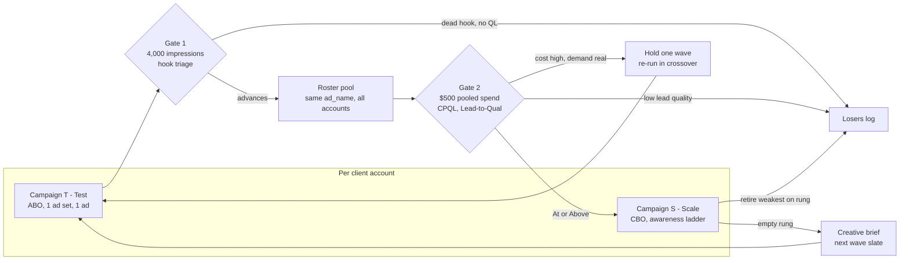

# Creative Testing Structure (Meta)

**Status: draft proposal — not operating law.** Do not migrate live accounts
until this doc is flipped to `active`. Until then, keep running the structure in
[new-client-campaign-setup-sop.md](new-client-campaign-setup-sop.md) and
[month-1-ad-account-management-sop.md](month-1-ad-account-management-sop.md).

This is the proposed Meta campaign and ad-set structure for **client** lead-gen
accounts. If approved, it would own structure decisions; those SOPs would keep
launch mechanics, diagnostics, and doctrine.

**Read alongside:** [creative-testing-scorecard.md](creative-testing-scorecard.md)
(how to judge a wave) · [performance-learnings.md](performance-learnings.md)
(what we have learned) · [ad-naming-convention.md](ad-naming-convention.md)
(campaign / ad-set / ad names)

## Purpose

Guarantee that every creative concept we ship gets enough spend to be judged,
at a budget tier where no single client account can fund a fair test.

## Scope

Meta campaigns for paying clients, RM and DSCR, from launch through steady
state. Does not cover Waiz acquisition marketing.

## Trigger

New client launch, or the start of any creative testing wave.

## Inputs

- Client daily budget and state
- The current Control slate for the account
- The wave concept slate from [performance-learnings.md](performance-learnings.md)

## Outputs

- One Scale campaign and one Test campaign per account
- A wave assignment recorded in the wave log
- A wave readout that graduates, holds, or kills each concept

## The problem this solves

Under a single CBO campaign with one ad set, spend collapses onto one or two
ads and the rest never accumulate enough impressions to be judged. Three
separate causes produce that symptom, and only the third is about money.

1. **Entity-ID collapse (primary).** Andromeda's retrieval layer builds
   multimodal embeddings per creative and clusters similar ads under one
   Entity ID. A cluster gets **one** ticket to the auction, and the system
   serves whichever member has the most historical data. Ads Manager exposes a
   Creative Similarity Score; above roughly 60% the collapse is active.
   Loading one ad set with creatives that are all the same format, all the same
   persona, and all the same visual world manufactures this outcome.
2. **No ad-level budget control exists.** Inside an ad set you cannot set a
   spend floor per ad, in CBO or in ABO. Guaranteed spend per concept can only
   be bought with **ad sets**. This is structural, not a tuning problem.
3. **Budget below the significance floor.** At $60/day and a $25 CPL an
   account produces about 2.4 leads/day. A clean per-ad-set conversion read
   wants roughly 50 events in a week, about $1,250/week. No mid-tier account
   can fund that, so **the roster — not the account — has to be the test unit.**

## The structure

Two campaigns per account, with different jobs. Never test in the Scale
campaign; never judge quality in the Test campaign alone.

| | Campaign S — Scale | Campaign T — Test |
|---|---|---|
| Budget type | CBO | ABO |
| Ad sets | 1 broad (mid tier) | 1 per concept |
| Ads per ad set | 4–6, laddered by awareness | **Exactly 1** |
| Share of daily budget | 65–75% | 25–35% |
| Job | Exploit what is proven | Isolate one new concept |
| Judged on | Blended CPQL, ladder coverage | Gate 1 then Gate 2 |

Settings common to both: objective Leads, Special Ad Category **Housing**,
conversion location **Website** (never native instant forms — see
[Lead capture decision](#lead-capture-decision-external-lp-not-instant-forms)),
state-level location only, audience broad with **no detailed targeting**, and
Advantage+ audience suggestions left empty.

### Campaign S — Scale: ladder the ads, do not stack winners

The ads inside the Scale ad set are chosen to cover the **awareness ladder**,
not to maximise individual CPL. Four rungs, mapped onto the vocabulary already
used by [frameworks-reference.md](creative-studio/frameworks-reference.md).
Which concept fills which rung for which persona lives in
[creative-awareness-ladder.md](creative-awareness-ladder.md).

| Rung | Schwartz awareness | House stage | Job of the ad |
|------|--------------------|-------------|---------------|
| Problem | Unaware / Problem-aware | TOF | Name the invisible pain; break the pattern |
| Solution | Solution-aware | MOF | Differentiate the mechanism; bust the myth |
| Proof | Product-aware | MOF/BOF | Show it working for someone like me |
| Offer | Most-aware | BOF | Reduce risk and convert the hand-raise |

This is the part of the structure that earns the consolidation: Meta sequences
a prospect down the ladder as engagement signals accrue, so a problem-aware ad
that never converts directly is still doing paid work by feeding the rungs
below it. Judge the ad set blended, not rung by rung.

**A rung with no ad in it is the creative brief.** Ladder gaps replace the
vague 4PI "find the biggest hole in the funnel" step with a grid a scriptwriter
can act on. The live coverage grid and the backlog drawn from its empty cells
are in [creative-awareness-ladder.md](creative-awareness-ladder.md); wave
results go in [performance-learnings.md](performance-learnings.md).

Because the four rungs are different personas, different environments, and
different formats by construction, the ladder also produces genuine Entity-ID
diversity for free. That is the mechanism that keeps spend from collapsing
onto one ad.

### Campaign T — Test: one concept, one ad, one ad set

Isolation is the whole point. One concept, in one format, as one ad, in its own
ad set with its own budget. That is the only arrangement in which the ad set's
numbers *are* the concept's numbers.

At mid tier the Test campaign holds **one** ad set at $20–$25/day rather than
two or three at $8–$12. A single ad set above the delivery floor beats three
below it; splitting a thin test budget across concepts is how you get three
unreadable results instead of one readable one.

Which concept that single ad set runs is decided at the roster level, not by
the account manager.

## Roster waves: split the roster, never the client's budget

Each account tests **exactly one** concept per wave. Concepts are assigned
across accounts, so the roster tests the full slate even though no single
account does.

1. **Block the roster** by budget tier and by state, so no concept draws only
   the cheap-CPM geos or only the biggest spenders.
2. **Assign round-robin** within each block. Record the assignment in the wave
   log before launch.
3. **Cross over in the next wave.** Wave 2 swaps which block runs which
   concept. A single wave cannot separate concept effect from account effect;
   two crossed waves can.
4. **Read the concept on the pool,** joined on `ad_name` across every account
   running it. The dashboard already aggregates this way — see
   [Measurement](#measurement-what-makes-a-wave-readable).

Worked example at eight mid-tier accounts: 8 × ~$22/day × 14 days is about
$2,460 of test spend per wave. Split across two concepts that is roughly
$1,230 each, or about 50 leads per concept at a $25 CPL. That clears both the
conversion-significance floor and the existing `>= $500 in window` winner gate
in [ad-intelligence-bridge.md](../../operations/ad-intelligence-bridge.md).

## Budget tiers

The structure is the same at every tier; only the number of ad sets changes.
Promote an account to the next tier when it has held the higher budget for two
consecutive waves without breaching the CPL floor rule.

| Tier | Daily budget | Campaign S | Campaign T | Gate 1 window |
|------|--------------|-----------|------------|---------------|
| Thin | under $50 | 1 broad ad set, 3–4 rungs | 1 ad set, $15–20/day | 12–18 days |
| Mid | $50–$150 | 1 broad ad set, 4–6 ads laddered | 1 ad set, $20–25/day | 7–10 days |
| High | $150–$400 | 2–3 ad sets, one per persona, laddered inside | 2 ad sets, $35–50/day | 4–6 days |
| Lab | $400+ | 2–3 persona ad sets | 4 ad sets, $50/day each | ~4 days |

Two notes on the upper tiers:

- **Persona ad sets are budget-gated.** One ad set per persona is the better
  Scale architecture — it gives Andromeda a cleaner signal per audience and
  builds a full ladder inside each — but RM has **three** active personas
  (Widowed Homeowner, Married Couple, Pre-Retiree — Veteran deprecated; see
  [rm-archetypes-canonical.md](creative-studio/rm-archetypes-canonical.md)) and
  four ad sets cannot each hold the delivery floor below roughly $200/day. Take
  the laddering at every tier; take the persona split only when it is funded.
- **The Lab tier is a screening asset, not just a bigger account.** At $400+/day
  four isolated test ad sets each clear 4,000 impressions in about four days.
  Use the largest account to screen concepts fast, then seed the survivors into
  the roster waves. That is worth more than pushing the same proven creative
  harder.

## Two gates, at two altitudes

A concept is judged twice, on different evidence, at different levels. Neither
gate alone can graduate a concept.

### Gate 1 — hook, read per client

**Hold every test ad set until it has accrued 4,000 impressions.** Before that
threshold: no edits, no budget changes, no verdict. Meta wants 4,000–8,000
impressions before a significant edit, and below it you are reading noise.

At $22/day and RM housing CPMs of roughly $25–$45, 4,000 impressions takes
about 7–10 days. **This is why a wave is 14 days** — it is what buys the
impression threshold at mid-tier budget, not a round number.

Gate 1 is delivery-and-hook **triage**, not a verdict, and it is deliberately
hard to fail. A concept is cut here only when the hook is dead *and* nothing
downstream is happening:

| Condition at >= 4,000 impressions | Result |
|-----------------------------------|--------|
| CTR < 0.8% **and** zero qualified leads | Kill; log the pattern |
| CTR < 0.8% **but** qualified leads arriving | Advance — re-edit candidate, not a loser |
| CTR 0.8%–1.2% | Advance; flag `hook-watch` |
| CTR > 1.2% | Advance |

CTR alone never kills a concept that is producing qualified leads. The
judgment standard is explicit that CTR is a leading indicator driving WATCH,
never a verdict. Full triage logic in
[creative-testing-scorecard.md](creative-testing-scorecard.md).

### Gate 2 — quality, read on the roster pool

At **>= $500 pooled spend** per concept, judge on **CPQL** and
**Lead-to-Qual %** against the current Control. **CPConv** is recorded every
wave but is only directional at wave volume — roughly 8–13 showed appointments
per concept — so it confirms across two waves rather than deciding one. Below
$500 the concept is `thin` and carries no claim.

Bands are canonical in
[client-kpi-judgment-standard.md](../../kpis/client-kpi-judgment-standard.md);
thresholds, volume math, and the readout template are in
[creative-testing-scorecard.md](creative-testing-scorecard.md).

**Never kill on CPL.** `CPL = CPQL × Lead-to-Qual`, so an expensive CPL with
strong CPQL is a concept that is self-selecting quality.

### The outcomes

| Gate 1 | Gate 2 | Verdict |
|--------|--------|---------|
| Advance | CPQL and Lead-to-Qual At/Above | **Graduate** into the Scale ladder at its rung |
| Advance | CPQL Below, Lead-to-Qual At/Above | **Hold** one wave; re-run in the crossover |
| Advance | Lead-to-Qual Below/911 | **Kill.** Wrong-audience hook — never scale on CTR alone |
| Advance, CTR < 0.8% | CPQL At/Above | **Re-edit.** Keep the offer, rebuild the hook as `v2` |
| Kill at Gate 1 | — | **Kill.** Log format + hook + archetype so Step 0 skips the combo |
| Under 4,000 impressions | — | **`no-read`.** Extend into the next wave; not a loss |

## Scaling: horizontal before vertical

When a concept graduates, add it to the ladder at the same budget before
raising any budget. Stacking several modest proven ads beats concentrating on
one, which is the same anti-concentration logic driving this whole structure —
and it matches what we already believe: a consistent $50/day campaign is worth
more than a volatile $150/day one.

Only once the ladder has an ad at **every rung** do you apply the existing
vertical rule (increase 5% on Monday / Wednesday / Friday while CPL <= $22,
decrease 5% daily while CPL > $30, floor $35, cap 2x current). Scaling
vertically on an account whose ladder is all Offer-rung creative just buys more
of an exhausted audience, which is how the frequency-above-3.5 fatigue spiral
starts.

## Graduation and retirement

The loop runs on a 14-day wave cadence, which also matches the existing
2–3 week rotation guidance.

1. Read the wave. Graduate, hold, or kill each concept per the four outcomes.
2. Insert graduates into the Scale ladder at the rung they serve.
3. Retire the weakest ad **on that same rung** — not the weakest ad overall.
   Retiring across rungs is how ladders quietly collapse into all-Offer slates.
4. Log every retirement in
   [losers-log.md](creative-research/losers-log.md) with hook type, format, and
   archetype.
5. Take the emptiest rung as the next wave's brief. Assign the new slate across
   the roster with the block crossed over from last wave.
6. Never rename a spend-bearing ad. Aliases only — see
   [ad-naming-convention.md](ad-naming-convention.md).

## Measurement: what makes a wave readable

The dashboard aggregates ad performance by **ad name**, trimming only, because
the same ad names are reused across clients. Client ids are merged into a set
on the rolled-up row. That is exactly the join a roster wave needs, and it
already exists.

The one-ad-per-test-ad-set rule is what keeps this working: when a test ad set
holds exactly one ad, `ad_name` uniquely identifies the ad set, so the wave is
readable today without any per-ad-set reporting.

This is verified, not assumed. `src/lib/ad-performance.ts` and
`/api/media-buyer` in the dashboard repo contain **zero** references to
`adset_name` or `adset_id` — grouping is `adKey(ad_name)` only. Ad-set results
are reachable solely by a custom SQL join. **Put two ads in a test ad set and
the per-concept read is gone.**

Ad-set attribution on leads has been hardened as a safety net: `adset_name` now
falls back to `utm_medium`, which is where the mandated UTM template puts the
ad set (`utm_medium={{adset.name}}`), with generic channel tokens rejected.
Before launch, confirm Make.com sends `adset_name` explicitly rather than
relying on the fallback.

Two standing cautions from the ad-performance skill apply to every readout:

- Ignore concepts flagged `thin` (under $500 spend or under 2 conversations).
- Do not refresh creative because CPCONV is bad while CTR is healthy. That is
  usually landing page, setters, speed-to-lead, or a single account — not the
  hook.

## Lead capture decision: external LP, not instant forms

**Decision: client campaigns send traffic to the Perspective landing page.
Native Meta instant forms are not used.** Recorded here so the question stops
resurfacing when an outside playbook recommends them.

Three reasons, in order of weight:

1. **Lead quality degrades.** Native forms optimise for the cheapest form fill
   and train delivery on prospects who never answer the phone. The friction in
   our funnel is deliberate — effort creates intent, and the RM funnel is not
   optimised for maximum form fills.
2. **The pipeline depends on it.** Every downstream KPI — qualified rate,
   appointments, show rate, CPCONV — arrives through
   Perspective → GHL → Make.com → Supabase. Instant forms bypass that path and
   the lead lands with no attribution and no speed-to-lead clock.
3. **It is a sales differentiator.** We sell against native forms explicitly on
   demo calls. Running them ourselves would contradict the pitch.

Instant forms remain acceptable in exactly one place: the DIY bootcamp course
material, which teaches a different audience a simpler setup.

## Quality bar

- [ ] One Scale campaign and one Test campaign per account, never mixed
- [ ] Exactly one ad in each test ad set
- [ ] Scale ad set has an ad at each ladder rung it can fund
- [ ] Creative Similarity Score checked; no two Scale ads clustered
- [ ] Special Ad Category Housing declared; conversion location Website
- [ ] Broad, state-level, zero detailed targeting, suggestions empty
- [ ] Wave assignment recorded before launch, with the crossover planned
- [ ] No verdict before 4,000 impressions (Gate 1) or $500 pooled (Gate 2)
- [ ] Retirement taken on the same rung as the graduate
- [ ] No spend-bearing ad renamed

## Metrics

| Metric | Where | Target |
|--------|-------|--------|
| Share of test ad sets reaching 4,000 impressions in-wave | Ads Manager | 100% |
| Share of Scale budget on the top ad | Ads Manager, spend sorted | under 50% |
| Ladder rungs filled per account | Scale ad set | 4 of 4 |
| Concepts graduated per wave | Wave readout | >= 1 |
| CPQL vs Control on graduates | Dashboard, Media Buyer view | beats Control |

## Related

- [creative-testing-scorecard.md](creative-testing-scorecard.md) — wave readout template
- [creative-awareness-ladder.md](creative-awareness-ladder.md) — rung coverage grid and brief backlog
- [performance-learnings.md](performance-learnings.md) — wave log and standing learnings
- [ad-naming-convention.md](ad-naming-convention.md) — campaign, ad set, and ad names
- [ad-development-workflow.md](ad-development-workflow.md) — RM learn/create loop
- [creative-production-loop.md](creative-production-loop.md) — research to swipe loop
- [losers-log.md](creative-research/losers-log.md) — patterns to avoid
- [client-kpi-judgment-standard.md](../../kpis/client-kpi-judgment-standard.md) — KPI bands
