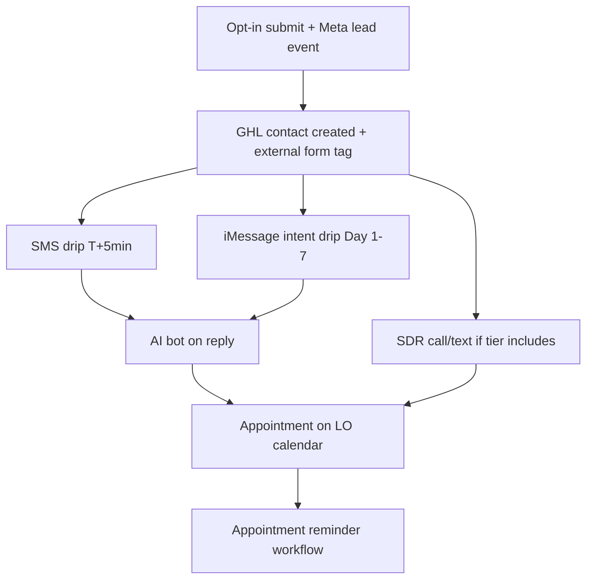

# RM Funnel Form Spec

> **DRAFT — DISQUALIFY-FIRST · HECM LEAD INTAKE.** The canonical reverse-mortgage lead funnel
> built in **Perspective** and integrated to the client's **GoHighLevel** sub-account. Every
> question exists to **qualify** (or surface a deal-killer) before the prospect reaches the LO or
> SDR — no decorative fields. Inherits product facts and compliance from
> [Intelligence RM Product](intelligence-rm-product.md),
> [Doctrine Reverse Mortgage](doctrine-reverse-mortgage.md), and
> [RM Compliance Guardrails](rm-compliance-guardrails.md).
>
> **Template rule:** This doc is **client-agnostic**. At build time, replace every `{placeholder}`
> with the client's approved copy, NMLS, contact info, and licensed states. Never commit live
> client names, phones, or addresses to this spec.

## Purpose

Define the standard RM Perspective funnel — page order, qualifying questions, answer options,
conditional logic, thank-you page blocks, GHL field mapping, and post-submit cadence — so media
buying and ops build consistent client funnels from one template.

## Scope

Perspective funnel pages, form questions, answer options, disqualification logic, thank-you page
requirements, GHL integration fields, and links to downstream nurture. Does **not** duplicate full
SMS/iMessage copy (see related nurture docs).

## Trigger

- Duplicating the [Reverse Template](../media-buying/perspective-client-manifest.yaml) funnel for a new RM client
- Revising qualifying questions or step order on an active client funnel
- Auditing GHL field mapping after a Perspective publish

## Inputs

- Product thresholds: [Intelligence RM Product](intelligence-rm-product.md) (age 62+, primary residence, equity)
- Intentional friction doctrine: [Doctrine Reverse Mortgage](doctrine-reverse-mortgage.md)
- Build steps: [Perspective Funnel Setup SOP](../media-buying/perspective-funnel-setup-sop.md)
- Intent routing for nurture: [RM iMessage Intent Drip (7-Day)](../client-marketing/rm-imessage-intent-drip-7day.md)

## Outputs

- A built, mapped, published Perspective funnel on `hecm.homequityhacks.com/{client_slug}`
- GHL contact with `form_intent`, qualification fields, and `external form` tag
- Meta Pixel `lead` event on final submit

## Quality Bar

- Align with [Identity Core](../../company/doctrine-identity-core-april-26.md) and [SOURCE-OF-TRUTH](../../SOURCE-OF-TRUTH.md).
- HECM / reverse mortgage framing only — no purchase or forward-mortgage angles on RM funnels.
- Marketing copy stays number-free; numeric inputs on form steps are **qualification capture**, not quotes.
- Footer on **every** page + thank-you page: `{company_name}`, `{mlo_name}`, `{nmls}`, `{address}`, Equal Housing Lender, disclaimer.

## Template placeholders

Replace at client build time:

| Placeholder | Use |
|-------------|-----|
| `{client_slug}` | URL slug on `hecm.homequityhacks.com` |
| `{company_name}` | Brokerage / brand name in copy and footer |
| `{mlo_name}` | Loan officer full name (consent, about section if used) |
| `{nmls}` | LO or company NMLS ID |
| `{phone}` | Client callback number (shown on thank-you + footer) |
| `{area_code}` | Area code hint on thank-you ("Watch for a call from a {area_code} number") |
| `{address}` | Company address in footer |
| `{hq_city}` | City for about-us block |
| `{licensed_states}` | States LO is licensed in |
| `{client_website_url}` | Company website (CTA if used) |
| `{privacy_policy_url}` | Privacy policy link |
| `{terms_url}` | Terms of use link |

## Operating Content

### Design principle — qualify-first friction

The RM funnel is **not** optimized for maximum form fills. Prospects answer real questions about
their home, mortgage, age, and goals before submitting contact info. Effort creates intent — see
[Doctrine Reverse Mortgage](doctrine-reverse-mortgage.md).

### Journey map (canonical page order)

| # | Page role | User-facing headline / purpose | Input type |
|---|-----------|--------------------------------|------------|
| 1 | Intent lander | Hero + intent question | Button select (4 options) |
| — | Loading interstitial | Brief progress screen after intent select | Auto-advance |
| 2 | Mortgage screen | Do you have a mortgage on the property? | Yes / No |
| 3 | Balance screen | Remaining Mortgage Balance? | Numeric (`Est Balance`) |
| 4 | Value screen | What do you think your home is worth? | Numeric (`Est Property Value`) |
| 5 | Age screen | What's your current age? | Numeric (`Age`) |
| 6 | Marital status | Are you currently married? | Yes / No |
| 7 | Spouse age | What's the age of your spouse? | Text (conditional) |
| 8 | State | What State is Your Property Located In? | Text or dropdown (`State`) |
| 9 | Opt-in | Where to send results to? | Contact + consent |
| — | Loading interstitial | Post-submit progress | Auto-advance |
| 10 | Thank-you | Confirmation + credibility + call expectations | Read-only |
| 11 | End | Terminal | — |

**Conditional branches**

| Condition | Behavior |
|-----------|----------|
| Married = **Yes** | Show spouse age (step 7) |
| Married = **No** | Skip spouse age |
| Mortgage = **Yes** | Show remaining balance (step 3) |
| Mortgage = **No** | Skip balance → go directly to value |

**Template variants:** The [Reverse Template](../media-buying/perspective-client-manifest.yaml) in
Perspective may ship with separate A/B landers (e.g. remove-payment vs cash-out entry) or a split
last-name step. **Default for new client builds:** single intent lander + combined opt-in page as
documented above unless media buying is actively A/B testing entry angles.

### Step 1 — Intent lander (hero + challenge question)

**Hero copy pattern**

| Element | Copy pattern |
|---------|--------------|
| Eyebrow | The Equity Option Banks Rarely Mention |
| Headline | Your Home Is Sitting on Thousands of Dollars. This Program Lets You Access It — No Monthly Payments. |
| Subhead | See if you qualify in 60 seconds. No credit check. No obligation. 100% confidential. |
| Question | If you could solve one challenge, what would it be? |

**Loading interstitial copy (after intent select):** short progress message (e.g. *Checking
eligibility…* or *Reviewing your answers…*) — auto-advances to step 2.

**Answer options → GHL `form_intent` routing**

| Button label | Suggested `form_intent` value | Nurture segment |
|--------------|-------------------------------|-----------------|
| Eliminate my mortgage payment | `remove_mortgage_payment` | Segment 1 — [intent drip](../client-marketing/rm-imessage-intent-drip-7day.md) |
| Get extra cash without a new monthly bill | `cash_out` or `tax_free_cash_out` | Segment 3 |
| Eliminate debt that's stressing my retirement | `pay_off_debt` | Segment 2 |
| Protect myself from rising costs and unexpected expenses | `cash_out` (or map to closest segment at GHL) | Segment 3 |

Map the selected option to the intent field in Perspective → GHL. Confirm `form_intent` custom
field is set in GHL workflow from the mapped value — required for
[intent-segmented nurture](../client-marketing/rm-imessage-intent-drip-7day.md).

### The questions (qualifier set)

| # | Question | Input | Answer options / format | Disqualifies or flags when… | GHL field (confirm per sub-account) |
|---|----------|-------|-------------------------|----------------------------|-----------------------------------|
| 1 | If you could solve one challenge, what would it be? | Button | 4 intent options (see above) | — (routes nurture only) | `form_intent` |
| 2 | Do you have a mortgage on the property? | Button | Yes · No | No → may still qualify (free-and-clear); balance skipped | `has_mortgage` |
| 3 | Remaining Mortgage Balance? | Number | Free numeric | High LTV vs value → weak / no cash-out room (internal) | `est_balance` |
| 4 | What do you think your home is worth? | Number | Free numeric | Very low value → below program minimums (internal) | `property_value` / `estimated_home_value` |
| 5 | What's your current age? | Number | Free numeric | Under 62 → **DQ** (HECM age floor) | `age` |
| 6 | Are you currently married? | Button | Yes · No | — (branching only) | `married` |
| 7 | What's the age of your spouse? | Text | Free text (conditional) | Spouse under 62 if NBS rules apply (internal) | `spouse_age` |
| 8 | What State is Your Property Located In? | Text / dropdown | State name or code | Outside LO licensed states → **DQ** (internal) | `state` |
| 9 | Where to send results to? | Form | First · Last · Phone · Email · SMS consent | Missing consent → block submit | standard contact + consent fields |

> **Build notes**
>
> - After duplicating the template, run Perspective **get_crm_properties** (MCP) and map each
>   question title to the correct GHL field — internal Perspective field IDs change per funnel copy.
> - Fix spouse-age placeholder typo if present on template (*Age of spouse*, not *souse*).
> - Prefer state **dropdown** over free text to reduce bad data.

### Opt-in page spec

| Element | Requirement |
|---------|-------------|
| Headline | Where to send results to? |
| Fields | First name, last name, phone (US +1 default), email |
| SMS consent | I Consent to Receive SMS Notifications, Alerts & Occasional Marketing Communication from **{mlo_name}**. You can reply STOP to unsubscribe at any time. |
| Submit CTA | **Learn More How This Works** — Meta Pixel `lead` event fires on this button click (not page view) |
| Consent UX | SMS consent checkbox must be **checked** before submit (tap label if hidden input) |
| Footer | `{company_name}` · NMLS # `{nmls}` · Equal Housing Lender · `{phone}` · `{address}` · disclaimer · Terms · Privacy |

### Thank-you page spec

Thank-you page is **credibility + call expectation-setting** — not where nurture runs. GHL owns
post-submit SMS/iMessage; this page sets what happens in the next 15 minutes.

#### Hero — confirmation + speed-to-lead promise

| Element | Copy pattern |
|---------|--------------|
| Headline | Get a Free Property Valuation |
| Urgency line | We're calling you in the next **15 minutes**. |
| Caller ID hint | Watch for a call from a **{area_code}** number |
| Subhead | Your free retirement mortgage valuation is ready. Someone from our team will be reaching out to you shortly. |
| Primary CTA | **Save Our Number** |

#### What happens next (3-step timeline)

| Step | Title | Body copy pattern |
|------|-------|-------------------|
| 1 | We review your information now | Your advisor is looking over the details you submitted to prepare your personalized valuation. |
| 2 | We call you in the next 15 minutes | You'll receive a personal call from your dedicated **{company_name}** advisor — not an automated system. |
| 3 | We walk through your valuation together | **15–20 minutes.** No pressure. No commitment. Just clear answers about what you actually qualify for. |

#### Value props — strategy call section

**Section title:** Get a Free Strategy Call To See What You Qualify For

| Bullet | Copy pattern |
|--------|--------------|
| Free & no-obligation | Get an expert-driven assessment at no cost — no commitments, just valuable insights. |
| Fast & accurate | Receive a precise quote on what you can actually qualify for. |
| Compare options | We help you find the best deal in the market — our team compares all options. |

**Repeat CTA:** Start your Free Valuation · *Only 2 min and completely free*

#### Social proof — testimonials block

**Section title:** Trusted by Homeowners, Backed by Results

| Element | Requirement |
|---------|-------------|
| Subhead | Helping Over Thousands Of Retirees |
| Intro | See why property owners rely on our free valuation service to make informed decisions. |
| Testimonials | **3** quotes — use client-approved testimonials or compliant generic composites on duplicate |

**Testimonial structure (template):** short headline in quotes + 1–2 sentence body. Use first
name only or initials per compliance review. Do not paste live borrower quotes without LO approval.

#### Education tiles (3-up)

| Tile | Headline | Body pattern |
|------|----------|--------------|
| 1 | Cash For Expenses | You can use a reverse to get monthly cash to fit your lifestyle. |
| 2 | Keep Your Home | With a reverse you can keep your home and still offer it to your heirs. |
| 3 | Who Can Qualify? | You and your spouse must be at least 62 and own the home. |

**Section label above tiles:** Reverse Mortgage For Seniors · Expert Guidance for Success

#### About us block

| Element | Copy pattern |
|---------|--------------|
| Section title | About us |
| Headline | Welcome To **{company_name}** |
| Lead | Built on a simple belief: financing a home shouldn't feel overwhelming. |
| Body | **{company_name}** is a **{hq_city}**–based mortgage brokerage specializing in helping homeowners approaching or in retirement turn built equity into breathing room — supplement income, eliminate a mortgage payment, cover healthcare or in-home care, or consolidate debt. |
| Tone line | No pressure, no jargon, no feeling rushed — just a clear path to more breathing room. |
| License line | Licensed in **{licensed_states}** |
| Tagline | Helping homeowners achieve the best outcomes |

> **Layout note:** Current V2 template uses a **company/about** block on thank-you. Legacy SOP
> also lists optional **Meet {mlo_name}** headshot + bio — add when client tier requires face-on
> credibility; omit when company-brand thank-you is sufficient.

#### FAQ accordion — "About your call"

| Question | Answer pattern |
|----------|----------------|
| How long will the call be? | 15–20 minutes. We respect your time. We'll cover what matters and never keep you longer than needed. |
| Will I be pressured to sign anything? | Absolutely not. This is an educational conversation, not a sales call. The decision is entirely yours, on your timeline. |
| What should I have ready? | Nothing. We have everything we need from your submission. Just answer when we call. |

#### Footer (duplicate from funnel pages)

`{company_name}` · NMLS # `{nmls}` · Equal Housing Lender · `{phone}` · `{address}` · NMLS Consumer
Access · Terms of Use · Privacy Policy · standard disclaimer (*Not a commitment to lend…*)

#### Optional CTAs on thank-you page

- **Save Our Number** (hero)
- **Start your Free Valuation** (mid-page + about section) — confirm destination (re-entry vs calendar) per client build

### Post-submit journey (Perspective → GHL → booking)

| Stage | Timing | System | Doc |
|-------|--------|--------|-----|
| CRM ingest | Immediate | GHL ← Perspective integration | [Perspective Funnel Setup SOP](../media-buying/perspective-funnel-setup-sop.md) |
| First SMS | +5 minutes | GHL workflow | [RM Text Drip 2025](../client-marketing/rm-text-drip-2025.md) |
| Intent nurture | Day 1–7 | GHL iMessage (by `form_intent`) | [RM iMessage Intent Drip](../client-marketing/rm-imessage-intent-drip-7day.md) |
| AI booking | On reply | WM AI bot | [How The WM AI Bot Works](../crm-architecture/how-wm-ai-bot-works.md) |
| SDR first contact | ≤5 minutes (SDR tier) | Call center | [Fulfillment Lead Lifecycle](../fulfillment-lead-lifecycle.md) § Stage 3 |
| Appointment reminders | Post-booking | GHL | [RM iMessage Appointment Follow-Up](../client-marketing/rm-imessage-appointment-followup.md) |

**Speed-to-lead rule:** First contact attempt within **5 minutes** of form submission on SDR-supported programs.

### GHL custom-field mapping

Perspective → GoHighLevel mapping at integration (SOP step 3). Fields **must exist in the client GHL
sub-account before mapping**. Confirm field API names against the client's GHL snapshot — do not
assume names from another client's sub-account.

| Form question | GHL field (typical) |
|---------------|---------------------|
| Intent / challenge | `form_intent` |
| Mortgage on property | `has_mortgage` |
| Est balance | `est_balance` |
| Est property value | `property_value` / `estimated_home_value` |
| Age | `age` |
| Married | `married` |
| Spouse age | `spouse_age` |
| State | `state` |
| Contact | `first_name`, `last_name`, `phone`, `email` |
| SMS consent | consent / compliance custom field |
| Entry tag | `external form` |

Also map UTM fields when present. After publish, verify ingest with a test lead before sending traffic.

### Integrations checklist

Follow [Perspective Funnel Setup SOP](../media-buying/perspective-funnel-setup-sop.md):

1. Duplicate **Reverse Template** funnel; rename for `{client_slug}`; set logo + footer placeholders.
2. Replace testimonials, about copy, `{phone}`, `{area_code}`, and licensed states on thank-you page.
3. Activate **GoHighLevel** integration → client sub-account; map all fields; add `external form` tag.
4. Activate **Meta Pixel** → map `lead` event to final opt-in button click.
5. Publish to `hecm.homequityhacks.com/{client_slug}`; update [perspective-client-manifest.yaml](../media-buying/perspective-client-manifest.yaml) and ClickUp client file.

### Funnel diagnostics (reference — not stored in git)

Use [Perspective Intelligence Bridge](../../operations/perspective-intelligence-bridge.md) + MCP to
pull live step drop-off and conversion for a **specific client funnel** when optimizing. Typical
patterns to watch (order-of-magnitude, not targets):

| Pattern | What it usually means |
|---------|------------------------|
| High drop-off on intent lander | Ad/funnel message mismatch or too many intent options |
| Long dwell on opt-in | Normal — contact step; test shorter form only if completion rate is broken |
| Low thank-you views vs opt-in submits | Tracking quirk or redirect issue — verify in Perspective UI |

Do not commit client-specific KPI time series or funnel IDs to this spec.

### Compliance

- Primary-residence HECM framing; no guaranteed approval or specific rates in marketing copy.
- TCPA/SMS consent on opt-in; honor STOP/HELP in GHL automations.
- Equal Housing Lender + NMLS footer on all pages including thank-you.
- Confirm consent wording with counsel before traffic.

## Related Docs

- [Perspective Funnel Setup SOP](../media-buying/perspective-funnel-setup-sop.md)
- [Perspective Intelligence Bridge](../../operations/perspective-intelligence-bridge.md)
- [perspective-client-manifest.yaml](../media-buying/perspective-client-manifest.yaml)
- [Doctrine Reverse Mortgage](doctrine-reverse-mortgage.md)
- [Intelligence RM Product](intelligence-rm-product.md)
- [RM Compliance Guardrails](rm-compliance-guardrails.md)
- [Fulfillment Lead Lifecycle](../fulfillment-lead-lifecycle.md)
- [RM Text Drip 2025](../client-marketing/rm-text-drip-2025.md)
- [RM iMessage Intent Drip (7-Day)](../client-marketing/rm-imessage-intent-drip-7day.md)
- [RM Quiz Funnel V2 Blueprint](rm-quiz-funnel-v2-blueprint.md) — quiz-native redesign target
- [DSCR Funnel Form Spec](../dscr-dna/dscr-funnel-form-spec.md) — parallel spec pattern
