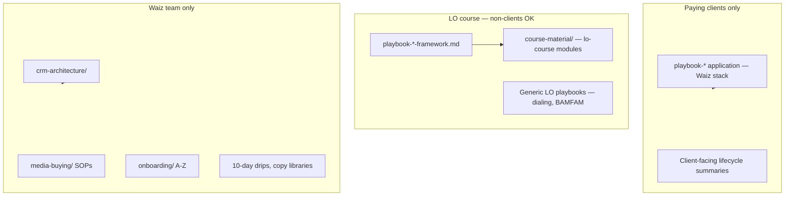

# Shareability Boundaries — LO Course vs Internal Fulfillment

## Purpose

Protect **Waiz DFY fulfillment** (how we build and run systems for paying clients) while still publishing **shareable frameworks** for loan officer education — including LOs who are **not** Waiz clients yet.

AI, team, and course authors must classify every doc before linking it into an LO course module.

## The rule

| Question | If **yes** → shareability |
|----------|---------------------------|
| Can any RM LO learn this without revealing how Waiz delivers DFY? | `lo-course` |
| Is this for **paying Waiz clients** only (their stack, their portal)? | `paying-client` |
| Is this **Waiz team** execution (GHL builds, bot logic, MB ops, onboarding runbooks)? | `internal-fulfillment` |
| Is this selling Waiz to LO prospects? | `docs/acquisition/` — not client-fulfillment |

**Never** put `internal-fulfillment` or `paying-client` doc content into an LO course for non-clients. **Link** to `lo-course` frameworks instead.

---

## Shareability tiers

| Tier | Who sees it | Course for non-client LOs? | Examples |
|------|-------------|----------------------------|----------|
| **`lo-course`** | Any LO (prospects, course, community) | **Yes** | Nurture principles, BAMFAM, manual dialing discipline, RM borrower psychology, compliance education |
| **`paying-client`** | Waiz DFY clients only | **No** — client portal / onboarding | Waiz Meta automation overview for *their* account, client-specific drips, lifecycle map for clients |
| **`internal-fulfillment`** | Waiz team only | **No** — never | GHL workflow specs, WM AI bot logic, A-Z onboarding SOP, media-buying SOPs, drip copy libraries, CRM tag architecture |



---

## Doc patterns by tier

### `lo-course` (shareable frameworks)

| Pattern | Folder | Notes |
|---------|--------|-------|
| `playbook-{topic}-framework.md` | `client-marketing/` | Universal principles — **primary source for LO course** |
| `*-course-material.md` with `shareability: lo-course` | `course-material/` | Teaching modules; link frameworks only |
| Generic LO skills | `client-marketing/` | e.g. BAMFAM, manual dialing — no Waiz GHL internals |
| RM education | `reverse-mortgage-dna/`, `course-material/` | Compliance guardrails, borrower ICP — education OK |

### `paying-client`

| Pattern | Folder | Notes |
|---------|--------|-------|
| `playbook-{topic}.md` (application) | `client-marketing/` | Waiz-specific stack for Meta, etc. |
| `fulfillment-lead-lifecycle.md` (client lens) | root CF | What *their* engine does — not how we build it |
| Per-client deltas | `client-marketing/clients/` | Always |

### `internal-fulfillment`

| Pattern | Folder | Notes |
|---------|--------|-------|
| `crm-architecture/` | | Bot, tags, infrastructure specs |
| `onboarding/a-z-*` | `onboarding/` | Post-close runbooks |
| `media-buying/` | | Campaign setup, MB ops |
| `*-drip-campaign.md`, copy libraries | `client-marketing/` | Executable copy + GHL |
| `client-success/` constraint SOPs | | Internal CS diagnosis |

---

## Frontmatter (required on new playbooks)

```yaml
shareability: lo-course   # lo-course | paying-client | internal-fulfillment
```

| Layer | Default shareability |
|-------|---------------------|
| `playbook-*-framework.md` | `lo-course` |
| `playbook-*.md` (Waiz application) | `paying-client` |
| `course-material/` (prospect course) | `lo-course` |
| `course-material/` (DFY client portal module) | `paying-client` |
| `*-sop.md` in media-buying, onboarding, crm-architecture | `internal-fulfillment` |
| Execution / drip copy | `internal-fulfillment` |

---

## Course authoring safeguards

Before publishing any module to an **LO course for non-clients**:

1. Set `shareability: lo-course` on the course material doc.
2. **Link only** to docs tagged `lo-course` (or acquisition marketing).
3. Run [shareability checklist](SHAREABILITY-CHECKLIST.md).
4. If a topic needs Waiz DFY context, use a **gated appendix**: *"Waiz DFY clients — see client portal"* — do not link internal paths in the main lesson body.
5. **Forbidden in prospect course body:** links to `crm-architecture/`, `onboarding/a-z`, `media-buying/`, `10-day-rm-drip`, bot specs, GHL routing tables.

When building via [client-playbook-creator](../../.claude/skills/client-playbook-creator/SKILL.md), the agent runs the shareability gate before save.

---

## Reference split (lead nurture)

| Doc | Shareability | Role |
|-----|--------------|------|
| [playbook-nurture-framework.md](../client-marketing/playbook-nurture-framework.md) | `lo-course` | LO course — principles |
| [lead-nurture-playbook.md](../course-material/lead-nurture-playbook.md) | `lo-course` | LO course module (framework-first) |
| [playbook-lead-nurture.md](../client-marketing/playbook-lead-nurture.md) | `paying-client` | Waiz Meta stack — clients / team |
| [10-day-rm-drip-campaign.md](../client-marketing/10-day-rm-drip-campaign.md) | `internal-fulfillment` | Copy + GHL — team only |
| [how-wm-ai-bot-works.md](../crm-architecture/how-wm-ai-bot-works.md) | `internal-fulfillment` | Bot spec — team only |

---

## Related

- [Waiz vs client marketing boundaries](waiz-vs-client-marketing-boundaries.md)
- [Client Playbooks README](client-playbooks/README.md)
- [PLAYBOOK-FORMAT.md](client-playbooks/PLAYBOOK-FORMAT.md)
- [Shareability checklist](client-playbooks/SHAREABILITY-CHECKLIST.md)
- [client-playbook-creator skill](../../.claude/skills/client-playbook-creator/SKILL.md)
