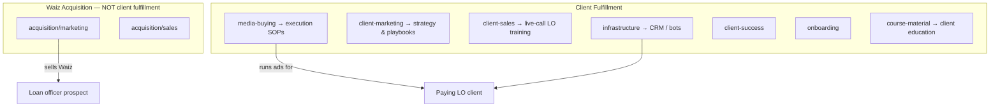

# Waiz Marketing vs Client Marketing — Boundaries

## Purpose

Prevent mixing **Waiz Media’s own growth** (selling Waiz to loan officers) with **marketing Waiz runs for clients** (loan officer lead gen, ads, funnels). AI and team should load the correct folder before writing SOPs, prompts, or ads.

## The Rule

| Question | If **yes** → folder |
|----------|---------------------|
| Is this about selling **Waiz Media** (demos, Boot Camp offer, Waiz brand)? | [`docs/acquisition/`](../acquisition/README.md) — especially [`marketing/`](../acquisition/marketing/README.md) and [`sales/`](../acquisition/sales/README.md) |
| Is this about **a paying client's** campaigns, CRM, ads, or client training? | [`docs/client-fulfillment/`](README.md) — see map below |
| Is this Waiz **internal** ops (hiring MBs, billing, VA tasks)? | [`docs/operations/`](../operations/README.md) |

**Never** file client Facebook ad SOPs under `acquisition/marketing/`. **Never** file Waiz case-study emails under `client-fulfillment/media-buying/`.

## Side-by-Side

| | **Waiz company marketing** | **Client marketing & delivery** |
|--|---------------------------|--------------------------------|
| **Goal** | Book demos; sell DFY / Boot Camp | Generate leads and appointments **for the LO client** |
| **Audience** | Reverse mortgage LO prospects | Homeowners / borrowers (client’s market) |
| **Brand voice** | Waiz Media ([brand doctrine](../company/doctrine-brand-and-visual-identity-april-26.md)) | Client / RM compliant ([reverse-mortgage-dna/](reverse-mortgage-dna/README.md)) |
| **Canonical home** | `docs/acquisition/marketing/` | `docs/client-fulfillment/client-marketing/` + `media-buying/` |
| **Drive source (export)** | `01 _ Acquisition/Marketing/` | `03 _ Client Fulfillment/Media Buying/` + client course material |
| **Examples** | Money Tales emails, Waiz ad scripts, ICP for **buying Waiz** | Campaign setup, ad copy library, Meta BM setup **for clients** |

## Client Fulfillment Map (client-side only)

| Subfolder | What belongs here |
|-----------|-------------------|
| [infrastructure/](infrastructure/README.md) | GHL, tags, AI bot, client CRM — **systems clients run on** |
| [client-marketing/](client-marketing/README.md) | RM ad playbooks, funnels, drips, nurture — **what we market for clients** (links to media-buying SOPs) |
| [client-sales/](client-sales/README.md) | Live-call LO training — discovery, beliefs, BAMFAM, close mechanics |
| [media-buying/](media-buying/README.md) | Day-to-day ad account ops, campaign setup, MB resources |
| [client-success/](client-success/README.md) | Performance, constraints, KPIs after launch |
| [onboarding/](onboarding/README.md) | Post-close client onboarding |
| [course-material/](course-material/README.md) | Client course material & education — **`shareability: lo-course`** for prospect LO course |
| [client-playbooks/](client-playbooks/README.md) | Playbook index, methodology pools, creation guide |
| [shareability-boundaries.md](shareability-boundaries.md) | **LO course vs DFY fulfillment** — what not to expose to non-clients |
| [reverse-mortgage-dna/](reverse-mortgage-dna/README.md) | RM market knowledge for **client** campaigns |
| [dscr-dna/](dscr-dna/README.md) | DSCR refinance product knowledge for **client** campaigns (investor ICP; refinance only) |

## Infrastructure (on GitHub)

Client delivery infrastructure lives here — **not** under acquisition:

- [CRM Infrastructure](crm-architecture/crm-infrastructure.md) (`active`)
- [How The WM AI Bot Works](crm-architecture/how-wm-ai-bot-works.md) (`active`)
- Hub: [infrastructure/](infrastructure/README.md)

Raw export mirror: `source-docs/.../03 _ Client Fulfillment/CRM Architecture/`

## Migration Rule

When converting from Drive:

1. Check this page.
2. If path starts with `01 _ Acquisition` → `docs/acquisition/`.
3. If path starts with `03 _ Client Fulfillment/Media Buying` → `docs/client-fulfillment/media-buying/` (and link from `client-marketing/` when it’s playbook-level).
4. If client course material → `course-material/` unless it's the canonical internal SOP (then `media-buying/` per [duplicate-resolutions](../_inventory/duplicate-resolutions.md)).

## Related

- [Client Fulfillment README](README.md)
- [Shareability boundaries](shareability-boundaries.md)
- [Acquisition Marketing](../acquisition/marketing/README.md)
- [Approved Operating Spine](../SPINE.md)
