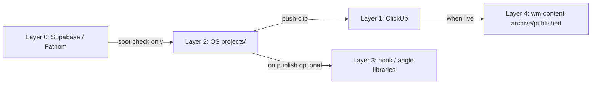

# Repurpose Projects — Storage & Lifecycle

**Purpose:** Keep Wm-os lean while running call → clip → editor workflows. Define
what lives in git, what stays in ClickUp, and when to create vs distill vs archive.

**Trigger:** Before `/new-repurpose-project`, `/push-clip`, or when a project
finishes / stalls.

**Scope:** Personal lane repurpose projects only (`personal/projects/`).

## System of record (five layers)

| Layer | System | Store | Never duplicate here |
|-------|--------|-------|----------------------|
| **0 — Raw** | Supabase / Fathom | Full transcript + recording | Wm-os git |
| **1 — Production** | ClickUp Personal Brand Pipeline | Status, assignee, revisions, export URLs | OS clip briefs |
| **2 — Structure** | Wm-os `personal/projects/[slug]/` | PROJECT.md + clip briefs (distilled edit plan) | Full transcript, video files |
| **3 — Reusable KB** | `personal/hook-library.md`, `angle-library.md`, etc. | Patterns that repeat across posts | Per-clip cut lists |
| **4 — Publish log** | `wm-content-archive/published/` (sibling, not git) | Live post URL, date, performance notes | ClickUp task bodies |

**Rule:** Each fact has one home. OS holds **edit structure**; ClickUp holds
**execution state**; Supabase holds **raw calls**; KB holds **reusable ideas**.

## Creation gates — when to open a project

Create **one** `personal/projects/[slug]/` folder only when **all** are true:

| Gate | Requirement |
|------|-------------|
| Source quality | Call has ≥1 splittable coaching moment (not rapport-only) |
| Commitment | Gabe intends ≥1 main clip to edit (not "maybe someday") |
| WIP capacity | Active projects ≤ **2** (see index) — finish or archive one first |
| No duplicate | Same Fathom URL / Supabase call UUID not already in Active or Completed index |

**Do not create a project when:**

- You only want hooks for the KB → run **knowledge-capture** into `angle-library.md`
- One-off filmed reel → `/script` → `personal/scripts/` (no project folder)
- Call is internal ops with no public clip plan → Supabase only

## What goes in the OS (and what does not)

### Store in `projects/[slug]/`

| Asset | Why |
|-------|-----|
| `PROJECT.md` | Master index, spot-check, publish order |
| Current clip brief (`clips/01-…md`) | Editor structure for **active** clip only |
| Fathom links + timestamp ranges | Pointers to layer 0 — not transcript text |
| `clickup_task_id` on clip frontmatter | Cross-link to layer 1 |

### Do not store in Wm-os

| Asset | Correct home |
|-------|--------------|
| Full transcript | Supabase `*_calls` or `wm-content-archive/transcripts/` |
| Raw / exported video | Drive, Frame.io, ClickUp `Final Asset Link` |
| Editor revision threads | ClickUp comments / Proofing |
| Duplicate beat tables | ClickUp task description **or** clip brief — not both in OS after push |
| Splinter clip files (`01a`) | Create only in phase 2 after parent main is **published** |
| Next main clip file (`02`) | Create only when clip 01 is published or explicitly handed off |

### Lazy file rule (reduces flood)

| When | Files to create |
|------|-----------------|
| `/new-repurpose-project` | `PROJECT.md` + **clip 01 only** |
| Clip 01 → editor | `/push-clip` — no new OS files |
| Move to clip 02 | `/add-clip` — one new clip file |
| Phase 2 short | New `01a-short-….md` only after main 01 `status: published` |

Queued clips stay as **rows in PROJECT.md** until they become current.

## ClickUp vs OS — no double maintenance

**Task shape:** One video = one ClickUp task with **zero** workflow subtasks
(captions, assembly, export live in `## Editor notes`). Multi-clip projects only:
parent `PROJECT — …` + **one subtask per clip**. See
[clickup-personal-brand-pipeline.md](../../clickup-personal-brand-pipeline.md).

After `/push-clip`:

| Field | Source of truth |
|-------|-----------------|
| Edit status (Editing, In Review, Revisions) | **ClickUp** |
| Clip structure (segments, cut list, hook) | **OS clip brief** until published |
| Assignee, due date, revision # | **ClickUp** |
| `clickup_task_id` | **OS** frontmatter (link only) |

Agents update OS clip `status` on major milestones (`approved` → `scripted` →
`published`). Do **not** mirror every ClickUp status change in OS.

## WIP limits

| Limit | Value | Action if exceeded |
|-------|-------|-------------------|
| Active projects | **2 max** | Archive or complete one before `/new-repurpose-project` |
| Active clip files per project | **1 main** (+ phase-2 shorts only after publish) | Use PROJECT.md queue |
| Open ClickUp clip tasks per project | 1 clip task/subtask active in phase 1 | Queue in PROJECT.md; push when prior clip is Published |

Active list lives in [projects/README.md](README.md). Completed list is separate.

## Project status lifecycle

| Status | Meaning | Index table |
|--------|---------|-------------|
| `active` | Phase 1 in progress | **Active projects** |
| `completed` | All mains published or explicitly killed | **Completed projects** |
| `archived` | Kept for reference; no active work | Completed only (demoted) |

### Clip status (frontmatter)

`in-review` → `approved` → `scripted` (ClickUp pushed) → `published`

Skip `filmed` for `call-clip-edit` — source is the call recording.

## Completion workflow

**Trigger:** Last main clip published, or Gabe says "archive project [slug]".

1. Set `PROJECT.md` frontmatter `status: completed` (or `archived`)
2. Move row from **Active** → **Completed** in [projects/README.md](README.md)
3. Ensure each published clip has `status: published` + ClickUp task in **Published**
4. **Optional distill** (only if hook/framework is reusable):
   - Append 1 row to `angle-library.md` or `hook-library.md`
   - Source: `project:[slug]:clip-[id]` — not full clip body
5. **Optional** publish log: `wm-content-archive/published/YYYY-MM-DD-ig-[slug].md`
6. Do **not** delete the project folder — briefs are small; index demotion is enough

### Kill / abandon

If project stops before publish:

1. `PROJECT.md` `status: archived`
2. Note reason in PROJECT.md (one line)
3. Move to Completed with note `killed`
4. ClickUp tasks → **Killed** — OS does not delete history

## KB distillation — when to pull into libraries

| Situation | Action |
|-----------|--------|
| New repurpose project scaffolded | **No** auto-append to angle-library |
| Clip structure approved | **No** — structure stays in project |
| Clip **published** and performed | **Optional** — distill hook + framework to libraries |
| Call had no clip plan | **knowledge-capture** only — no project folder |

Distill **patterns**, not production artifacts. One library row beats duplicating
a full clip brief.

## Monthly hygiene (15 min)

| Check | Action |
|-------|--------|
| Active projects > 2? | Complete, kill, or archive oldest |
| Stuck `in-review` > 14 days? | Approve, revise, or archive |
| ClickUp Published but OS `status` stale? | Bump clip + PROJECT to `published` |
| Completed projects > 12? | Keep folders; Completed table is fine — no purge required |
| Duplicate Fathom URLs in index? | Merge or archive duplicate project |

## Agent rules

Before `/new-repurpose-project`:

1. Read this file + [projects/README.md](README.md)
2. Count Active projects — stop at 2 unless Gabe overrides
3. Check Fathom URL / call UUID not already indexed
4. Never paste transcript blocks into PROJECT.md or clip briefs
5. Never create `personal/scripts/` for call-clip-edit unless reshooting filmed

Before `/push-clip`:

1. Confirm clip not already pushed (`clickup_task_id` empty)
2. ClickUp owns execution after push — minimal OS updates

On publish:

1. Update clip `status: published`
2. Offer optional KB distill + publish log — default **skip** unless Gabe asks

Command: `/archive-project [slug]` — run completion workflow above.

## Related

- [projects/README.md](README.md) — index + workflow
- [EditorProjectcreator skill](../../../../.claude/skills/editor-project-creator/SKILL.md)
- [INFRASTRUCTURE.md](../../INFRASTRUCTURE.md) — content-engine routing
- [clickup-personal-brand-pipeline.md](../../clickup-personal-brand-pipeline.md)
- [call-intelligence-bridge.md](../../../operations/call-intelligence-bridge.md)
