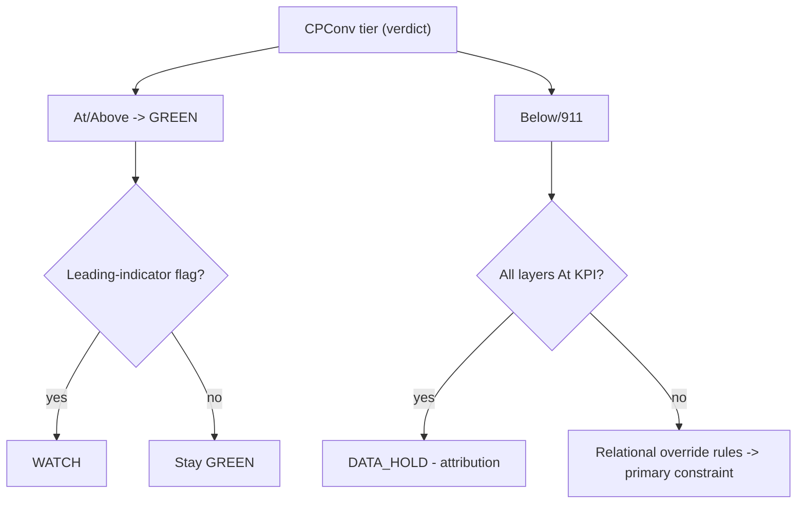

# Client KPI Judgment Standard

## Purpose

Define **how Waiz judges reverse-mortgage client performance** — not as a stack of isolated pass/fail tiers, but as a single **outcome-anchored, relational** model. A metric is never "good" or "bad" on its own. It is good or bad **relative to the outcome it is supposed to produce** and **relative to the other metrics around it**.

This is a clean rebuild. It replaces the isolated-tier method in the prior standards docs (see [Supersession map](#11-supersession-map)). The numbers here are **re-derived from funnel math**, not inherited.

## Scope

- Per-client account-health judgment for Meta → landing → call center → LO funnels.
- The **logic** of judgment (what verdict to assign and why). Time-window mechanics (W7/W14/W30, WATCH/RECOVERING) live in the [Client Performance Diagnostic Rulebook](client-performance-diagnostic-rulebook.md); the runnable steps live in the [Client Diagnostic Playbook (Runnable)](client-diagnostic-playbook-runnable.md).

Out of scope: dashboard visual layout (deferred), acquisition sales KPIs ([sales-kpi-thresholds](acquisition/sales-kpi-thresholds.md)).

## Owner

See [domain owners](../_inventory/domain-owners.md): **client-success** (account verdict). Media buyer owns L1–L2 levers, CSR manager owns L3, client success owns L4 + CPConv accountability.

---

## 1. Philosophy — the one idea

> **CPConv is the verdict. Every other metric is evidence.**

**CPConv** (cost per qualified conversation = ad spend ÷ showed appointments) is not "one more KPI." It is the **empirical composite score** of the entire funnel. Ad efficiency, landing-page conversion, lead quality, booking, and show rate are all *already inside it*. If CPConv is healthy, the machine is working — even if an upstream number looks ugly. If CPConv is broken, at least one layer is failing and the upstream metrics tell you **which**.

Two lenses, one conclusion:

| Lens | What it says |
|------|--------------|
| **CEO / marketer** | We are buying **profitable booked conversations**, not cheap clicks. A more expensive lead that converts is a *win*. Do not optimize a vanity metric (CPL, CTR, opt-in) against the metric that pays the bills. |
| **Data analyst** | CPConv is a deterministic function of the upstream rates. So upstream "tiers" that aren't derived from a CPConv target will contradict CPConv — and they currently do (see §4). Judge the composite; use components as **explainers and leading indicators**. |

### 1.1 The principle that broke the old standard

The founder's example is the whole thesis: **CPL can be "Below KPI" (too expensive) and that can be completely fine** — if CPQL is strong and CPConv is healthy, the campaign is *self-selecting quality*. You paid more per lead and got better leads. Killing that campaign on CPL alone destroys value.

The old method couldn't express this. It judged CPL in isolation and would flag the account. **This standard makes the relationship the unit of judgment.**

---

## 2. Funnel math model (the backbone)

Everything downstream is derived from this identity. Define the spine on **qualified leads (QL)**, because ad spend maps to QL directly through CPQL.

```
Showed appts = QL x (Booked / QL) x (Showed / Booked)
Spend        = CPQL x QL

CPConv = Spend / Showed
       = (CPQL x QL) / (QL x Booked/QL x Showed/Booked)
       = CPQL / (Booked/QL x Showed/Booked)
```

Collapse the two downstream rates into one diagnostic lever:

```
Conversation Yield (CY) = (Booked / QL) x Show Rate
                        = appointments shown, per qualified lead

CPConv = CPQL / CY
```

**This single equation — `CPConv = CPQL / CY` — is the standard.** It says account health is "what it costs to get a qualified lead" divided by "how efficiently the call center + LO turn qualified leads into shown appointments."

### 2.1 Definition pin (founder approval needed)

The legacy docs measure **Booking Rate = booked ÷ leads *contacted*** and **Contact Rate = contacted ÷ dials**. Those bases do **not** close the CPConv identity, because not every qualified lead is contacted. This standard uses **`Booked/QL` (booked per *qualified lead*)** so the math is decomposable.

Operationally: `Booked/QL ≈ (cumulative contact rate) × (booking rate per contacted)`. When contact rate over the full dial cadence is high, `Booked/QL ≈ Booking Rate` and the legacy number is usable as-is.

**Mr. Waiz Client Success grading pin (2026-08):** the graded `show_rate` KPI is **Show Rate** — unique people we booked who eventually spoke to the LO (`show ∪ claimed ∪ live_transfer`), ÷ unique booked. Not **True Show** (slot took-place). Use board counts `spoke / unique booked` on Mon/Thu review.

- [ ] **Founder sign-off:** start reporting booking on a *qualified-lead* basis (`Booked/QL`) so CPConv is fully decomposable. Until then, treat legacy booking rate as an approximation and flag accounts with contact rate < 30%.

---

## 3. Re-derived bands (CPConv-anchored)

We set the **CPConv target first**, then derive the upstream bands that *jointly* produce it. This is the reverse of the old method (which set each band independently and hoped they agreed — they didn't).

### 3.1 CPConv (the verdict metric)

Anchored so that the **worst-case "all-At-KPI" upstream combination cannot exceed the At-KPI ceiling** (the consistency rule the old bands violated — see §4).

| Tier | CPConv | Meaning |
|------|--------|---------|
| **Above KPI** | **< $90** | Elite. Requires ≥2 layers above target at once. Document and replicate. |
| **At KPI** | **$90 – $150** | Healthy. Achievable with every layer at-or-near target. GREEN if no WATCH flag. |
| **Below KPI** | **$150.01 – $215** | One layer is below target. A single primary constraint is usually findable. |
| **911** | **> $215** | Multi-layer failure or a 911-tier upstream metric. Same-day escalation. |

> **CEO context (do not panic-kill):** Even CPConv $215 at a 20% close rate is ~$1,075 per closed loan — still profitable on RM commissions. The bands measure **operational efficiency vs. what this funnel can achieve**, not breakeven. Use 911 to trigger *diagnosis*, not reflexive campaign shutdown.

### 3.2 Upstream bands, re-derived from `CPConv = CPQL / CY`

Solve at the At-KPI boundary: `CPQL_ceiling / CY_floor ≤ CPConv_ceiling ($150)`.
Choosing `CPQL ≤ $25` and `CY ≥ 0.167` gives `25 / 0.167 = $150` exactly. Those become the At-KPI floors/ceilings.

| Metric | Tier band (re-derived) | Old band | Why it changed |
|--------|------------------------|----------|----------------|
| **CPQL** (Spend ÷ QL) | Above < $18 · At $18–25 · Below $25.01–32 · 911 > $32 | At $20–29.99 · 911 > $35 | Old At-ceiling ($30) **cannot** produce an At-KPI CPConv unless downstream is elite. Tightened to $25 so CPQL "At" actually maps to CPConv "At". |
| **Conversation Yield (CY = Booked/QL × Show)** | Above > 0.24 · At 0.167–0.24 · Below 0.12–0.167 · 911 < 0.12 | (did not exist) | New derived lever. Replaces judging booking and show in isolation. Floor 0.167 set by the math above. |
| **Show Rate** (operational key: `show_rate`) | Unique booked leads who eventually spoke (show ∪ claimed ∪ live transfer) ÷ unique booked. Bands: Above > 70% · At 60–70% · Below 52–60% · 911 < 52%. **True Show** = Shows÷(Shows+No-shows+LO bail) is secondary process quality only. | Slot “net show” only; ignored recovery and multi-path speak. |
| **Booked/QL** (booking, QL basis) | Above > 34% · At 28–34% · Below 22–28% · 911 < 22% | At 25–30% (contacted basis) · 911 < 20% | Re-based to qualified leads (§2.1) and raised so `Booked/QL × Show` clears the CY floor. |
| **Lead-to-Qual %** | Above > 65% · At 50–65% · Below 40–50% · 911 < 40% | At 50–65% · 911 < 40% | Unchanged — already consistent. Gates whether a CPQL miss is *quality* (targeting). |
| **CPL** (Spend ÷ leads) | **Diagnostic only — no independent verdict** (reference: At ~$12–17 implied by CPQL × qual) | At $15–19.99 · 911 > $25 | **Demoted.** CPL = CPQL × Lead-to-Qual. It can never gate a verdict by itself (this is the founder's example). Shown for context, never RED on its own. |
| **CTR** | **Leading indicator — drives WATCH, never the verdict** (fatigue signal: < 1.2% warn, < 0.8% refresh) | At 1.3–2.5% · 911 < 0.8% | Reclassified as early-warning. A low CTR with healthy CPConv is a *watch*, not a *fail*. |
| **Frequency** | **Leading indicator — drives WATCH** (> 3.0 warn, > 4.0 refresh) | At 1.5–3.0 · 911 > 4.0 | Same: predicts CPConv drift on lag; does not override CPConv. |
| **Opt-in Rate** | **Relational** (At 15–30%; > 30% with weak CPQL = too soft; < 10% = LP problem) | At 15–29.9% · 911 < 10% | Bands kept, but judged *with* CPQL — high opt-in is not a win if CPQL rises. |
| **Close Rate** | Above > 35% · At 20–35% · Below 10–20% · 911 < 10% (LO-owned; verify lead quality first) | unchanged | Unchanged. Outside Waiz's direct control; investigate L1–L2 before blaming LO. |

> Every re-derived number is listed for **founder sign-off** in §11.2 before it becomes canon.

---

## 4. Internal-consistency stress test (why the old bands fail)

Plug the **old** "At KPI" ranges into `CPConv = CPQL / (Booked/QL × Show)`:

- **Best-case all-At** — CPQL $20, booking 30%, show 70%:
  `CPConv = 20 / (0.30 × 0.70) = 20 / 0.21 = $95` → healthy. ✅
- **Worst-case all-At** — CPQL $29.99, booking 25%, show 56%:
  `CPConv = 29.99 / (0.25 × 0.56) = 29.99 / 0.14 = $214` → lands in CPConv **"Below KPI" ($150–225)**. ❌

So under the old standard **every upstream metric can read "At KPI" while CPConv is red.** That is the exact confusion the team reported. The re-derived bands close the gap: worst-case all-At now computes to ≤ $150.

- **Re-derived worst-case all-At** — CPQL $25, CY 0.167:
  `CPConv = 25 / 0.167 = $150` → top of At-KPI, not below it. ✅

The bands now mean the same thing at every layer: "all At" guarantees "CPConv At."

---

## 5. The judgment model (chosen after stress-testing alternatives)

| Candidate | Verdict |
|-----------|---------|
| **Pure weighted score** (weight each metric, average to one number) | **Rejected.** It manufactures a *second* health number that competes with CPConv, uses arbitrary weights, and hides which layer broke. CPConv is *already* the empirically weighted outcome. |
| **Pure conditional matrix** | **Insufficient alone.** Great for "it depends," but blind to **lag** — show rate hits CPConv ~2–3 weeks later, so a matrix-only model misses building risk. |
| **3-part hybrid** | **Chosen.** Combines a true outcome verdict, a relational diagnostic, and a lead-time warning. |

**The model:**

1. **Outcome verdict — CPConv tier (§3.1).** The only thing that declares an account GREEN/RED.
2. **Relational diagnostic — override rules (§6).** When CPConv is off (or at risk), this resolves *why*, using metric **combinations**, and explicitly tolerates off-tier upstream metrics when the composite is healthy.
3. **Leading-indicator flags (§7).** CTR, frequency, CY trend, lead volume — predict CPConv breakage **before** it lands, driving WATCH.



---

## 6. Relational override rules (the "it depends" engine)

Read top to bottom; the **first** matching row is the verdict. "CPConv" = W14 tier from §3.1.

| # | Condition (combination) | Verdict / label | Action posture |
|---|--------------------------|-----------------|----------------|
| R1 | **CPL Below** (expensive) + **CPQL At/Above** + **CPConv At/Above** | **GREEN — ignore CPL** | Do **not** touch the campaign. It is self-selecting quality. (Founder's example, formalized.) |
| R2 | CPL Above (cheap) + **CPQL Below** | **Lead Quality** (L1–L2) | Cheap junk. Pull disqual reasons; tighten targeting/qual, not budget. |
| R3 | **CPQL Below** + **Lead-to-Qual Below** | **Lead Quality** (L1–L2) | Targeting/messaging attracts wrong people. Sharpen archetype. |
| R4 | **CPQL Below** + **Lead-to-Qual At** + CPL Below | **Lead Cost** (L1) | Acquisition cost itself too high. Rotate creative, widen audience, check frequency. |
| R5 | **CPQL At** + **CY Below** | **Downstream conversion** (L3/L4) | Split: is `Booked/QL` Below (call center) or Show Below (LO/reminders)? Fix the lower one. |
| R6 | CPQL At + Booked/QL At + **Show Rate Below** | **Show Rate / L4** (confirmations, rebook, speak logging) | GHL reminder sequence + disposition logging + near-term slots + rebook after no-show. |
| R7 | **Opt-in Above** + **CPQL Below** | **Qualification too soft** (L2) | Add friction/qual questions. Do **not** celebrate the high opt-in. |
| R8 | **CTR/Frequency 911 or Below** + **CPConv At/Above** | **WATCH — creative fatigue** | Refresh creative; do **not** change targeting or pause. Re-check in 7 days. |
| R9 | **All layer metrics At KPI** + **CPConv Below/911** | **DATA_HOLD — attribution** | Stop. No operational changes. Escalate to founder (tracking/dispo issue). |
| R10 | Show At + **Close Below** (after lead quality verified At) | **LO Consultation** (L4) | Coach LO; confirm pre-call prep. Verify L1–L2 first. |

**Tie-break / layer order:** if two rows could match, choose the one for the **earliest funnel layer** (L1 before L4). Never blame a downstream layer until upstream is cleared.

---

## 7. Leading-indicator flags (predict, don't just react)

CPConv lags. These flags assign **WATCH** even while CPConv reads At KPI.

| Flag | Trigger | Lag before CPConv moves |
|------|---------|--------------------------|
| Creative fatigue | CTR < 1.2% or Frequency > 3.0 (W7) | days–1 week |
| Lead-cost drift | CPQL crosses into Below on W7 | days–1 week |
| Conversion erosion | CY (Booked/QL × Show) down ≥ 15% W7 vs W14-prior | ~2–3 weeks |
| Volume choke | Lead volume W7 < 50% of expected pace (spend unchanged) | before cost metrics move |

WATCH = document the likely layer, raise review frequency, **do not** run the full RED playbook yet.

---

## 8. Account states

| State | Definition | Action |
|-------|------------|--------|
| **GREEN** | W14 CPConv At/Above **and** no §7 flag | Log weekly; monitor W7 |
| **WATCH** | W14 CPConv At/Above **but** a §7 flag fired | Pre-document constraint; re-check in 7 days; no major fixes |
| **RED** | W14 CPConv Below/911, confirmed by W30 **or** W7 not improving | Run [runnable playbook](client-diagnostic-playbook-runnable.md) |
| **RECOVERING** | W14 CPConv Below **but** W7 CPConv At and improving | Hold the plan; don't revert recent wins; re-check in 7 days |
| **DATA_HOLD** | R9 fired, or disposition/tracking incomplete | Fix data first; no layer fixes |

Window mechanics (W7/W14/W14-prior/W30, RECOVERING expiry, low-volume/LAUNCH handling): [Client Performance Diagnostic Rulebook §2](client-performance-diagnostic-rulebook.md).

---

## 9. Guardrails (non-negotiable)

| ID | Guardrail |
|----|-----------|
| **G-1** | If CPConv is At/Above, **do not chase CPL** or pause for any single upstream metric (R1). |
| **G-2** | All layers At + CPConv bad → **DATA_HOLD**, no ops changes, escalate (R9). |
| **G-3** | Lead-to-Qual Below → treat as **ads/targeting**, not call center, until disproven. |
| **G-4** | Check **external factors** (holidays, calendar, GHL, LO reputation, recent edits) before structural diagnosis; if confirmed, **observe 48–72h**. |
| **G-5** | **GHL/automation changes require founder approval**; ops may diagnose only. |
| **G-6** | CPL, CTR, frequency, opt-in **never** trigger RED alone — they inform, they don't convict. |

---

## 10. AI-ready schema (paste weekly for automated diagnosis)

One object per client per run. Prefer **raw counts** per window; the standard computes rates and CPConv. Rates are optional overrides.

```json
{
  "client": "string (required)",
  "review_date": "YYYY-MM-DD (required)",
  "phase": "launch | stable | scaling (required)",
  "timezone": "string (optional, default account TZ)",
  "windows": {
    "w7":        { "...": "metrics block (required)" },
    "w14":       { "...": "metrics block (required)" },
    "w14_prior": { "...": "metrics block (optional; needed for trend)" },
    "w30":       { "...": "metrics block (optional; needed for persistence)" }
  },
  "external_factors": {
    "holiday": "bool (required)",
    "meta_platform_change": "bool (required)",
    "calendar_open_4plus_slots_10d": "bool (required)",
    "lo_reputation_issue": "bool (required)",
    "recent_campaign_edit": "bool (required)",
    "weather_disruption": "bool (optional)",
    "notes": "string (optional)"
  },
  "data_quality": {
    "appt_sheet_complete": "bool (required)",
    "tracking_issues": "string (optional)"
  },
  "headline_variants": [
    {
      "variant_id": "string (required)",
      "headline": "string (required)",
      "lp_url": "string (optional)",
      "visitors": "int (required)",
      "leads": "int (required)",
      "optin_rate": "float % (optional; computed if visitors+leads given)",
      "cpql": "float $ (optional)",
      "spend": "float $ (optional)",
      "notes": "string (optional)"
    }
  ]
}
```

**Metrics block** (per window). Provide raw counts; mark `null` if unknown.

| Field | Type | Required | Notes |
|-------|------|----------|-------|
| `spend` | float $ | **required** | ad spend in window |
| `leads` | int | **required** | opt-ins |
| `qualified_leads` | int | **required** | met call-center qual criteria |
| `appts_booked` | int | **required** | appointments set |
| `appts_showed` | int | **required** | shown appointments (CPConv denominator) |
| `impressions` | int | optional | for CTR/frequency |
| `clicks` | int | optional | for CTR |
| `reach` | int | optional | for frequency |
| `lp_visitors` | int | optional | for opt-in rate |
| `dials` | int | optional | for contact rate |
| `contacted` | int | optional | for contact/booking basis |
| `deals_closed` | int | optional | for close rate |

**Derived by the standard (do not paste; computed):** `cpl`, `cpql`, `ctr`, `frequency`, `optin_rate`, `lead_to_qual`, `booked_per_ql`, `show_rate`, `conversation_yield`, `close_rate`, `cpconv`, plus per-metric tier and the account state.

---

## 11. Supersession map

### 11.1 Old → new

| Old doc | Status under this standard |
|---------|----------------------------|
| [fulfillment-constraint-diagnosis-kpi-standards.md](../client-fulfillment/client-success/fulfillment-constraint-diagnosis-kpi-standards.md) | **Superseded (pending founder approval)** for *tier numbers and judgment method*. Its **levers/solutions** remain useful and are referenced by the playbook. |
| [rm-client-kpi-check.md](../operations/systems/rm-client-kpi-check.md) | **Tier tables superseded.** Workflow steps (Goldilocks, ClickUp forms) still valid; point its thresholds here. |
| [constraint-troubleshooting-sop.md](../client-fulfillment/client-success/constraint-troubleshooting-sop.md) | **Kept** as the fix/lever library, invoked after a label is set. Threshold tables in it defer to this doc. |
| [client-performance-diagnostic-rulebook.md](client-performance-diagnostic-rulebook.md) | **Kept** for time-window mechanics; its Part 9 benchmark-authority note now points here. |

No old file is edited or deleted by this change — supersession is declarative until founder sign-off.

### 11.2 Founder sign-off list (numbers that change canon)

- [ ] CPConv bands: At **$90–150** (was $80–149), 911 **> $215** (was > $225).
- [ ] CPQL At ceiling tightened **$30 → $25**; 911 **$35 → $32**.
- [ ] Show Rate At floor raised **56% → 60%**; 911 **51% → 52%**.
- [ ] Introduce **Conversation Yield (CY)** and **Booked/QL** (qualified-lead basis) — §2.1.
- [ ] Demote **CPL, CTR, frequency, opt-in** to non-gating diagnostics (G-6).
- [ ] Report booking on a qualified-lead basis going forward (§2.1).

---

## Quality bar

- Every verdict cites the **CPConv tier** (§3.1) and the **override row** (§6) used.
- Show the CPConv arithmetic (`spend ÷ showed`, and the `CPQL / CY` cross-check).
- One **primary** constraint per review; rank hypotheses if ambiguous.
- No single upstream metric convicts an account (G-6).

## Related docs

- [Client Diagnostic Playbook (Runnable)](client-diagnostic-playbook-runnable.md) — executes this standard step by step
- [Client Performance Diagnostic Rulebook](client-performance-diagnostic-rulebook.md) — time windows and account-state mechanics
- [Constraint Troubleshooting SOP](../client-fulfillment/client-success/constraint-troubleshooting-sop.md) — levers/fixes after a label is set

## Open questions

- [ ] Founder sign-off on §11.2 re-derived numbers.
- [ ] Confirm CPConv profitability anchor (close rate × commission) to validate the $90–150 target band against unit economics.
- [ ] Adopt qualified-lead booking basis in reporting (§2.1).
