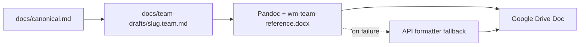

# Team Google Drive Publish

## Purpose

Publish approved canonical docs from `docs/` into a **separate** Google Drive library for team access. GitHub remains the only source of truth; Drive receives one-way, human-readable copies.

## Scope

- Includes: SPINE and registry-listed SOPs, playbooks, and scripts marked `publish_status: active`.
- Excludes: `source-docs/`, migration inventory, prompts, raw exports, and `draft` docs unless you pass `--force`.

## Owner

Operations (Gabriel). Service account performs API writes.

## When To Use

- After creating or materially updating a canonical SOP (`status: active`).
- After first-time Google Cloud setup (below).
- When re-publishing so team Docs match the repo.

## Inputs

- Updated Markdown under `docs/`.
- [team-publish-registry.yaml](../../_inventory/team-publish-registry.yaml) entry for the file.
- [team-drive-folders.yaml](../../../config/team-drive-folders.yaml) with folder IDs (from bootstrap).
- Service account JSON on your machine — configured via `config/team-publish.local.yaml` (gitignored) or `GOOGLE_APPLICATION_CREDENTIALS`.

**Configured service account:** `claude-drive-access@rugged-nucleus-383418.iam.gserviceaccount.com` (share your team folder with this email as Editor).

**Important:** The service account `client_id` in the JSON is not the Drive folder ID. Use the ID from your folder URL (`.../folders/FOLDER_ID`).

## Outputs

- Google Doc in the correct role folder.
- Updated `google_doc_id` in the registry.
- Shareable Doc URL for the team.

## Architecture

| Layer | Location | Role |
|-------|----------|------|
| Canonical OS | `docs/` | Source of truth; AI and founder operate here |
| Team drafts | `docs/team-drafts/*.team.md` | Human-facing copy; approve before publish |
| Raw export | `source-docs/` | Historical; never published |
| Team publish | Google Drive `Waiz Team SOPs` | Layperson-readable copies only |
| Registry | `docs/_inventory/team-publish-registry.yaml` | Maps repo path ↔ Doc ID |

Edits in Google Docs **do not** sync back. On conflict, repo wins on next publish.

## Publish pipeline (default: DOCX)



1. **Prepare:** `python scripts/team-doc-prepare.py docs/.../sop.md`
2. **Edit** draft; run [wm-team-doc-review-checklist.md](../../templates/wm-team-doc-review-checklist.md) (angle libraries: [wm-team-angle-unit-template.md](../../templates/wm-team-angle-unit-template.md))
3. **Validate (optional):** `python scripts/team-doc-approve.py docs/team-drafts/<slug>.team.md --check-only`
4. **Approve:** `python scripts/team-doc-approve.py docs/team-drafts/<slug>.team.md`
5. **Publish:** `python scripts/publish-team-doc.py docs/.../sop.md`

Config in `config/team-publish.local.yaml` (see [team-publish.local.example.yaml](../../../config/team-publish.local.example.yaml)):

- `default_publish_pipeline: docx`
- `reference_docx: docs/templates/wm-team-reference.docx`
- `require_approved_draft: true`

**Prerequisite:** Pandoc on PATH, or run once:

```bash
python scripts/setup-pandoc.py
```

Then set `pandoc_path` in `config/team-publish.local.yaml` (printed by setup script). Alternative: `brew install pandoc`

**Force API only:** `python scripts/publish-team-doc.py docs/.../sop.md --pipeline api`

## Google Cloud Setup (once)

1. Create a Google Cloud project (e.g. `rugged-nucleus-383418`).
2. Enable **Google Docs API** and **Google Drive API**.
3. Create a **service account** → download JSON key → keep outside repo (e.g. `~/Downloads/...json`).
4. Copy [config/team-publish.local.example.yaml](../../../config/team-publish.local.example.yaml) to `config/team-publish.local.yaml` and set `credentials_path` to your JSON file (this file is gitignored).
5. In Google Drive, create or open your team folder (e.g. `Waiz Team SOPs`).
6. **Share** that folder with `claude-drive-access@rugged-nucleus-383418.iam.gserviceaccount.com` as **Editor**.
7. Copy the folder ID from the URL (`https://drive.google.com/drive/folders/FOLDER_ID`) into [config/team-drive-folders.yaml](../../../config/team-drive-folders.yaml) as `root_folder_id`.
8. Install deps: `pip install -r scripts/requirements-publish.txt`
9. Verify: `python scripts/verify-team-drive-access.py`
10. Run: `python scripts/bootstrap-team-drive.py`
11. Publish: `python scripts/publish-team-doc.py --spine` then `python scripts/publish-team-doc.py --start-here`

## Drive Folder Layout (team-facing)

```
Waiz Team SOPs/
├── 00 - Start Here/
├── 01 - Company Basics/
├── 02 - Setters/
├── 03 - Closers/
├── 04 - Client Success/
├── 05 - Operations/
└── 99 - Archive/
```

## Process

### Publish one doc (DOCX-first)

```bash
# Credentials load from config/team-publish.local.yaml automatically, or:
# export GOOGLE_APPLICATION_CREDENTIALS=path/to/service-account.json
python scripts/team-doc-prepare.py docs/acquisition/sales/setter-daily-checklist.md
# Edit docs/team-drafts/setter-daily-checklist.team.md
python scripts/team-doc-approve.py docs/team-drafts/setter-daily-checklist.team.md
python scripts/publish-team-doc.py docs/acquisition/sales/setter-daily-checklist.md
```

### Publish all SPINE-active registry entries (missing or stale doc id)

```bash
python scripts/publish-team-doc.py --spine
```

### Publish Start Here index

```bash
python scripts/publish-team-doc.py --start-here
```

### Update existing Doc (replace body)

Same command as publish; registry `google_doc_id` triggers update instead of create.

### Archive before overwrite

```bash
python scripts/publish-team-doc.py docs/path/to/doc.md --archive
```

## Registry

Add a row in [team-publish-registry.yaml](../../_inventory/team-publish-registry.yaml) before first publish:

```yaml
- repo_path: docs/acquisition/sales/example-sop.md
  team_title: "Example SOP"
  drive_folder: setters
  google_doc_id: null
  publish_status: active
  team_role: setter
```

Optional frontmatter on repo files (not sent to Drive): `team_publish: true`, `team_folder: setters`.

## Translator and styling

Apply [.claude/skills/team-doc-translate/SKILL.md](../../../.claude/skills/team-doc-translate/SKILL.md) when editing **team drafts**.

**Visual reference:** [WM Objection Categories](https://docs.google.com/document/d/19creUTdx5cTwWJVjdX3qPUMY40v1z379bCNoieY_Q5Y/edit) — [wm-team-doc-format-spec.md](../../templates/wm-team-doc-format-spec.md).

| Path | Role |
|------|------|
| [team_doc_translator.py](../../../scripts/lib/team_doc_translator.py) | Canonical md → draft scaffold |
| [pandoc_publish.py](../../../scripts/lib/pandoc_publish.py) | Draft md → styled DOCX |
| [wm-team-reference.docx](../../templates/wm-team-reference.docx) | Pandoc reference styles |
| [team_doc_formatter.py](../../../scripts/lib/team_doc_formatter.py) | API fallback only |

- Strips YAML, migration notes, Open Questions, export paths.
- Rewrites `## Related Docs` links to Google Doc URLs when targets are published.
- Replaces founder-only pricing detail with “escalate to Gabriel.”

## Quality Bar

- Only `status: active` repo docs publish by default.
- Registry must list every published file.
- Start Here must link to role folders and essential docs.
- No GitHub URLs in team Docs.

## Escalation

- **Pandoc not found:** `brew install pandoc`, or publish with `--pipeline api`.
- **Draft not approved:** run `team-doc-approve.py` after editing draft.
- API or permission errors: verify folder shared with service account, APIs enabled, credentials path.
- Wrong folder: fix `drive_folder` in registry and re-publish.
- Team edited a Doc: accept loss on next publish or merge feedback into repo first.
- DOCX import looks wrong: refresh [wm-team-reference.docx](../../templates/wm-team-reference.docx) from the gold Objection Categories Word file.

## Metrics

- Count of registry entries with non-null `google_doc_id`.
- `last_published` date per registry row (set by publish script).

## Related Docs

- [SOURCE-OF-TRUTH](../../SOURCE-OF-TRUTH.md)
- [Approved Operating Spine](../../SPINE.md)
- [team-publish-registry.yaml](../../_inventory/team-publish-registry.yaml)
- [team-doc-publish-template.md](../../templates/team-doc-publish-template.md)
- [team-doc-publish skill](../../../.claude/skills/team-doc-publish/SKILL.md)
