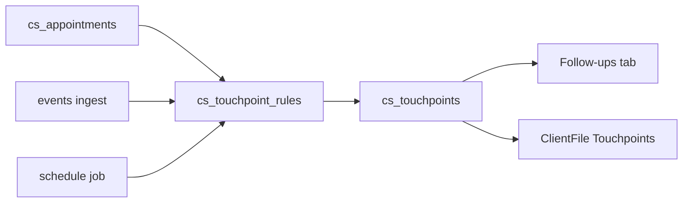

# CS Touchpoints Queue Design (Mr. Waiz)

## Purpose

Turn the
[Client Success Slack Touchpoint Playbook](../client-fulfillment/onboarding/onboarding-to-launch-client-communication.md)
into a daily clear-the-queue surface in Mr. Waiz without overloading
`events`, `client_action_logs`, or the Client File overview.

## Decisions locked

| Decision | Choice |
|----------|--------|
| Data model | New `cs_touchpoints` table (Hybrid C) |
| UI home | Client Success **hub**: Health \| Follow-ups |
| Complete bar | Slack sent + required `slack_snippet` |
| Rules v1 | Call-offset **and** first-fire events |
| Mid-build / M2 biweekly | Time-based fallbacks (snooze/skip OK) |
| Rule runner | App-side idempotent upserts |
| Slack auto-send | Out of scope for v1 |

## Architecture

Touchpoints are **work items**. Rules emit rows; CSM completes them;
history is the same table filtered to done.

### Do not mutate

- `events` schema or meaning
- `client_action_logs` KPI-intervention semantics
- Billing / EOD form schema (v1)

### Existing hooks to reuse

- [`cs_appointments`](../../call-center-reporting-template%20-%20Copy/supabase/schema.sql)
  + `cs_calendar_config` (OB / launch / check-in)
- Webhook ingest `lead`, `appointment_booked`, `show`
- Credit-queue UX pattern; Agents `ViewHub` pattern
- Client File already has `cs_calls` — add thin `touchpoints` tab

## Schema (`cs_touchpoints`)

| Column | Notes |
|--------|--------|
| `client_id` | FK → `clients` |
| `touchpoint_type` | See types below |
| `cycle_key` | Launch ISO date or `ob:{appointment_id}` |
| `status` | `open` \| `snoozed` \| `done` \| `skipped` |
| `due_at` | Queue sort |
| `trigger_source` | `cs_appointment` \| `client_call` \| `event` \| `schedule` \| `manual` |
| `source_ref` | Appointment / event / rule id |
| `slack_sent` | Required true on complete |
| `slack_snippet` | Required non-empty on complete |
| `completion_note` | Optional |

**Unique:** `(client_id, touchpoint_type, cycle_key)`

**Indexes:**

- Partial `(due_at)` where `status in ('open','snoozed')`
- `(client_id, completed_at desc)` for history
- `(status, due_at)` for overdue / due-today

### Touchpoint types (v1)

`post_ob`, `mid_build`, `pre_launch`, `launch_day`,
`m1_expectation_reset`, `first_lead`, `first_qc`, `first_booking`,
`first_show`, `m2_biweekly`

### Default offsets

| Type | Trigger | Due |
|------|---------|-----|
| `post_ob` | OB appointment completed | Same day |
| `mid_build` | Schedule: OB + 3 days if not launched | That day |
| `pre_launch` | Launch appt booked | `scheduled_at` − 1 day |
| `launch_day` | Launch completed / `launch_date` set | That day |
| `m1_expectation_reset` | Launch + 6 days | That day |
| `first_*` | First matching event | Immediate |
| `m2_biweekly` | After launch + 30 days, then every 14 days | Generator; skip if strong event completed in last 7 days |

## API

| Route | Role |
|-------|------|
| `GET /api/cs-touchpoints` | Queue filters |
| `PATCH /api/cs-touchpoints/[id]` | done / snooze / skip |
| `GET /api/clients/[id]/touchpoints` | Client File |
| `POST /api/cs-touchpoints/run-schedule` | Cron (secret) |

## UI

1. Promote `client_health` to hub (Health | Follow-ups)
2. `CsTouchpointsQueue` — overdue → due today → upcoming; complete modal
3. Client File `touchpoints` tab — open + history only (no Overview clutter)

## Out of v1

- Auto-post to Slack
- Yellow/red / training / Trustpilot auto-queue
- Postgres triggers on hot `events` writes

## Implementation order

1. Migration + schema mirror + types
2. Rule helpers + hooks (appointments, ingest, schedule)
3. Queue APIs + complete validation
4. Client Success hub + Follow-ups UI
5. Client File Touchpoints tab
6. Playbook Related link back to this design

## Related

- [Client Success Slack Touchpoint Playbook](../client-fulfillment/onboarding/onboarding-to-launch-client-communication.md)
- [Client Success Daily OS](../operations/people/client-success-daily-os.md)
- [Post-Launch Client Success System](../client-fulfillment/client-success/post-launch-client-success-system.md)
