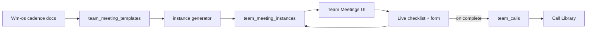

# Team Call Runbooks Design

## Purpose

Turn the Q3 weekly operating rhythm into scheduled Mr. Waiz meeting
instances the team can open, run from a live checklist, attach a
recording, and disposition as complete — so each call has an executable
cadence instead of tribal memory.

## Scope

### In (v1)

- Five recurring series from the lean CEO rhythm:
  - Mon Setter Weekly Review (CCM + setters)
  - Daily setter training (Tue–Fri)
  - Mon KPI — Week Plan
  - Mon Ops Planning — Launch + Systems
  - Thu KPI — Commitment Check
  - Fri Exec Q&A — Decisions Only
- Upcoming / this-week calendar list in Mr. Waiz
- Live runbook UI (checklist + agenda order) opened at meeting start
- End-of-call disposition form with recording URL
- Link completed instance → `team_calls` row (Call Library)
- Wm-os cadence content as source of checklist/agenda copy

### Out (v1)

- Zoom/Meet auto-ingest of recordings or transcripts
- Multi-attendee parallel form fills (host submits once)
- Editable Google Calendar sync
- Commitment objects / red-yellow board as first-class DB entities
  (capture summary text only; Phase 2 structures them)
- Christian Tue/Wed tech blocks (solo work, not a group call)
- Setter EOD or lead-seat EOD changes

## Locked assumptions

| Topic | Choice |
|-------|--------|
| Meetings | Q3 lean CEO rhythm (six series incl. Mon setter weekly review) |
| Who submits | Host / facilitator for that series (one submission per instance) |
| Recording | Manual URL paste (existing Call Library pattern) |
| Where it lives | Mr. Waiz (schedule + run + disposition); Wm-os owns cadence copy |
| Generation | Recurring templates generate instances for a rolling window |
| Timezone | All `default_time` / instance scheduling in `America/Sao_Paulo` (matches `CALL_CENTER_TIMEZONE`) |

## Approaches considered

### A — Stuff schedule into `team_calls`

Add `scheduled_at`, `status`, and checklist JSONB onto `team_calls`.

- Pros: One table; Call Library already exists.
- Cons: Archive and schedule collide; incomplete/cancelled meetings
  pollute the library; hard to version runbooks.

### B — Templates + instances, link `team_calls` on complete (chosen)

New `team_meeting_templates` + `team_meeting_instances`. Completing an
instance upserts/links a `team_calls` row.

- Pros: Clear lifecycle; reuses Call Library as archive; checklist
  pattern matches launch/churn/EOD JSONB forms.
- Cons: One more schema surface and API.

### C — Docs + calendar links only

Keep cadence in Wm-os; link Google Calendar + Notion forms; no Mr. Waiz UI.

- Pros: Fastest to “ship.”
- Cons: No disposition truth in Mr. Waiz; no Call Library link; no
  upcoming queue next to EOD / Command dashboards.

**Recommendation:** B. It matches how CS appointments and EOD already
work (instance → structured responses → durable record) and keeps team
calls queryable next to floor data.

## Architecture



### Components (Mr. Waiz)

| Unit | Responsibility |
|------|----------------|
| `team_meeting_templates` | Series definition: slug, weekday(s), default time, host role, call_type, checklist schema, agenda sections, default duration |
| Instance generator | Creates instances for next N days if missing (idempotent by template + scheduled_at) |
| `team_meeting_instances` | One scheduled occurrence: status, checklist progress, form responses, recording_url, team_call_id |
| Team Meetings view | List/calendar of upcoming + recent; open instance |
| Runbook page | Live checklist at top; agenda; disposition section; submit complete |
| API | CRUD/list instances; PATCH progress; POST complete |

### Data flow

1. Templates seeded from Wm-os cadence (code constants v1, editable later).
2. On dashboard load or cron-ish API hit, generator ensures next 14 days
   of instances exist.
3. Host opens upcoming instance → status `in_progress` → checks items
   during the call (autosave PATCH).
4. End of call: paste recording URL, fill disposition fields, submit.
5. API validates required checklist + disposition → sets status
   `completed` → creates/updates linked `team_calls` row with title,
   call_type, called_at, participants, recording_url, summary, tags
   including series slug.

## Data model

### `team_meeting_templates`

```text
id              uuid PK
slug            text UNIQUE   -- e.g. mon-kpi-week-plan
title           text
theme           text          -- short theme label
call_type       text          -- maps to team_calls.call_type
weekday         int[]         -- 1=Mon … 7=Sun; empty = daily Mon–Fri
default_time    time          -- America/Sao_Paulo local
duration_min    int
host_role       text          -- ccm | client_success | ceo | shared
attendee_roles  text[]
agenda_md       text          -- short in/out + order (or JSON sections)
checklist       jsonb         -- [{key,label,required,section}]
disposition     jsonb         -- field defs for end form
active          boolean
```

### `team_meeting_instances`

```text
id                uuid PK
template_id       uuid FK → team_meeting_templates
scheduled_at      timestamptz NOT NULL
status            text  -- scheduled | in_progress | completed | skipped | cancelled
host_agent_id     uuid FK → agents NULL
checklist_state   jsonb NOT NULL DEFAULT '{}'  -- {key: true|false}
responses         jsonb NOT NULL DEFAULT '{}'  -- disposition answers
recording_url     text
notes             text
team_call_id      uuid FK → team_calls NULL
completed_at      timestamptz
completed_by      uuid FK → auth.users NULL
created_at / updated_at
UNIQUE (template_id, scheduled_at)
```

### Disposition statuses

| Status | Meaning |
|--------|---------|
| `scheduled` | Generated, not opened |
| `in_progress` | Host opened runbook |
| `completed` | Checklist + disposition submitted; `team_call_id` set |
| `skipped` | Did not run (reason required in responses) |
| `cancelled` | Admin cancelled |

### Seed templates (v1)

| Slug | When | Host | `call_type` |
|------|------|------|-------------|
| `mon-setter-weekly-review` | Mon | ccm | `team_review` |
| `daily-setter-training` | Tue–Fri | ccm | `training` |
| `mon-kpi-week-plan` | Mon | client_success | `team_meeting` |
| `mon-ops-planning` | Mon | ceo | `team_meeting` |
| `thu-kpi-commitment-check` | Thu | client_success | `team_meeting` |
| `fri-exec-qa` | Fri | ceo | `team_review` |

v1 seed times (`America/Sao_Paulo`), adjustable in template rows:

| Slug | Local time | Duration |
|------|------------|----------|
| `mon-setter-weekly-review` | 09:00 | 30 min |
| `daily-setter-training` | 09:00 | 20 min |
| `mon-kpi-week-plan` | 10:00 | 25 min |
| `mon-ops-planning` | 10:30 | 60 min |
| `thu-kpi-commitment-check` | 10:00 | 25 min |
| `fri-exec-qa` | 16:00 | 40 min |

**Mon Setter Weekly Review (CCM):** last week + this week catch-up, priority
accounts, day-by-day dial plan for the week, watch shift schedule.

## UI

### Nav

New item under Team / Ops: **Team Meetings**
(`dashboard?view=team_meetings`).

Also surface “today’s meetings” on CCM Command and a compact strip on
Ops Overview for leadership.

### List view

- Default: this week, grouped by day
- Each row: time, title, theme, status chip, host, Open
- Filters: upcoming | needs disposition | completed
- Empty completed week is a leadership smell — show count of skipped

### Runbook view (`/meetings/[instanceId]` or dashboard panel)

One composition, top to bottom:

1. **Header** — title, theme, scheduled time, host, status
2. **Live checklist** — required items checkable during the call
   (same interaction pattern as launch checklist)
3. **Agenda / cadence** — ordered sections (In / Out / Speak order)
4. **Disposition** — recording URL (required on complete), summary,
   series-specific fields, skip reason if status=skipped
5. **Submit** — Complete or Skip

Aesthetic: match existing Mr. Waiz ops surfaces (dense, utilitarian,
no marketing-hero chrome). Checklist must be usable mid-call — large
tap targets, sticky submit bar on mobile.

### Permissions

- Host role + owner/admin can edit/complete that series
- All lead seats can view upcoming list
- `call_library` manage still owns post-hoc library edits

## Checklist + disposition schemas (structure only)

Cadence *copy* is authored next (separate content pass). v1 schemas:

### Shared disposition fields

- `recording_url` (required unless skipped)
- `summary` (required, short)
- `participants_present` (text)
- `follow_ups` (optional bullet text)
- `skipped_reason` (required if skipped)

### Series checklist keys (placeholders; copy filled in content pass)

| Series | Checklist keys (required) |
|--------|---------------------------|
| Daily training | `numbers_reviewed`, `one_coaching_focus`, `dial_targets_set` |
| Mon KPI | `ryg_scan_done`, `reds_have_owners`, `commitments_named`, `ob_glance` |
| Mon Ops Planning | `ob_board_walked`, `system_gaps_listed`, `week_priorities_set` |
| Thu KPI | `commitments_checked`, `still_red_recommitted`, `fri_qa_reminded` |
| Fri Exec Q&A | `questions_from_intake`, `each_item_decided_or_deferred` |

Meeting rules (In / Out) live in `agenda_md` and mirror
[team restructure design](./2026-07-13-team-restructure-design.md).

## Error handling

- Incomplete required checklist → 400 with missing keys; UI highlights
- Complete without recording_url → 400 (unless skipped)
- Double-submit → idempotent: return existing `team_call_id`
- Generator race → UNIQUE (template_id, scheduled_at) + upsert ignore
- Soft-delete never removes completed instances; skip/cancel only

## Testing

- Unit: checklist validation per template; generator weekday math in `America/Sao_Paulo`
- API: create window → open → patch checks → complete → `team_calls` row
  has expected tags + recording_url
- UI smoke: list shows today’s series; runbook saves progress

## Implementation outline (post-approval)

1. Migration: templates + instances tables + RLS aligned with team_calls
2. Seed five templates from constants
3. Lib: types, validation, generator, complete→team_calls mapper
4. API: `/api/team-meetings` list/ensure; `/api/team-meetings/[id]` get/patch/complete
5. UI: Team Meetings list + Runbook panel/page
6. Wire “today” teaser on CCM Command + Ops Overview
7. Content pass: fill agenda_md + checklist labels from Daily OS / lane map
8. Docs: update people README + CALL-INTELLIGENCE notes

## Phase 2 hooks

- Structured commitment objects shared with Laura’s KPI board
- Fri Q&A intake as its own form feeding Fri instance
- Auto-pull recording from known conference provider
- Transcript → `call_intelligence` for team domain

## Success criteria

- Host opens Mr. Waiz, sees today’s themed calls, runs checklist live,
  pastes recording, marks complete in under 2 minutes after the call ends
- Call Library shows the meeting with series tag and recording
- Leadership can see which weekly calls were skipped without Slack archaeology

## Spec self-review

- No TBDs for v1 architecture or meeting set
- Approach B is the only planned path (A/C rejected above)
- Scope fits one implementation plan; content cadence is a follow-on
  pass using this schema, not a second product
- Ambiguities resolved: host-only submit; URL recording; five series;
  instances ≠ archive until complete
