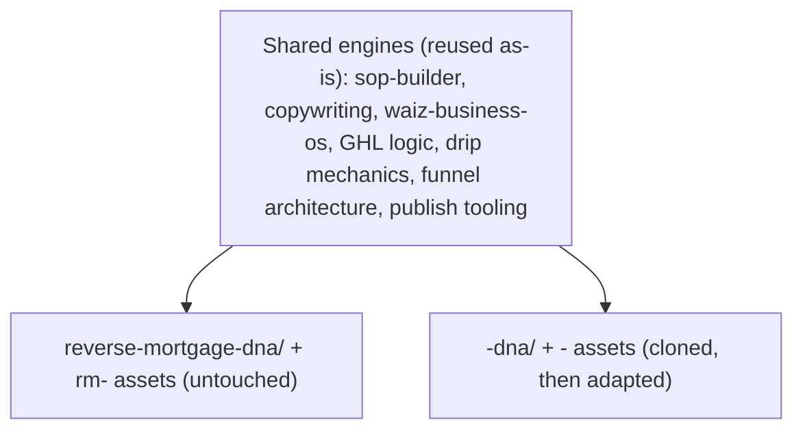
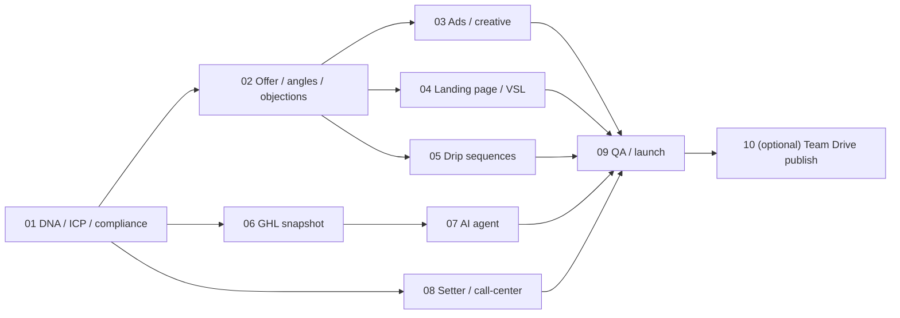

# Product Launch Playbook (New Vertical Build System)

## Purpose

A reusable, product-agnostic system for standing up a complete new marketing vertical
(funnel, ads, lander, follow-up, AI agent, setter scripts, CRM/GHL, ICP, and supporting
docs) inside this OS by **mirroring the proven reverse-mortgage (RM) fulfillment system**
— same strategy, frameworks, and structure, applied to a new product.

DSCR is the first product built with this playbook. Everywhere you see `<product>`
(slug, e.g. `dscr`) and `<Product>` (display name, e.g. `DSCR`), substitute the new
vertical.

## When to use

Use when launching or testing any new fulfillment product line that should reuse the RM
marketing machine (e.g. DSCR, fix-and-flip, HELOC, non-QM). Do **not** use for changes to
an existing product — edit that product's own docs instead.

## Core model: shared core + product DNA

This OS stays clean across multiple products by separating durable engines from
product-specific knowledge.



- Each product gets its own knowledge pod: `docs/client-fulfillment/<product>-dna/`
  (mirrors `docs/client-fulfillment/reverse-mortgage-dna/`).
- Product-specific assets reuse the existing functional folders
  (`client-marketing/`, `media-buying/`, `crm-architecture/`, `call-center/`) with a
  `<product>-` filename prefix, exactly mirroring the `rm-` pattern.
- If the product fails, you delete one pod + its prefixed files. Nothing else is touched.

## Integrity rules (non-negotiable)

1. **Clone, then adapt.** Copy the named RM template into the new `<product>-` path, then
   rewrite it. Never edit, rename, or "generalize" an existing product's doc.
2. **One source of truth.** Check `docs/_inventory/duplicate-resolutions.md` before
   creating a doc; cross-link instead of copying large sections.
3. **New docs start `status: draft`.** The owner flips to `active` after review.
4. **Do not touch** `docs/SPINE.md`, anything under `scripts/` or `config/`, or
   `docs/_inventory/team-publish-registry.yaml`.
5. **No invented pricing.** Only quote pricing that exists in an approved pricing sheet.
6. **Work on a branch** (`git checkout -b build/<product>-launch`) and open a PR; the
   owner reviews and merges.

## How the build runs

The build is split into **focused per-layer chats — one cognitive job and one skill per
chat** — not one long mega-chat. This keeps each chat sharp and the output high-quality,
lets layers run in parallel, and makes each deliverable independently reviewable.

**State lives in the repo, not in chat memory.** Each chat reads the *committed* outputs
of earlier layers as its inputs. That is why the DNA layer is built first — every
downstream layer reads it. The execution surface for these chats is the ClickUp List
(see "Instantiate for a new product"), where each task = one chat.

### The web research gate (the safety mechanism)

A new product is often the near-opposite of RM (e.g. DSCR borrowers are real-estate
investors, not retirees; DSCR is typically business-purpose lending, not consumer
HUD/FHA). To prevent assumption bleed, every layer runs this gate **before writing
anything canonical**:

1. The chat performs its **own web research** on the `<product>`-vs-RM delta for that
   layer (ICP, offer/angle, compliance).
2. It presents a concise findings summary **with sources** and flags every uncertainty.
3. It **STOPS** for owner confirmation/correction.
4. Only then does it clone the RM template and adapt it. Unconfirmed web facts stay
   `draft` and are clearly marked.

### Step 0: scaffolding pass (skill: file-organizer)

Run once, at the start, before any content layer:

- Create the product pod: `docs/client-fulfillment/<product>-dna/`.
- Define the `<product>-` filename naming map (mirror of the `rm-` map below).
- Verify no filename or concept collision with RM or any existing product.
- Add a short `README.md` to the new pod describing the product and linking this playbook.

## Chat dependency map + skill routing



| Layer | Skill to load |
|-------|---------------|
| 01 DNA / ICP / compliance | `waiz-business-os` |
| 02 Offer / angles / objections | `copywriting` + `marketing-psychology` |
| 03 Ads / creative | `copywriting` + `marketing-psychology` |
| 04 Landing page / VSL | `copywriting` |
| 05 Drip sequences | `copywriting` |
| 06 GHL snapshot | `sop-builder` |
| 07 AI agent | `sop-builder` |
| 08 Setter / call-center | `sop-builder` |
| 09 QA / launch | `waiz-business-os` |
| 10 Team publish (owner-only) | `team-doc-translate` / `team-doc-publish` |

### Wave grouping (MVP-first)

- **Wave A — minimum testable funnel (build first):** 01, 02, 03, 04, 06, 08, 09. This is
  everything needed to run traffic, book calls, and validate the product.
- **Wave B — scale layer (build after Wave A shows traction):** 05 (full drips), 07 (AI
  agent), 10 (team publish).

## Worker-prompt template (the reusable shape)

Each layer's chat / ClickUp task uses this shape:

```
# <Product> Build — Layer NN: <Layer name>

Objective: <one line — what this layer produces>
Skill to load: <skill(s)>

Resources / inputs (READ FIRST):
- Conventions: docs/SOURCE-OF-TRUTH.md ; dedup check: docs/_inventory/duplicate-resolutions.md
- Prerequisite committed outputs: <paths from earlier layers>
- RM template(s) to CLONE: <exact repo paths>

Steps:
1. Open a fresh Cursor chat, load the skill above.
2. Read the resources/inputs listed.
3. Run the WEB RESEARCH GATE: research the <product>-vs-RM delta for this layer
   (ICP / offer / compliance), present findings + sources, and STOP for owner approval.
4. After approval, clone the RM template(s) into the <product>- output path(s).
5. Adapt the content to <product> using the approved research. Keep status: draft.
6. Cross-link related docs; do not duplicate.
7. Commit, paste the doc link into this task, check the Definition of Done, mark done.

Output path: <exact <product>- destination>
Risks / gotchas: <layer-specific>
Definition of done: <checklist>
```

## Per-layer specs (RM templates -> `<product>-` outputs)

> Paths below use `dscr` as the worked example. For another product, swap the slug.

### 01 — DNA / ICP / compliance  (skill: waiz-business-os) — blocks everything
- Clone: `docs/client-fulfillment/reverse-mortgage-dna/intelligence-icp-rm.md`,
  `doctrine-reverse-mortgage.md`, `intelligence-rm-product.md`,
  `rm-compliance-guardrails.md`, `doctrine-rm-marketing.md`.
- Output: `docs/client-fulfillment/dscr-dna/intelligence-icp-dscr.md`,
  `intelligence-dscr-product.md`, `dscr-compliance-guardrails.md`,
  `dscr-gtm-positioning-brief.md`, `dscr-campaign-master-angles.md`.
- Risks: **ICP inversion** (real-estate investors, not retirees) — different
  psychographics, platforms, proof. **Compliance regime change** (DSCR is largely
  business-purpose lending vs consumer HUD/FHA) — get this confirmed before any copy.
- DoD: One lean ICP (AI creative SOT) with personas + selling points + NEVER list;
  thin product mechanics; compliance guardrails; GTM beachhead; optional master-angle
  expand doc; all `status: draft`; cross-linked; pod README created. **Do not** clone
  RM into parallel doctrine essays / angle libraries / ads playbooks — those dilute AI.

### 02 — Offer / angles / objections  (skills: copywriting + marketing-psychology)
- Fold angles + objections into `intelligence-icp-dscr.md` (proven slate + invent-freely).
- Expand winners only into `dscr-campaign-master-angles.md` (tokens + full writeups).
- Risks: angles must map to investor pains (cash-flow qualifying, portfolio scale,
  speed/closing), not retiree security framing. Don't create a second angle menu.

### 03 — Ads / creative  (skills: copywriting + marketing-psychology)
- Creative rules live in the ICP + GTM test rules — not a separate ads playbook.
- Statics: `dscr-static-image-generator-project.md` (knowledge = ICP only).
- Risks: creative/compliance rules differ; confirm platform ad-policy treatment for the
  investor offer.

### 04 — Landing page / VSL  (skill: copywriting)
- Clone: `docs/client-fulfillment/media-buying/perspective-funnel-setup-sop.md`,
  `new-client-campaign-setup-sop.md`.
- Output: `docs/client-fulfillment/media-buying/dscr-funnel-setup-sop.md`.
- Risks: qualifying questions and lead-quality logic change for investors vs homeowners.

### 05 — Drip sequences  (skill: copywriting)  [Wave B]
- Clone: `docs/client-fulfillment/client-marketing/10-day-rm-drip-campaign.md`,
  `rm-text-drip-2025.md`, `rm-imessage-intent-drip-7day.md`,
  `rm-lead-nurture-drip-sequence.md`.
- Output: `docs/client-fulfillment/client-marketing/dscr-*-drip-*.md` (mirror names).
- Risks: cadence/compliance for business-purpose SMS; investor objections differ.

### 06 — GHL snapshot  (skill: sop-builder)
- Clone: `docs/client-fulfillment/crm-architecture/crm-infrastructure.md`.
- Output: `docs/client-fulfillment/crm-architecture/dscr-crm-snapshot.md`.
- Decision flag: today GHL is documented narratively (no importable export). Decide
  whether to also produce an importable GHL snapshot blueprint for the new sub-account.
- Risks: GHL automations are marked "do not touch" — build a copy, never mutate live RM.

### 07 — AI agent / bot  (skill: sop-builder)  [Wave B]
- Clone: `docs/client-fulfillment/crm-architecture/how-wm-ai-bot-works.md`,
  `how-claimed-tag-works.md`.
- Output: `docs/client-fulfillment/crm-architecture/how-dscr-ai-bot-works.md`.
- Risks: bot script must reflect investor ICP + compliant disclosures.

### 08 — Setter / call-center  (skill: sop-builder)
- Clone: `docs/client-fulfillment/call-center/script-appointment-setting-call.md`,
  `script-live-transfer-warm-handoff.md`, `script-boundary-rules.md`;
  reference `docs/acquisition/sales/script-factory/intro-icp-tracks.md` for track logic.
- Output: `docs/client-fulfillment/call-center/script-dscr-appointment-setting-call.md`
  (+ matching handoff/boundary variants if needed).
- Risks: qualification and objections differ; investor leads behave unlike retiree leads.

### 09 — QA / launch  (skill: waiz-business-os) — Wave A launch gate
- Clone: none (synthesizes prior layers).
- Output: `docs/client-fulfillment/dscr-dna/dscr-launch-qa-checklist.md`.
- DoD: funnel wired end-to-end; CRM pipelines mapped; compliance reviewed; all docs
  cross-linked; zero RM duplication; propose SPINE additions to the owner.

### 10 — Team publish  (skills: team-doc-translate / team-doc-publish)  [Wave B, owner-only]
- Runs only after the owner flips relevant docs to `status: active`.
- Use `team-doc-translate` then the owner runs the publish tooling. Do not run publish as
  a contributor.

## Risk register

| Risk | Where | Mitigation |
|------|-------|------------|
| ICP bleed (retiree assumptions in an investor product) | 01-05, 08 | Web research gate + owner approval before writing |
| Compliance bleed (consumer framing on business-purpose lending) | 01, 02, 03, 05, 07 | Confirm compliance regime in layer 01 first; guardrails doc gates downstream copy |
| GHL automation breakage | 06, 07 | Build a copy/new sub-account; never edit live RM automations |
| Duplicate / conflicting docs | all | Dedup check + clone-then-adapt + cross-link, never copy |
| Building scale layer too early | 05, 07 | Wave A first; build Wave B only after traction |

## Instantiate for a new product (incl. push to ClickUp)

1. Pick the slug (`<product>`) and display name (`<Product>`).
2. Run **Step 0 scaffolding** (file-organizer): create the pod + naming map.
3. Create a ClickUp **List** for the build (e.g. in the **Operations** Space) with one
   **task per layer (01..10)** in dependency order. Each task body = the worker-prompt
   template above, filled in from that layer's spec; add the Definition of Done as a
   subtask checklist; set task dependencies so each unblocks the next; tag `wave-a` /
   `wave-b`.
4. Assign the build owner/operator. They execute one task at a time: open a fresh chat,
   load the skill, run the research gate, clone + adapt, commit, link the doc, mark done.
5. The repo (committed `<product>-` docs) is the shared memory across all chats. ClickUp
   is the disposable tracking/delegation layer — task bodies are not committed to the repo.

## Related docs

- Conventions: [docs/SOURCE-OF-TRUTH.md](../SOURCE-OF-TRUTH.md)
- Dedup decisions: [docs/_inventory/duplicate-resolutions.md](../_inventory/duplicate-resolutions.md)
- RM product pod (mirror source): [docs/client-fulfillment/reverse-mortgage-dna/README.md](../client-fulfillment/reverse-mortgage-dna/README.md)
- Fulfillment overview: [docs/client-fulfillment/fulfillment-operating-system.md](../client-fulfillment/fulfillment-operating-system.md)
