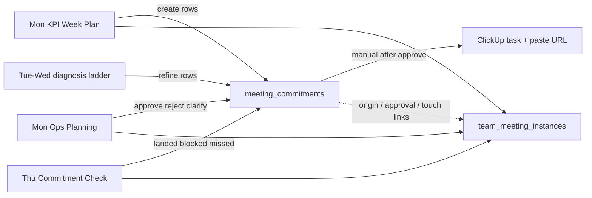
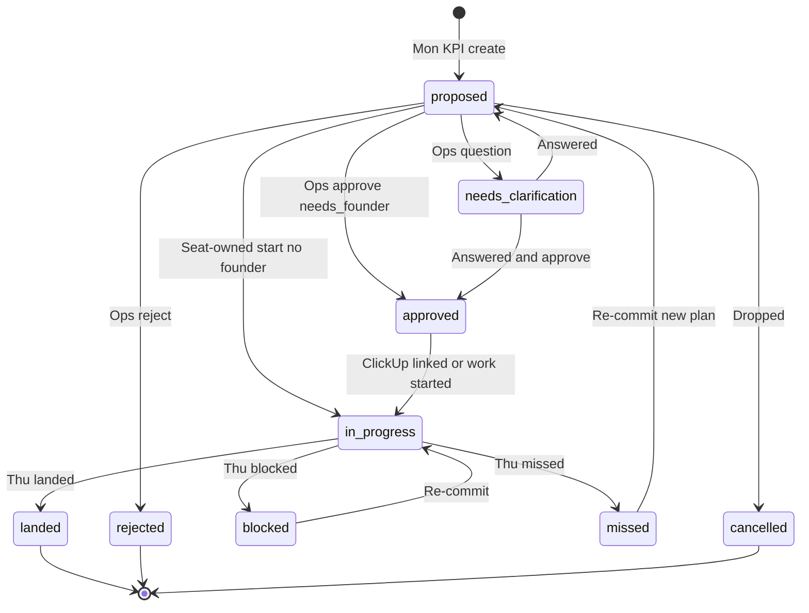

# KPI Meeting Commitments Design

> **Superseded for the target product path (2026-08-06):** weekly account
> work with multi-task person/day scheduling now lives in
> [Account Week Plans Design](2026-08-06-account-week-plans-design.md).
> Keep this doc as history of the meeting-commitments design;
> `meeting_commitments` may remain in Mr. Waiz until migration/retire.

## Purpose

Turn Mon/Thu KPI review and Mon Ops Planning into a durable commitment +
approval loop in Mr. Waiz Team Meetings: the team captures structured
diagnosis and plans during KPI check; the Founder batch-approves
founder-facing asks in Ops Planning; owners then create ClickUp tasks
manually and paste the link back — with full history on past meeting
instances.

This is the Phase 2 “structured commitments” layer deferred from the
Team Call Runbooks and KPI Review Meeting SOP designs. It does **not**
replace the Client Success “deployed changes” surface (hard adjustments
already shipped).

## Scope

### In (this design)

- First-class `meeting_commitments` table linked to
  `team_meeting_instances`.
- Structured Commitments panel on Mon KPI and Thu KPI runbooks.
- Needs Founder panel on Mon Ops Planning (filtered queue).
- Status lifecycle: propose → founder approve/reject/clarify →
  in progress → Thu landed/blocked/missed.
- Manual ClickUp: paste `clickup_url` after approval; no ClickUp API.
- Wm-os SOP updates: KPI Review Meeting SOP note lines → structured
  rows; Ops Planning agenda filled with Needs Founder section.
- History: opening a past meeting instance shows commitments linked to
  that meeting (created, approved, or status-updated there).

### Out (this design)

- ClickUp API task creation or silent automation.
- Merging into Client Success deployed-changes / hard-adjustment UI.
- Fri Exec Q&A structured form.
- Auto-pulling live KPI numbers into commitment rows.
- Multi-attendee concurrent editing (host/facilitator still submits
  meeting disposition; commitments may be edited by owning roles
  between meetings).
- Rewriting the Client Health grader, KPI bands, or diagnosis ladder
  content (ladder stays the async diagnosis SOP).

## Locked decisions

| Topic | Choice |
|-------|--------|
| Primary job | Both: KPI check fills structured items; Ops Planning batch-approves before ClickUp |
| Views | Split: full commitment list for the team; filtered **Needs Founder** for Ops |
| Surface | Team Meetings only (extend existing runbooks) |
| Storage | First-class `meeting_commitments` table (not JSONB-only on instances) |
| ClickUp | Manual create after approve; paste URL back into Mr. Waiz |
| Approach | Meeting-local editors + shared table |
| Numbers SoT | Mr. Waiz live grading / Client Success overview — form does not re-enter KPIs |
| Positions | Positions only in SOPs (Client Success, Media Buyer, CCM, Founder, Ops) |

## Architecture

### Infra rule

- Keep `team_meeting_templates` / `team_meeting_instances` as today
  (runbook, checklist, disposition, Call Library link on complete).
- Commitments are owned by `meeting_commitments`; meetings only
  **reference** them.
- Do **not** store the live commitment list only inside
  `responses` JSONB (breaks Ops/Thu continuity and client history).
- Do **not** add a separate Approvals product tab or CS-tab merge in v1.

### Artifact paths

| Artifact | Path |
|----------|------|
| This design | `docs/superpowers/specs/2026-07-22-kpi-meeting-commitments-design.md` |
| Meeting SOP (update) | `docs/operations/people/kpi-review-meeting-sop.md` |
| Ladder (unchanged content) | `docs/operations/people/under-kpi-diagnosis-ladder.md` |
| Prior SOP design | `docs/superpowers/specs/2026-07-21-kpi-review-meeting-sop-design.md` |
| Runbooks design | `docs/plans/2026-07-21-team-call-runbooks-design.md` |
| Mr. Waiz schema | `supabase/migrations/` + `meeting_commitments` |
| Mr. Waiz lib | `src/lib/meeting-commitments.ts` |
| Mr. Waiz UI | `src/components/TeamMeetings.tsx` (+ panel component) |
| Seeds | `src/lib/team-meetings.ts` (`mon-kpi-week-plan`, `thu-kpi-commitment-check`, `mon-ops-planning`) |

## Data model

### Table: `meeting_commitments`

| Field | Type / values | Purpose |
|-------|----------------|---------|
| `id` | uuid PK | Row id |
| `client_id` | uuid FK → clients | Which logo |
| `severity` | `911` \| `below` | Act now vs Below KPI |
| `why` | text | One-sentence what went wrong |
| `constraint_type` | `system` \| `quality` \| `data` | Fork from ladder |
| `constraint_label` | text | Short label (dial coverage, CPL, DATA_HOLD, …) |
| `plan` | text | What will be done |
| `owner_role` | `client_success` \| `media_buyer` \| `ccm` \| `ops` \| `founder` | Seat owner |
| `due_date` | date | Usually Thursday of that week |
| `needs_founder` | boolean | Gates Ops Needs Founder queue |
| `founder_ask` | text nullable | Required when `needs_founder`; approve X / unblock Y / answer Z |
| `status` | see lifecycle | Workflow state |
| `success_signal` | text | How we’ll know it worked |
| `origin_meeting_id` | uuid FK → team_meeting_instances | Mon KPI (or create) instance |
| `approved_in_meeting_id` | uuid FK nullable | Ops instance when approved |
| `last_touched_meeting_id` | uuid FK nullable | Last meeting that changed status |
| `clickup_url` | text nullable | Pasted after manual task create |
| `founder_note` | text nullable | Reject reason or clarification question |
| `check_note` | text nullable | Thu landed/blocked/missed note |
| `created_at` / `updated_at` | timestamptz | Audit |
| `created_by` | uuid nullable → auth.users | Who created |

**Orphan safety:** Cancelling or deleting a meeting does **not** delete
commitments; meeting FKs use `ON DELETE SET NULL` (or equivalent).

**Duplicate guard (soft):** Warn if an open commitment already exists for
the same `client_id` + `constraint_label` in the current ISO week
(America/Sao_Paulo). Do not hard-block create.

### Status lifecycle

Allowed transitions (enforce in lib + API):

| From | To |
|------|-----|
| `proposed` | `approved`, `rejected`, `needs_clarification`, `in_progress`, `cancelled` |
| `needs_clarification` | `proposed`, `approved`, `rejected`, `cancelled` |
| `approved` | `in_progress`, `cancelled` |
| `in_progress` | `landed`, `blocked`, `missed`, `cancelled` |
| `blocked` | `in_progress`, `missed`, `cancelled` |
| `missed` | `proposed`, `cancelled` |
| `rejected`, `landed`, `cancelled` | terminal (no further transitions) |

Rules:

- **Approve / reject / needs_clarification** only when `needs_founder = true`,
  and only from `proposed` or `needs_clarification`.
- **`proposed` → `in_progress`** only when `needs_founder = false`
  (seat-owned work does not wait on Ops).
- **`needs_founder = true`** must reach `approved` before `in_progress`.

## Meeting UX

### Monday Week Plan — Commitments section

- Lives inside the Team Meetings runbook under agenda/checklist (same
  instance UI; not a separate dashboard tab).
- Host adds one row per under-KPI client (or per distinct ask if one
  client has both a founder ask and a seat-owned plan).
- Required fields: client, severity, why, constraint type, constraint
  label, plan, owner role, due date, success signal.
- Toggle **Needs Founder** → reveals `founder_ask` (required when on).
- Soft gate on complete: if Act now / Below clients exist and zero
  commitment rows, warn (allow complete if they document observe/skip
  in summary). Checklist keys stay unchanged:
  `ryg_scan_done`, `reds_have_owners`, `commitments_named`, `ob_glance`.
- Disposition summary/recording/attendees unchanged; commitments replace
  the copy-paste note-line format as the system of record for plans.
- Numbers still come from Client Success / live grading — do not re-enter
  KPI values on the row.

### Tuesday–Wednesday (async)

- No new meeting UI. Owning roles refine open rows (plan, constraint,
  founder_ask) using the open commitments list or when Thu instance is
  open.
- Deep diagnosis remains the [Under-KPI Diagnosis Ladder](../../operations/people/under-kpi-diagnosis-ladder.md);
  the form stores the outcome only.

### Monday Ops Planning — Needs Founder

- Default section: open commitments where `needs_founder = true` and
  status ∈ `proposed` | `needs_clarification`.
- Per item display: client, severity, why, constraint, plan, founder
  ask, owner.
- Founder actions:
  - **Approve** → `approved`; set `approved_in_meeting_id` to this Ops
    instance; set `last_touched_meeting_id`.
  - **Reject** → `rejected` + reason in `founder_note`.
  - **Needs clarification** → `needs_clarification` + question in
    `founder_note` (stays on queue until answered).
- Seat-owned commitments (`needs_founder = false`) do **not** appear in
  the default Ops queue.
- Optional toggle: “Show full week plan” (all open commitments) for
  context — not the default.
- Empty queue is a success state: show “Nothing needs founder.”
- Fill Ops Planning `agenda_md` PLACEHOLDER with this section (Wm-os +
  Mr. Waiz seeds).

### After approval (process)

- Owner creates ClickUp task per existing constraint SOP (“log before
  act”).
- Paste `clickup_url`; move to `in_progress` when work starts
  (`clickup_url` recommended but not hard-required to enter
  `in_progress`).
- GHL / system changes: no execute until status is `approved` (this
  row is the Founder approval record).

### Thursday Commitment Check

- Default view: open commitments for the current week (status not in
  `landed` | `rejected` | `cancelled`), not a full book re-scan.
- Per row: `landed` / `blocked` / `missed` + optional `check_note`.
- Blocked/missed → re-commit (edit plan / due date; `blocked` →
  `in_progress`, or `missed` → `proposed`) or flag for Fri Q&A intake
  (note only this pass — no Fri structured form).
- Needs Founder items still in `proposed` / `needs_clarification` on
  Thu surface as overdue for Ops.

### History

- Opening any past Mon / Ops / Thu instance lists commitments where
  `origin_meeting_id`, `approved_in_meeting_id`, or
  `last_touched_meeting_id` equals that instance id.
- Shared disposition fields unchanged.

## Components and API (Mr. Waiz)

### Components

- Extend `TeamMeetings.tsx` (or extract `MeetingCommitmentsPanel.tsx`):
  - Commitments editor list for Mon/Thu templates.
  - Needs Founder approval list for Ops template.
- Lib: `src/lib/meeting-commitments.ts` — types, transition matrix,
  Needs Founder filter, “open for week” filter, duplicate soft-check.

### API

- Authenticated CRUD + status actions.
- Create/update: Client Success, Media Buyer, CCM, Ops (role-gated as
  existing Team Meetings auth).
- Approve / reject / needs_clarification: Founder / CEO (and Ops host
  if already authorized for Ops Planning completion).
- Paste `clickup_url` / set `in_progress`: owning roles.
- Invalid transitions return clear 4xx errors with allowed next states.

### Wm-os / library

- Update KPI Review Meeting SOP: structured rows replace paste note
  lines; keep checklist keys.
- Cross-link this design from the 2026-07-21 KPI SOP design and mark
  Team Call Runbooks Phase 2 commitments as specified here.
- Re-import library SOP after SOP text update (implementation plan).

## Error and edge handling

- Invalid status transitions rejected with explicit message.
- Soft warning when completing Mon KPI with reds present and zero
  commitment rows.
- Meeting cancel/delete does not cascade-delete commitments.
- Soft duplicate warn for same client + constraint_label in the week.
- Empty Ops Needs Founder queue shows success empty state.

## Testing

- Unit: status transition matrix; Needs Founder filter; Thu open-set
  for current week; duplicate soft-check.
- API: create on Mon instance → appears in Ops filter → approve → Thu
  can mark landed; `clickup_url` optional until `in_progress`.
- UI smoke: three runbooks mount the correct panel; past instance shows
  linked rows.

## Quality bar

- Founder can open Ops Planning and clear Needs Founder without Slack
  archaeology.
- Every Mon under-KPI account leaves with a structured row (or explicit
  observe row with Why).
- Thu verifies open set only; meeting stays ~25 minutes.
- One thin table; no parallel Approvals product; no ClickUp API debt.
- Positions-only SOP copy; Mr. Waiz remains numbers SoT.

## Success metrics (process)

- % of Mon reds with a commitment row (why + plan + owner + due).
- % of Needs Founder items dispositioned in Ops same Monday
  (approved / rejected / needs_clarification).
- % of approved items with `clickup_url` before Thu.
- % of Thu open commitments dispositioned (landed / blocked / missed).

## Relationship to prior docs

| Prior doc | Change |
|-----------|--------|
| KPI Review Meeting SOP design (2026-07-21) | Near-term “no new form fields” superseded for commitments by this design; checklist keys still stable |
| Team Call Runbooks design | Phase 2 structured commitments = this design |
| Constraint troubleshooting SOP | Still requires ClickUp before execute; this form is the Founder GHL/approval record for asks flagged Needs Founder |
| Client Success deployed-changes UI | Unchanged; different job (shipped adjustments vs proposed week plans) |
