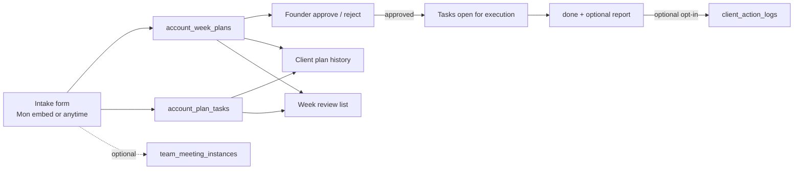

# Account Week Plans Design

## Purpose

Give the team a durable, client-rolled system of record for **weekly
account work plans**: Monday (and anytime) intake of under-KPI plans
with multi-task tactics; Founder approves every plan; tasks assign to
people and schedule to days; workers complete with an optional report
and optional “log as account change.” History stays on the client so
the team can review what was executed and whether material changes
moved the account.

This is intentionally thin for v1: correct database shape, intake form,
approval, completion, and review lists. Role-command dashboards that
*surface* today’s tasks are built elsewhere; they only require the
query model defined here.

## Relationship to prior designs

| Prior | Relationship |
|-------|----------------|
| [KPI Meeting Commitments](2026-07-22-kpi-meeting-commitments-design.md) | **Evolved / superseded for this job.** Keep existing `meeting_commitments` code until migrated or retired; do not extend that table for multi-task person/day work. New tables own plans + tasks. |
| Client action logs (`client_action_logs`) | **Unchanged.** Measured “shipped change → KPI outcome.” Optional bridge from a completed task only when the user opts in. |
| KPI Review Meeting SOP | Cadence stays Mon week plan / Thu check. Intake UI may embed in Mon KPI and also live outside meetings. |

### Two surfaces (do not merge)

| Surface | UI language | Answers |
|---------|-------------|---------|
| **Week plans & tasks** | “Account work” / Week plan | What did we decide? Who does what, when? Done? How did it go? |
| **Action logs** | “Account changes” (existing) | What material change shipped, and did the KPI move? |

Bridge: on task **done** → optional **“Log as account change?”** → create/link
`client_action_logs`. Nuanced or purely investigative tasks may stay plan
history only.

## Scope

### In (v1)

- First-class `account_week_plans` + `account_plan_tasks` in Mr. Waiz
  (Supabase).
- Intake form: create/edit plan + tasks (Mon KPI embed + standalone
  access outside Monday).
- Founder approval on **every** plan (approve / reject + note).
- Tasks: free-text work, optional free-text tag, person assignee, day.
- Complete with optional completion report; optional promote to action log.
- History: per-client plan list + “this week / last week” cross-client
  list; past meeting instance may show linked plans if
  `origin_meeting_id` set.
- Statuses stay minimal (see below).
- Indexes that support personal “tasks for day” queries for future
  dashboards.

### Out (v1)

- Fixed tactic category catalog (free-text tags only; catalog later).
- ClickUp create/sync (native Mr. Waiz work only for this process).
- Auto KPI outcome grading of every task (that remains action logs when
  promoted).
- Role command-center layout / day-playbook UI (separate track).
- Heavy workflow statuses (`in_progress`, `blocked`, clarification
  queues, multi-step founder loops).
- Merging plans into the Client Success action-log UI as one product.

## Locked decisions

| Topic | Choice |
|-------|--------|
| Unit of work | One **week plan per client** with **many tasks** inside |
| Approval | **Every plan** waits on Founder before tasks count as active work |
| Assignee | **Specific person** (`assignee_user_id`), not role-only |
| Tactic label | Free-text **tag** (optional); no mandatory catalog |
| Action logs | Optional promote on complete only |
| Intake vs execution | Form is **intake**; same table is **SoT** for review + later dashboards |
| Access | Embed in Mon meeting; also create/list outside meetings |
| Review | Client history + week filter lists; durable done tasks |
| ClickUp | Not part of this process for v1 |
| Numbers SoT | Live grading / CS overview stays outside this form |

## Architecture

### Infra rules

- Plans and tasks are first-class tables; **not** only JSONB on meeting
  instances.
- Meeting FKs are optional (`ON DELETE SET NULL`). Cancelling a meeting
  does not delete plans or tasks.
- Denormalize `client_id` onto tasks for simple client timeline queries.
- Before plan is `approved`, tasks may exist for drafting; personal/day
  “work for today” queries **exclude** them until the plan is approved.
- Do not store the live plan list only inside meeting `responses`.

### Artifact paths

| Artifact | Path |
|----------|------|
| This design | `docs/superpowers/specs/2026-08-06-account-week-plans-design.md` |
| Prior commitments design | `docs/superpowers/specs/2026-07-22-kpi-meeting-commitments-design.md` |
| Meeting SOP (later update) | `docs/operations/people/kpi-review-meeting-sop.md` |
| Mr. Waiz migrations | `supabase/migrations/` |
| Mr. Waiz schema mirror | `supabase/schema.sql` |
| Lib (expected) | `src/lib/account-week-plans.ts` |
| APIs (expected) | `src/app/api/account-week-plans/…` |
| UI (expected) | intake form + approval queue + client history + week list |

## Data model

### Table: `account_week_plans`

| Field | Type / values | Purpose |
|-------|----------------|---------|
| `id` | uuid PK | |
| `client_id` | uuid FK → clients ON DELETE CASCADE | Logo |
| `week_start` | date | Monday of the work week (America/Sao_Paulo calendar) |
| `why` | text not null | What went wrong / why we plan work |
| `severity` | `911` \| `below` \| `watch` nullable | Optional triage |
| `status` | `pending` \| `approved` \| `rejected` | Minimal lifecycle |
| `success_signal` | text nullable | Optional “how we’ll know” |
| `origin_meeting_id` | uuid FK → team_meeting_instances ON DELETE SET NULL | If created in Mon KPI |
| `approved_by` | uuid FK → auth.users ON DELETE SET NULL | |
| `approved_at` | timestamptz nullable | |
| `founder_note` | text nullable | Reject (or optional approve) note |
| `created_by` | uuid FK → auth.users ON DELETE SET NULL | |
| `created_at` / `updated_at` | timestamptz | |

**Soft duplicate guard:** warn (do not hard-block) if another non-rejected
plan already exists for the same `client_id` + `week_start`.

**Indexes**

- `(client_id, week_start desc)`
- `(status)` partial optional for `status = 'pending'`
- `(week_start, status)`
- `(origin_meeting_id)` where not null

### Table: `account_plan_tasks`

| Field | Type / values | Purpose |
|-------|----------------|---------|
| `id` | uuid PK | |
| `plan_id` | uuid FK → account_week_plans ON DELETE CASCADE | Parent plan |
| `client_id` | uuid FK → clients ON DELETE CASCADE | Denormalized for history queries |
| `title` | text not null | What to do |
| `notes` | text nullable | Extra context |
| `tactic_tag` | text nullable | Free-text label (v1 catalog later) |
| `assignee_user_id` | uuid FK → auth.users ON DELETE SET NULL | Person |
| `scheduled_for` | date nullable | Calendar day for dashboards |
| `status` | `open` \| `done` \| `cancelled` | Minimal |
| `completion_report` | text nullable | How it went (on/after done) |
| `completed_at` | timestamptz nullable | |
| `completed_by` | uuid FK → auth.users ON DELETE SET NULL | |
| `client_action_log_id` | uuid FK → client_action_logs ON DELETE SET NULL | Optional promote |
| `sort_order` | int default 0 | Form order |
| `created_at` / `updated_at` | timestamptz | |

**Indexes** (dashboard-ready)

- `(assignee_user_id, scheduled_for)` — personal day lists  
  Prefer partial where useful: `status = 'open' AND plan approved`
  (plan approval can be enforced in app query join until partial index
  is proven needed)
- `(client_id, created_at desc)`
- `(plan_id, sort_order)`
- `(status)` light filters

**Orphan safety:** plan delete cascades tasks. Meeting delete does not
cascade plans. Action log delete nulls the link on the task; task
history remains.

### Status rules (minimal)

**Plan**

| Status | Meaning |
|--------|---------|
| `pending` | Being written or waiting on Founder |
| `approved` | Founder approved; open tasks are active work |
| `rejected` | Dead; tasks not active work |

Transitions:

- Create → `pending`
- Founder: `pending` → `approved` \| `rejected`
- Rejected plans are terminal for that row (edit + resubmit keeps
  `pending`, or create a new plan for the same week)

No separate draft/clarification statuses in v1: clarification is a
conversation + leave plan `pending` (or reject with note).

**Task**

| Status | Meaning |
|--------|---------|
| `open` | Not finished |
| `done` | Finished |
| `cancelled` | Dropped |

Rules:

- Personal/day **active work** queries: plan.`status` = `approved` AND
  task.`status` = `open` (and optional date/assignee filters).
- Completing a task: plan must be `approved` (reject 4xx otherwise).
- On plan `rejected`: bulk-set open tasks to `cancelled` (app or trigger).
- Done/cancelled rows are **retained forever** for review (no hard-delete
  on complete).

### Promote to action log

When marking a task `done`:

1. Optional free-text `completion_report`.
2. Optional checkbox: log as account change.
3. If checked: create `client_action_logs` from task fields (title, notes,
   report as change/hypothesis seeds) and set `client_action_log_id`.
4. User finishes measurement / outcome on the existing action-log flow.

No auto-success grading on the plan task itself.

## Product surfaces (v1)

1. **Intake form** — client, why, optional severity/week/success_signal;
   multi-row tasks (title, tag, assignee, day, notes). Available from
   Mon KPI runbook and outside meetings.
2. **Founder approval queue** — all `pending` plans (client, why, task
   summaries; approve/reject + note).
3. **Execution entry points** — mark task done/cancel; completion report;
   optional action-log promote. At least a minimal list by plan/client;
   day personal views may ship with role dashboards later.
4. **Review**
   - **Client:** chronological week plans + expanded tasks + completion
     reports + link to action log when set.
   - **Week list:** this week / last week across clients for Thu/Fri
     outcome review without reopening a meeting.

Meeting past-instance view (nice-to-have v1 if cheap): plans where
`origin_meeting_id` = this instance.

## API / auth sketch

- Authenticated CRUD for plans/tasks; roles aligned with Team Meetings /
  CS (team can create/edit pending; Founder/CEO approve-reject).
- Endpoints group under `/api/account-week-plans` (list, create, update
  status) and nested tasks or `/api/account-plan-tasks/[id]`.
- List filters: `client_id`, `week_start`, `status`, `assignee_user_id`,
  `scheduled_for`, `view=pending_approval`.
- Invalid complete on non-approved plan → 4xx with clear message.

## Postgres notes

- Prefer FKs + check constraints for status enums.
- Index assignee + scheduled_for early even if UI ships later.
- Soft uniqueness on open plan per client/week in application, not a
  hard unique constraint (edge: replan after reject).
- RLS: follow existing authenticated-service patterns for Mr. Waiz
  internal tables (same as meeting_commitments / client_action_logs).

## Migration from `meeting_commitments`

- **Do not** dual-write in v1 unless already depended on in prod UX.
- New product path uses week plans only.
- Existing meeting_commitments rows: leave table in place; optional
  one-time import later; UI prioritizes account week plans for Mon/Thu
  once built.
- Update KPI SOP copy in a follow-up PR to point at week plans language
  and Founder **all-plans** approval (not only old Needs Founder).

## Error and edge handling

- Reject complete-if-plan-not-approved.
- Soft-warn duplicate plan same client + week_start.
- Empty tasks allowed only if product wants “observe-only” plan — **v1
  requires ≥1 task** on submit for approval (else plan is incomplete
  “why” with no work; allow save pending with zero tasks for draft
  editing, but block approve with zero open tasks).
- Cancelled meeting: plans remain, `origin_meeting_id` nulls.
- Optional fields (assignee, day) may be empty after approve; those
  tasks still appear on plan/client review, but not on “today for user”
  queries until both are set.

## Testing

- Unit: approve flips plan; open task appears in assignee/day filter only
  when approved; complete blocked when pending/rejected; promote sets FK.
- API: create plan+tasks → pending queue → approve → complete + optional
  action log.
- History: client list returns prior weeks’ done tasks with reports.

## Quality bar

- Founder can clear a week’s pending plans without Slack digs.
- Every approved plan leaves durable client-visible work history.
- Thu/Fri can answer “what did we execute?” from week list + client
  history in minutes.
- Team never confuses task lists with measured account-change logs.
- Schema ready for “my tasks today” without redesign.

## Success metrics (process)

- % of Mon reds with an approved week plan same week.
- % of approved open tasks completed by Friday of that week.
- % of done tasks with a completion report (target improves over time;
  not forced).
- % of done tasks promoted to action logs when the change was material
  (process/teaching metric, not hard gate).

## Deferred (explicit)

- Tactic catalog enum/table.
- Needs-clarification status / multi-round Ops UX.
- ClickUp integration.
- In-dashboard deep embeds (other chat).
- Auto “did KPI move” without action-log path.
- One-click replan templates from past plans.
